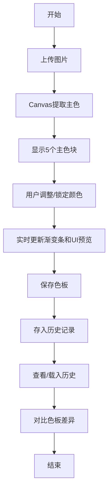

## 1. 产品概述

图片主色调提取与色板预览工具，帮助前端开发者和设计师快速从参考图中提取主色调、生成和谐的渐变色板，并实时预览在UI组件上的应用效果。解决了手动吸色效率低、配色方案不和谐的痛点。

- 目标用户：前端开发者、UI/UX设计师、创意工作者
- 核心价值：从图片到配色方案的一站式快速生成，降低配色决策成本

## 2. 核心功能

### 2.1 功能模块

1. **主色提取模块**：图片拖拽上传、Canvas像素分析、5个主色调聚类提取
2. **色板编辑模块**：颜色锁定/解锁、颜色选择器手动调整、渐变色板实时生成
3. **色板存储模块**：localStorage持久化、保存提示反馈
4. **UI预览模块**：按钮组件预览、卡片组件预览、颜色平滑过渡动画
5. **历史管理模块**：最近5条历史记录展示、历史载入、色板对比与差异高亮

### 2.2 页面详情

| 页面名称 | 模块名称 | 功能描述 |
|---------|---------|---------|
| 首页 | 拖放上传区 | 300x300px虚线边框拖放区，支持拖拽/点击上传jpg/png，最大5MB |
| 首页 | 提取结果展示 | 左侧缩略图(200px宽)，右侧5个彩色方块+HEX色值标签 |
| 首页 | 色板编辑区 | 5个主色块带锁定图标，点击色块弹颜色选择器，下方渐变条展示 |
| 首页 | 保存色板 | 底部保存按钮，保存到localStorage，显示绿色成功提示 |
| 首页 | UI预览区 | 标题+2个按钮+1个卡片，颜色0.5s平滑过渡 |
| 首页 | 历史侧栏 | 左侧220px深色侧栏，展示最近5条历史，支持载入和对比 |
| 首页 | 对比浮层 | 半透明背景，左右并排展示当前与历史色板，差异色块标红星 |

## 3. 核心流程

用户上传参考图片 → 系统提取5个主色调 → 用户调整锁定颜色 → 系统实时生成渐变色板和UI预览 → 用户保存色板 → 可查看历史并对比差异

## 4. 用户界面设计

### 4.1 设计风格

- 主色调：#5b6abf（品牌紫蓝）
- 布局：深色侧栏(#2a2d3e) + 浅色主区(#ffffff)的双色布局
- 圆角：所有交互元素带圆角（拖放区20px、色块6px、按钮10px/22px）
- 字体层次：标题24px/600，正文16px，辅助文字12px
- 动效：hover过渡0.25s，颜色变化0.5s平滑过渡

### 4.2 页面设计概览

| 区域 | 模块 | UI元素 |
|-----|-----|-------|
| 左侧栏 | 历史记录 | 深色背景#2a2d3e，每条52px高，悬浮变#3a3e50 |
| 主区上部 | 拖放区 | 300x300px虚线#bbb，背景#f8f9fa，拖入时边框变#5b6abf，背景变#eef2ff |
| 主区中部 | 色板区 | 5个40x40px色块带HEX标签，锁定图标🔒/🔓，下方30px高渐变条 |
| 主区下部 | UI预览区 | 白色背景，内阴影，标题+2个按钮+卡片组件 |
| 浮层 | 对比视图 | z-index1000，rgba(0,0,0,0.5)背景，左右色板对比，差异deltaE>20标红★ |

### 4.3 响应式

- 桌面端：侧栏220px + 主区弹性布局
- 移动端(<768px)：单列堆叠布局，侧栏收起或置于顶部
- 触摸优化：色块和按钮增大点击区域

### 4.4 性能指标

- 主色提取：≤1.5秒（Canvas getImageData + K-means聚类）
- 保存/载入响应：≤200ms（localStorage操作）
