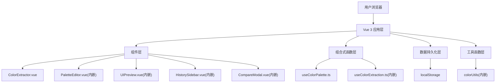

## 1. 架构设计



## 2. 技术描述

- 前端框架：Vue 3 + TypeScript
- 构建工具：Vite 5
- 路由：vue-router@4
- 工具库：lodash
- 颜色提取：color-thief-node（浏览器端降级使用Canvas自实现）
- 状态共享：Vue provide/inject + Composition API reactive
- 样式方案：原生CSS + CSS变量

## 3. 目录结构

```
├── package.json
├── vite.config.js
├── tsconfig.json
├── index.html
└── src/
    ├── main.ts
    ├── App.vue
    ├── style.css
    ├── components/
    │   └── ColorExtractor.vue
    └── composables/
        └── useColorPalette.ts
```

## 4. 核心数据模型

### 4.1 类型定义

```typescript
interface PaletteColor {
  hex: string
  locked: boolean
}

interface ColorPalette {
  id: string
  colors: PaletteColor[]
  savedAt: number
}

interface ExtractionResult {
  colors: string[]
  thumbnail: string
}
```

### 4.2 localStorage Schema

```
Key: 'color-palette-history'
Value: ColorPalette[] (最多5条，按savedAt倒序)

Key: 'color-palette-current'
Value: ColorPalette (当前编辑中的色板)
```

## 5. 关键技术方案

### 5.1 主色提取算法
1. 创建Canvas并绘制图片缩略图(最大200x200px)
2. getImageData获取像素数据
3. K-means聚类算法（k=5），使用量化RGB空间加速
4. 按像素数量排序取Top5作为主色调

### 5.2 颜色差异计算
使用Delta E 2000算法简化版（CIE76近似）：
1. RGB转Lab色彩空间
2. 计算欧氏距离作为deltaE值
3. deltaE > 20 标记为差异显著

### 5.3 渐变色板生成
```
linear-gradient(to right, color1, color2, color3, color4, color5)
```
5段渐变，每个主色占均等位置。

### 5.4 响应式布局
使用CSS媒体查询：
- ≥768px：flex row布局，侧栏固定220px
- <768px：flex column布局，各区域堆叠

## 6. 性能优化

1. 图片提取前先压缩到200x200px以内，减少像素处理量
2. 使用lodash.throttle/debounce优化频繁操作
3. CSS transition实现颜色平滑过渡，避免JS动画开销
4. localStorage读写做try-catch容错处理
