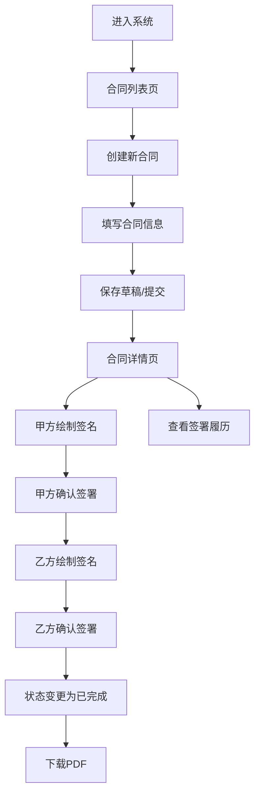

## 1. 产品概述

在线合同管理系统，帮助小企业主和自由职业者在浏览器中快速生成合同草稿、追踪签署状态并导出PDF。解决传统Word/邮件来回修改合同的痛点，包括版本混乱、签署状态不清晰、截止日期易遗忘等问题。

- 核心功能：合同创建、在线签署、状态追踪、PDF导出、签署履历
- 目标用户：小企业主、自由职业者、需要频繁签订合同的专业人士
- 产品价值：提升合同管理效率，减少版本错误，全程可追溯

## 2. 核心功能

### 2.1 用户角色
| 角色 | 注册方式 | 核心权限 |
|------|----------|----------|
| 合同用户 | 直接使用（无需注册） | 创建、编辑、删除合同，在线签署，导出PDF |

### 2.2 功能模块
1. **合同列表页**：合同卡片展示、创建新合同、删除合同、加载状态
2. **合同创建/编辑页**：合同标题、甲乙双方信息、条款内容（富文本）、保存草稿/提交
3. **合同详情页**：只读合同正文、签名区（Canvas绘制）、签署确认、签署履历、PDF下载

### 2.3 页面详情
| 页面名称 | 模块名称 | 功能描述 |
|-----------|-------------|---------------------|
| 合同列表页 | 导航栏 | 切换"我的合同"和"创建新合同" |
| 合同列表页 | 合同卡片 | 展示双方名称、创建日期、签署进度，支持删除/编辑 |
| 合同列表页 | 加载状态 | 环形进度条 |
| 合同创建页 | 表单输入 | 合同标题、甲方/乙方姓名邮箱、富文本条款 |
| 合同创建页 | 操作按钮 | 保存草稿、关闭表单 |
| 合同详情页 | 合同正文 | 只读展示合同内容 |
| 合同详情页 | 签名区 | Canvas绘制签名、确认签署按钮 |
| 合同详情页 | 签署履历 | 时间线展示签署记录 |
| 合同详情页 | PDF下载 | 悬浮按钮，导出含签名的PDF |

## 3. 核心流程

用户进入系统后，可在合同列表查看所有合同卡片。点击"创建新合同"进入表单，填写合同信息后保存。在详情页中，甲乙双方可分别绘制并确认签名，签署状态实时更新。签署完成后可下载包含签名和日期的PDF文件。所有签署操作都会记录在履历列表中。

## 4. 用户界面设计

### 4.1 设计风格
- 主色调：深蓝灰 #1a1a2e（背景）、#16213e（卡片底色）
- 辅助色：浅蓝 #4fc3f7（强调）、高饱和蓝 #1976d2（按钮）、橙色 #ff5722（下载）、绿色 #4caf50（确认）、红色 #f44336（取消）
- 文本色：白色 #ffffff、浅灰 #e0e0e0
- 按钮风格：圆角（6px-8px），hover状态有过渡动画
- 布局：顶部导航，卡片式列表，详情页左右分栏
- 图标风格：简洁线性图标，hover时变色

### 4.2 页面设计概述
| 页面名称 | 模块名称 | UI元素 |
|-----------|-------------|----------|
| 合同列表页 | 导航栏 | 活跃状态下划线动画，按钮hover效果 |
| 合同列表页 | 合同卡片 | 渐变背景，hover放大1.02倍，阴影过渡0.2s |
| 合同创建页 | 表单 | 输入框focus时边框色渐变动画（0.3s） |
| 合同详情页 | 签名区 | 虚线框Canvas，浅灰笔触，圆形清除按钮 |
| 合同详情页 | 履历列表 | 绿色小圆点时间线，自定义滚动条 |
| 全局 | 悬浮按钮 | 圆形下载按钮，50px，橙色背景 |

### 4.3 响应式
- Desktop-first设计
- ≤768px时：导航改为汉堡菜单，卡片改为竖向列表
- 触摸优化：签名Canvas支持触摸绘制

### 4.4 动画与交互
- 卡片hover：scale(1.02) + 阴影加深，过渡0.2s
- 输入框focus：border-color从#ddd到#4fc3f7，过渡0.3s
- 加载状态：环形进度条旋转动画
- 按钮状态变化：颜色渐变过渡
