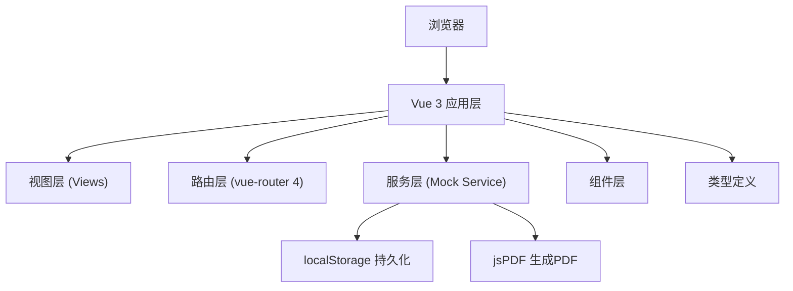

## 1. 架构设计



## 2. 技术说明

- 前端：Vue@3 + TypeScript@5 + Vite@5
- 路由：vue-router@4
- 构建工具：Vite@5（devServer端口3000）
- 数据存储：localStorage（模拟后端）
- PDF生成：jsPDF + file-saver
- 辅助工具：uuid（生成ID）、lodash（工具函数）

## 3. 路由定义

| 路由 | 用途 |
|-------|---------|
| / | 合同列表页（默认路由） |
| /contracts | 合同列表页 |
| /contracts/new | 创建新合同 |
| /contracts/:id | 合同详情页 |
| /contracts/:id/edit | 编辑合同 |

## 4. 数据模型

### 4.1 类型定义

```typescript
interface Party {
  name: string;
  email: string;
}

interface Signature {
  party: 'partyA' | 'partyB';
  dataUrl: string;
  signedAt: string;
}

interface SignRecord {
  id: string;
  party: 'partyA' | 'partyB';
  signerName: string;
  signerEmail: string;
  action: string;
  timestamp: string;
}

type ContractStatus = 'unsigned' | 'partial' | 'completed';

interface Contract {
  id: string;
  title: string;
  partyA: Party;
  partyB: Party;
  content: string;
  status: ContractStatus;
  signatures: Signature[];
  signRecords: SignRecord[];
  createdAt: string;
  updatedAt: string;
}
```

## 5. 项目结构

```
├── index.html
├── package.json
├── tsconfig.json
├── vite.config.js
└── src/
    ├── main.ts
    ├── App.vue
    ├── contracts.d.ts
    ├── router/
    │   └── index.ts
    ├── services/
    │   └── mockService.ts
    └── views/
        ├── ContractList.vue
        ├── ContractForm.vue
        └── ContractDetail.vue
```

## 6. 核心模块职责

- **mockService.ts**：模拟后端API，提供合同CRUD、签名保存、PDF生成、localStorage持久化
- **ContractList.vue**：展示合同卡片列表，处理删除、加载状态
- **ContractForm.vue**：合同创建/编辑表单，富文本编辑区
- **ContractDetail.vue**：合同详情展示、Canvas签名、签署履历、PDF导出
- **App.vue**：根组件，导航栏，路由视图容器
