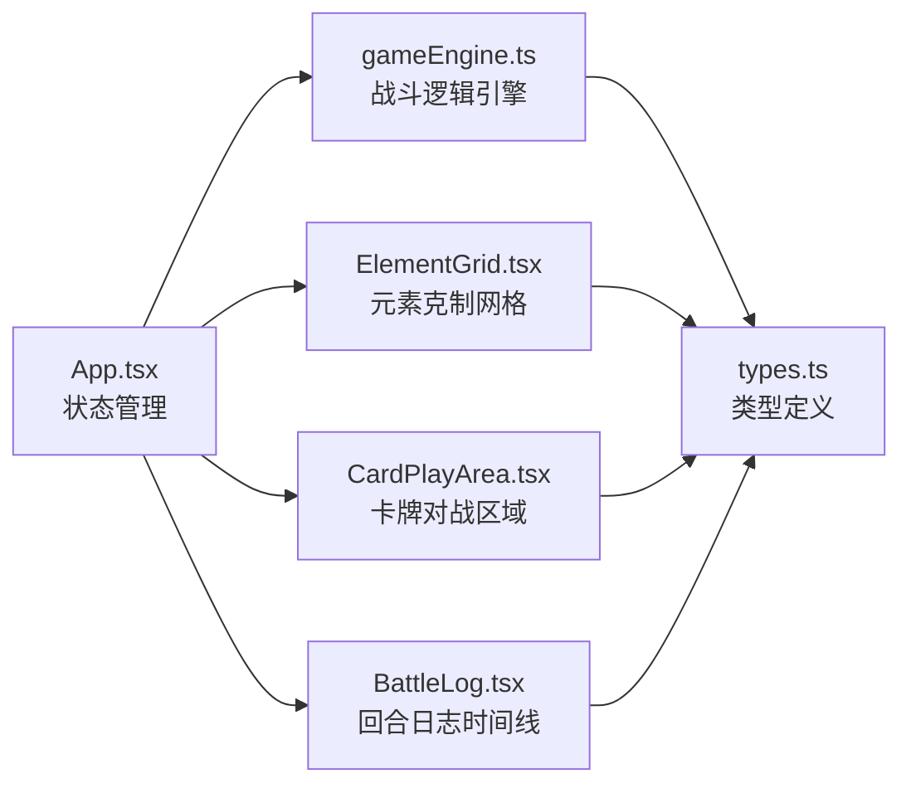
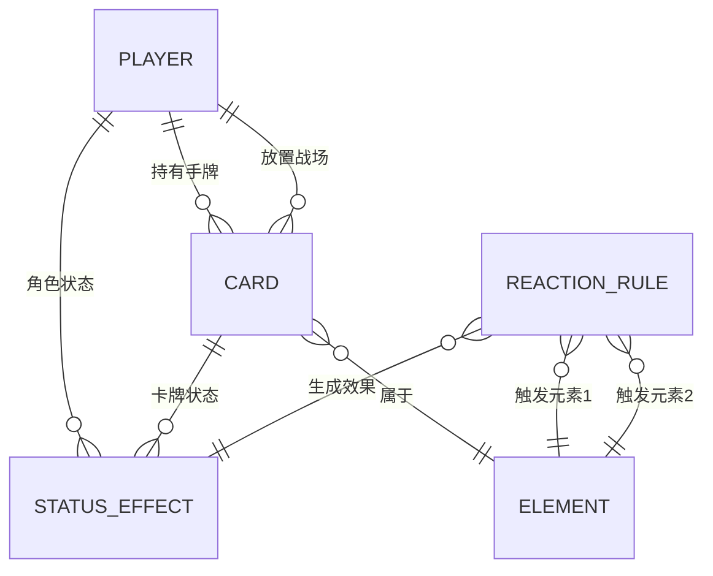

## 1. 架构设计



数据流向：
- App.tsx 持有全局状态（角色、手牌、战场、回合数、日志）
- 用户交互 → App.tsx 调用 gameEngine.ts 计算 → 更新状态 → 子组件重渲染
- 子组件通过 props 接收数据，通过回调回传用户操作

## 2. 技术栈描述

- **前端框架**：React@18 + TypeScript
- **构建工具**：Vite@5 + @vitejs/plugin-react
- **工具库**：uuid（唯一ID）、lodash（工具函数）
- **样式方案**：原生CSS（模块化），CSS transitions 动画
- **状态管理**：React useState/useReducer（单组件集中管理）

## 3. 文件结构

```
src/
├── types.ts              # 所有数据类型定义（Card, StatusEffect, ReactionRule等）
├── gameEngine.ts         # 核心战斗逻辑引擎（伤害计算、反应匹配、状态结算）
├── data/
│   └── reactionRules.ts  # 预设的6种元素反应规则数据
├── components/
│   ├── ElementGrid.tsx   # 4x4元素克制关系网格
│   ├── CardPlayArea.tsx  # 战场区域（手牌、战场槽位、角色状态）
│   ├── Card.tsx          # 单张卡牌组件
│   ├── BattleLog.tsx     # 回合日志时间线（含虚拟滚动）
│   ├── HealthBar.tsx     # 生命值条与数值变化动画
│   └── GameOverModal.tsx # 胜负结算弹窗
├── App.tsx               # 主应用组件（状态管理、游戏流程控制）
├── main.tsx              # React入口
└── index.css             # 全局样式与主题变量
```

## 4. 数据模型

### 4.1 核心类型定义



### 4.2 主要接口

- **Card**: { id, name, cost, element, attack, hp, maxHp, statuses[] }
- **StatusEffect**: { type, name, duration, value, icon }
- **ReactionRule**: { elements: [element1, element2], resultElement, multiplier, damage, statusEffect }
- **Player**: { hp, maxHp, hand: Card[], field: (Card|null)[], statuses: StatusEffect[] }
- **BattleLogEntry**: { turn, attackerId, defenderId, reaction, damage, statuses, timestamp }

## 5. 性能优化

- 战斗计算逻辑纯函数化，50ms内完成
- 回合日志超过50条启用虚拟滚动（只渲染可视区域）
- CSS transitions/transforms 实现动画，确保60fps
- 状态更新使用 React 批处理，避免不必要重渲染
