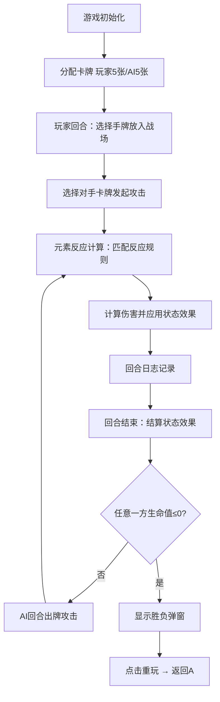

## 1. 产品概述

元素反应卡牌对战模拟器是一款面向卡牌游戏设计师的PVE对战原型工具，用于快速定义和模拟以元素反应为核心机制的卡牌战斗。设计师可通过可视化界面直观观察不同元素卡牌（火、水、草、雷）之间的交互效果、伤害数值计算和状态叠加过程。

## 2. 核心功能

### 2.1 功能模块

1. **元素克制关系网格**：以4x4彩色表格直观展示所有元素组合的反应规则
2. **战斗主战场**：玩家与AI对手的卡牌对战区域，支持出牌、攻击、状态结算
3. **回合日志时间线**：详细记录每一步战斗过程，支持历史回放和高亮
4. **状态效果系统**：燃烧、蒸发、感电、激化、超载、绽放等元素反应效果
5. **胜负判定系统**：生命值归零判定与重玩功能

### 2.2 页面详情

| 页面名称 | 模块名称 | 功能描述 |
|-----------|-------------|---------------------|
| 主对战页面 | 元素克制网格 | 4x4表格展示火水草雷四种元素的反应组合，显示倍率和状态图标 |
| 主对战页面 | 玩家手牌区 | 展示玩家当前手牌（最多5张），点击可放入战场槽位 |
| 主对战页面 | 玩家战场区 | 3个卡牌槽位，放置已出牌的卡牌 |
| 主对战页面 | AI战场区 | 3个卡牌槽位，展示AI已出牌的卡牌 |
| 主对战页面 | AI手牌区 | 展示AI当前手牌数量（背面显示） |
| 主对战页面 | 角色状态栏 | 展示双方角色生命值和状态图标，含数值变化动画 |
| 主对战页面 | 回合日志面板 | 时间线形式展示战斗历史，支持点击回放高亮 |
| 主对战页面 | 胜负弹窗 | 游戏结束时显示胜利/失败，提供重玩按钮 |

## 3. 核心流程

玩家从手牌区选择卡牌放入战场槽位，选择对手卡牌发起攻击，系统根据双方元素类型触发反应计算伤害，回合结束时结算所有状态效果，重复直到一方生命值归零。

## 4. 用户界面设计

### 4.1 设计风格

- **主色调**：暗色主题，主背景#111827，卡片背景#1e293b
- **强调色**：#f59e0b（金色，选中状态），#ef4444（火），#3b82f6（水），#22c55e（草），#a855f7（雷）
- **文字主色**：#e2e8f0
- **布局风格**：三列布局（左：元素网格280px，中：主战场自适应，右：日志300px）
- **按钮风格**：圆角12px，悬浮态阴影效果
- **卡牌风格**：圆角矩形100x140px，顶部彩色元素圆点，底部生命条渐变

### 4.2 页面设计概要

| 页面名称 | 模块名称 | UI元素 |
|-----------|-------------|-------------|
| 主对战页面 | 元素克制网格 | 4x4彩色方格，元素色块，反应倍率图标 |
| 主对战页面 | 卡牌组件 | 圆角矩形，元素圆点，名称，攻击值，HP渐变条 |
| 主对战页面 | 战斗区域 | 上下对称布局，槽位高亮，攻击连线动画 |
| 主对战页面 | 角色状态栏 | 头像，HP数值，变化箭头动画（300ms） |
| 主对战页面 | 回合日志 | 时间线，彩色圆点，伤害数值，状态图标 |
| 主对战页面 | 胜负弹窗 | 半透明遮罩，圆角16px，重玩按钮 |

### 4.3 响应式

桌面端优先设计，主区域最小宽度500px，三列固定宽度布局。
