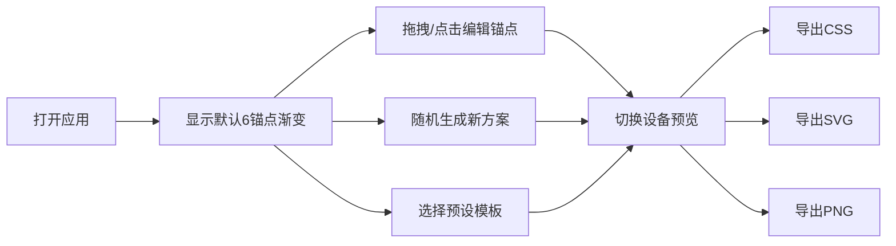

## 1. 产品概述

Mesh Gradient Studio 是一款面向平面设计师和品牌经理的浏览器端动态渐变网格背景生成与编辑工具，解决在 Figma 或 Photoshop 中手动调整渐变节点流程繁琐、无法实时预览多设备适配效果的痛点。

- 核心价值：快速创建专业级 Mesh Gradient 背景，支持实时编辑、多设备预览、一键导出多种格式
- 目标用户：平面设计师、品牌经理、UI/UX 设计师、前端开发者

## 2. 核心功能

### 2.1 用户角色
| 角色 | 登录方式 | 核心权限 |
|------|----------|----------|
| 普通用户 | 无需登录，浏览器直接使用 | 编辑渐变网格、使用预设模板、导出文件 |

### 2.2 功能模块
1. **渐变网格编辑器**：800x600 画布，6个可拖拽锚点，支持新增锚点（最多12个），每个锚点支持颜色选择和透明度调节
2. **预设与随机生成**：4个专业预设方案（日落暖阳、海洋极光、赛博都市、薄荷清醒），随机生成渐变方案带平滑过渡动画
3. **多格式导出**：支持导出 CSS 代码（含代码预览面板和一键复制）、SVG 文件、PNG 图片
4. **响应式预览**：设备模拟器（手机/平板/桌面），画布自适应缩放，适配评分系统
5. **历史记录**：20步撤销/重做，实时显示历史状态

### 2.3 页面详情
| 页面名称 | 模块名称 | 功能描述 |
|----------|----------|----------|
| 主编辑器 | 顶部工具栏 | 三个导出按钮（CSS/SVG/PNG），固定高度60px |
| 主编辑器 | 左侧工具栏 | 随机生成按钮、4个预设模板卡片，宽度240px |
| 主编辑器 | 中央画布 | Mesh Gradient 预览画布，支持锚点拖拽、双击新增、悬停显示信息 |
| 主编辑器 | 设备模拟器 | 画布下方，手机/平板/桌面三种分辨率切换 |
| 主编辑器 | 适配评分条 | 设备模式切换后显示，红黄绿渐变色指示 |
| 主编辑器 | 历史面板 | 左下角，撤销/重做按钮，步数指示器 |
| 主编辑器 | CSS代码面板 | 底部弹出，代码预览+复制按钮，高度200px |

## 3. 核心流程

用户打开应用 → 看到默认渐变网格 → 通过拖拽调整锚点位置/点击修改颜色 → 使用随机生成或预设模板快速切换方案 → 切换设备模式预览适配效果 → 导出为 CSS/SVG/PNG 文件

## 4. 用户界面设计

### 4.1 设计风格
- **主题**：深色科技风（Dark Theme）
- **主背景色**：#1a1a2e，面板背景色 #2d2d44
- **主文字色**：#dfe6e9
- **强调色**：#6c5ce7（紫色）、#00b894（绿色）
- **按钮样式**：圆角8px，hover 放大1.05倍 + 4px白色光晕，0.3s 缓动过渡
- **字体**：现代无衬线字体，等宽字体用于代码展示
- **布局风格**：顶部固定工具栏 + 左右分栏主区域 + 底部可展开面板
- **交互动效**：所有控件 0.3s ease 过渡，渐变切换带缓动动画（随机3s，预设1.5s）

### 4.2 页面设计概览
| 页面名称 | 模块名称 | UI 元素 |
|----------|----------|---------|
| 主编辑器 | 顶部工具栏 | 固定高度60px，底部1px分割线 #4a4a6a，三个导出按钮按功能着色 |
| 主编辑器 | 左侧工具栏 | 宽度240px，背景 #2d2d44，圆角12px，随机按钮 #6c5ce7，预设卡片 100x70px |
| 主编辑器 | 中央画布 | 800x600 默认尺寸，背景 #1a1a2e，锚点半径12px带交互反馈 |
| 主编辑器 | 设备模拟器 | 三个按钮并排，激活态蓝色 #0984e3 |
| 主编辑器 | 适配评分条 | 红→黄→绿线性渐变 #d63031→#fdcb6e→#00b894 |
| 主编辑器 | 历史面板 | 小号字体12px，灰色文字 #b2bec3，深灰按钮 #636e72 |
| 主编辑器 | CSS代码面板 | 背景 #1e1e2e，等宽字体显示代码，复制按钮带反馈 |

### 4.3 响应式
- 桌面优先设计（Desktop-first）
- 整体最小宽度 1000px
- 低于 1000px 时左侧工具栏折叠为汉堡菜单
- 画布内容自适应缩放，不裁剪

### 4.4 性能要求
- 锚点拖拽刷新频率 ≥ 30FPS（requestAnimationFrame 循环）
- PNG 导出渲染耗时 ≤ 800ms
- 渐变过渡动画流畅（随机3s，预设1.5s）
