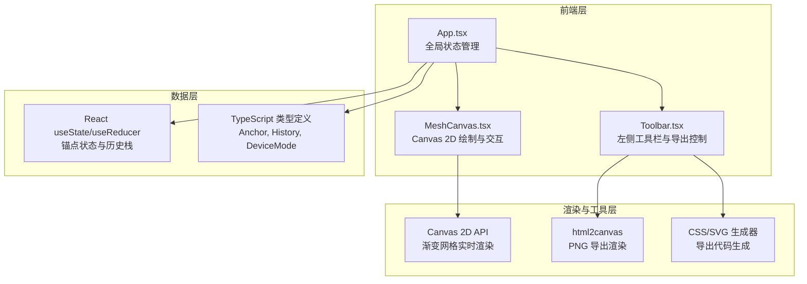

## 1. 架构设计



## 2. 技术描述

- **前端框架**：React@18 + TypeScript + Vite@5
- **初始化工具**：Vite（手动配置）
- **渲染引擎**：Canvas 2D API（渐变网格实时渲染）
- **PNG 导出**：html2canvas@latest
- **工具函数**：lodash@latest（深拷贝、防抖等）
- **后端**：无（纯前端应用）
- **数据库**：无（状态存储在 React 内存中）

## 3. 路由定义
| 路由 | 用途 |
|------|------|
| / | 主编辑器页面（唯一页面） |

## 4. 数据模型

### 4.1 TypeScript 类型定义

```typescript
// 锚点数据结构
interface Anchor {
  id: string;
  x: number;           // 相对于画布的位置 (0-1 比例)
  y: number;           // 相对于画布的位置 (0-1 比例)
  color: string;       // 十六进制颜色值，如 "#ff6b6b"
  opacity: number;     // 透明度 0-1
}

// 历史状态
interface HistoryState {
  anchors: Anchor[];
}

// 设备模式
type DeviceMode = 'mobile' | 'tablet' | 'desktop';

// 设备尺寸配置
interface DeviceConfig {
  width: number;
  height: number;
  label: string;
}

// 预设模板
interface Preset {
  id: string;
  name: string;
  anchors: Anchor[];
}
```

### 4.2 常量配置

```typescript
// 默认画布尺寸
const DEFAULT_CANVAS = { width: 800, height: 600 };

// 锚点配置
const ANCHOR_CONFIG = {
  radius: 12,
  maxCount: 12,
  defaultCount: 6,
};

// 历史记录限制
const HISTORY_LIMIT = 20;

// 设备尺寸映射
const DEVICE_MODES: Record<DeviceMode, DeviceConfig> = {
  mobile: { width: 375, height: 667, label: '手机' },
  tablet: { width: 768, height: 1024, label: '平板' },
  desktop: { width: 1280, height: 800, label: '桌面' },
};

// 颜色池（用于随机生成）
const COLOR_PALETTE = {
  warm: ['#ff6b6b', '#ff8e72', '#ffa502', '#ff6348', '#ee5253'],
  cool: ['#4ecdc4', '#0abde3', '#54a0ff', '#5f27cd', '#48dbfb'],
  neutral: ['#ffe66d', '#a29bfe', '#fd79a8', '#6c5ce7', '#00b894'],
};

// 预设模板数据
const PRESETS: Preset[] = [
  {
    id: 'sunset',
    name: '日落暖阳',
    anchors: [
      { id: '1', x: 0.2, y: 0.3, color: '#ff6b6b', opacity: 1 },
      { id: '2', x: 0.8, y: 0.2, color: '#ffa502', opacity: 1 },
      { id: '3', x: 0.5, y: 0.7, color: '#ff8e72', opacity: 0.9 },
      { id: '4', x: 0.3, y: 0.8, color: '#ee5253', opacity: 0.8 },
      { id: '5', x: 0.7, y: 0.5, color: '#ff6348', opacity: 0.7 },
      { id: '6', x: 0.1, y: 0.6, color: '#ffe66d', opacity: 0.6 },
    ],
  },
  // ... 其他预设
];
```

## 5. 文件结构

```
auto192/
├── package.json
├── index.html
├── tsconfig.json
├── vite.config.js
└── src/
    ├── App.tsx           # 主组件：全局状态、布局、事件协调
    ├── MeshCanvas.tsx    # 画布组件：Canvas渲染、锚点交互
    └── Toolbar.tsx       # 工具栏组件：按钮、预设、导出
```

## 6. 核心实现要点

### 6.1 Canvas 渲染策略
- 使用 `requestAnimationFrame` 维持独立渲染循环，确保 ≥30FPS
- 每个锚点渲染一个径向渐变，通过 `globalCompositeOperation = 'lighter'` 叠加混合
- 拖拽时实时重绘，非交互状态下惰性渲染

### 6.2 历史记录管理
- 采用 `history: HistoryState[]` + `currentIndex: number` 双游标模式
- 每次锚点变更 push 新状态到栈中（限制最大20条）
- 撤销/重做仅移动游标，不删除数据

### 6.3 平滑过渡动画
- 目标状态与当前状态分离存储
- 使用 `requestAnimationFrame` 按时间进度插值（easeInOutCubic）
- 随机生成：3000ms 过渡；预设切换：1500ms 过渡

### 6.4 导出功能
- **CSS**：将锚点转换为多个 radial-gradient 叠加的 CSS 代码
- **SVG**：生成 `<radialGradient>` 元素的 SVG 文件
- **PNG**：使用 html2canvas 捕获 Canvas 并下载，控制在 800ms 内完成

### 6.5 适配评分算法
- 遍历所有锚点，统计超出画布边界的锚点数量
- 评分 = (1 - 超出数量 / 总锚点数) × 100%
- 评分条使用线性渐变从红到黄到绿映射
