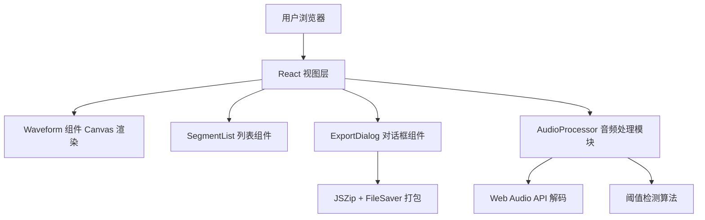

## 1. 架构设计

纯前端浏览器应用，无需后端服务。所有音频处理、波形渲染、文件打包均在客户端完成。



## 2. 技术说明

- **前端框架**：React 18 + TypeScript
- **构建工具**：Vite 5（devServer 端口 3000）
- **波形绘制**：原生 Canvas 2D API + waveform-utils@0.5
- **音频处理**：Web Audio API（AudioContext.decodeAudioData）
- **文件导出**：jszip@3 + file-saver@2
- **状态管理**：React useState + useCallback（轻量场景无需额外状态库）
- **样式方案**：原生 CSS（CSS Modules 可选），CSS Variables 管理主题色

## 3. 模块文件结构

```
src/
├── AudioProcessor.ts      # 音频解码、波形采样、阈值检测、片段分割
├── App.tsx                # 主组件：布局管理、状态聚合、事件分发
└── components/
    ├── Waveform.tsx       # Canvas 波形渲染 + 拖拽交互
    ├── SegmentList.tsx    # 片段垂直列表 + 删除/跳转
    └── ExportDialog.tsx   # 导出配置对话框 + ZIP 打包下载
```

## 4. 核心数据结构

```typescript
interface AudioSegment {
  id: string;
  startTime: number;      // 秒
  endTime: number;        // 秒
  label: string;
  color: string;
}

interface WaveformData {
  samples: Float32Array;  // 归一化波形采样 [-1, 1]
  sampleRate: number;
  duration: number;       // 秒
  channels: number;
}

interface ExportConfig {
  format: 'wav' | 'mp3';
  includeLabelInFilename: boolean;
}
```

## 5. 关键算法

### 5.1 波形降采样
原始音频采样率通常 44.1kHz/48kHz，Canvas 像素宽度有限（约 1000-2000px）。对原始 PCM 数据进行分块取最大绝对值，生成与画布宽度匹配的降采样数组。

### 5.2 静音检测（阈值法）
1. 将阈值 dB 值转换为线性振幅：`amplitude = 10^(dB / 20)`
2. 滑动窗口扫描降采样波形，窗口大小约 50ms
3. 窗口内最大振幅低于阈值 → 标记为静音帧
4. 合并相邻静音帧，过滤掉极短静音（< 200ms）和极短有声（< 100ms）

### 5.3 WAV 编码导出
从 AudioBuffer 截取指定时间段的 PCM 数据，按 RIFF/WAV 格式封装：
- 44 字节文件头（ChunkID、ChunkSize、Format、Subchunk 等）
- 16-bit PCM 样本，小端序写入
