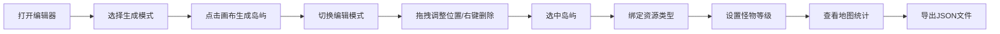

## 1. 产品概述

浮空探险地图编辑器是一个基于浏览器的2D浮空岛屿生成与探险地图编辑工具，让用户能通过点击和拖拽在网格画布上随机生成或手动搭建浮空岛屿群，并为每个岛屿绑定资源类型和怪物等级，最终生成可导出为JSON的完整探险地图。

- 目标用户：游戏策划、关卡设计师、探险游戏爱好者
- 产品价值：提供直观高效的探险地图设计工具，支持随机生成与手动编辑双模式，快速产出可序列化的地图数据

## 2. 核心功能

### 2.1 功能模块
1. **主编辑页面**：模式切换、网格画布、岛屿生成/编辑、资源绑定面板、怪物等级控制、地图统计、JSON导出

### 2.2 页面详情
| 页面名称 | 模块名称 | 功能描述 |
|---------|---------|---------|
| 主编辑页面 | 模式切换开关 | 两个按钮并排切换生成模式/编辑模式，选中态有白色下划线 |
| 主编辑页面 | 网格画布 | 20x20像素浅灰网格背景，支持点击生成、拖拽移动、右键删除岛屿 |
| 主编辑页面 | 岛屿渲染 | 贝塞尔曲线不规则形状、渐变填充、云层粒子环绕动画、选中高亮效果 |
| 主编辑页面 | 资源绑定面板 | 右侧滑出面板，三个资源图标按钮（木材/矿石/水晶），岛屿中央显示对应图标和彩色光环 |
| 主编辑页面 | 怪物等级滑块 | 范围1-10，等级5+红色闪烁，等级8+快速闪烁，底部显示恶魔之眼动画 |
| 主编辑页面 | 地图统计栏 | 底部固定栏，显示岛屿总数、各资源数量、平均怪物等级 |
| 主编辑页面 | JSON导出 | 点击按钮下载包含完整岛屿数据的JSON文件 |
| 主编辑页面 | 左侧状态栏 | 显示当前模式、选中岛屿信息、快捷键列表 |
| 主编辑页面 | 网格吸附 | 拖拽时自动吸附到网格交叉点，触发光环脉冲动画 |

## 3. 核心流程

用户打开编辑器 → 选择生成模式点击画布创建岛屿 → 切换到编辑模式调整岛屿位置 → 选中岛屿绑定资源类型 → 调整怪物等级 → 查看地图统计 → 导出JSON文件

## 4. 用户界面设计

### 4.1 设计风格
- **主色调**：深蓝夜空渐变背景（#0b0e2a → #1a1e4b），深色赛博朋克风格
- **强调色**：紫色（#6c63ff）- 生成模式按钮；深灰（#2a2b38）- 编辑模式按钮；绿色（#4CAF50）- 导出按钮
- **资源色**：木材棕（#8B4513）、矿石灰（#708090）、水晶紫（#9b59b6）
- **按钮样式**：圆角8-12px，悬停亮度提升（filter: brightness(1.2)）0.2秒过渡，点击缩放（transform: scale(0.95)）
- **字体**：现代无衬线字体，标题白色半透明，正文白色16px
- **布局风格**：左侧20%状态栏 + 中间80%画布 + 右侧浮动资源面板 + 底部固定统计栏
- **图标风格**：Emoji图标（🔨⛏️💎👁️）

### 4.2 页面设计概述
| 页面名称 | 模块名称 | UI元素 |
|---------|---------|--------|
| 主编辑页面 | 顶部标题 | 居中白色半透明标题"浮空探险地图编辑器" |
| 主编辑页面 | 模式切换 | 左上角两个并排按钮，选中态白色下划线 |
| 主编辑页面 | 画布区域 | 占页面80%宽度，网格背景，岛屿渲染区域 |
| 主编辑页面 | 左侧状态栏 | 20%宽度，显示模式信息、选中岛屿信息、快捷键 |
| 主编辑页面 | 资源面板 | 右侧浮动220px宽，圆角12px，背景#2d2d42，资源按钮+等级滑块 |
| 主编辑页面 | 底部统计栏 | 固定高度60px，背景#1a1a2e透明度0.9，左侧统计右侧导出按钮 |

### 4.3 响应式设计
- 桌面端优先设计
- 移动端（宽度<768px）：右侧面板折叠为底部抽屉，点击岛屿后从底部滑出
- 触摸操作优化：长按选中、拖拽移动

### 4.4 动画与交互
- 岛屿云层粒子：白色半透明（alpha 0.2-0.4），缓慢旋转浮动
- 网格吸附：半透明白色圆环从中心向外扩散，持续0.3秒
- 怪物等级闪烁：等级5+闪速0.8秒一次，等级8+闪速0.4秒一次
- 恶魔之眼：半透明红色图标在岛屿底部来回扫视
- 按钮过渡：悬停0.2秒亮度提升，点击缩放动画
