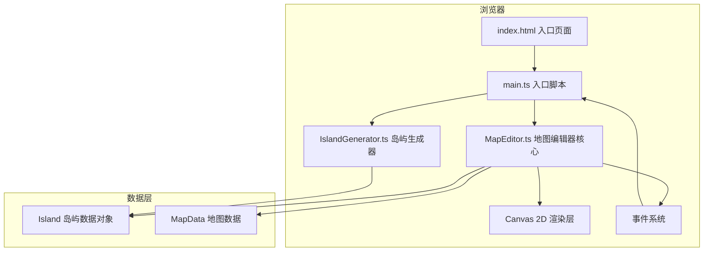
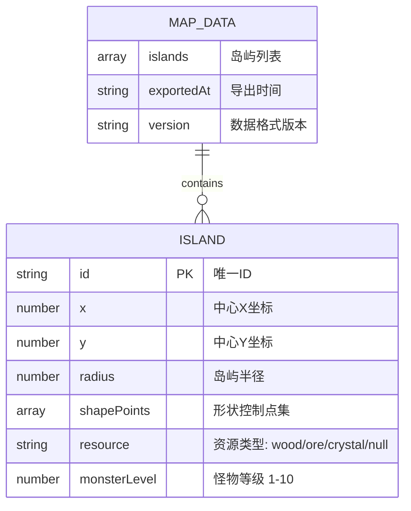

## 1. 架构设计



## 2. 技术描述
- **前端**：TypeScript + Vite 5 + Canvas 2D API
- **初始化工具**：Vite 官方脚手架 vanilla-ts 模板
- **第三方库**：lodash（工具函数）、uuid（唯一ID生成）
- **无后端**：纯前端应用，数据导出为JSON文件下载

## 3. 路由定义
| 路由 | 用途 |
|------|------|
| / | 主编辑器页面 |

纯单页应用，无路由跳转。

## 4. 数据模型

### 4.1 数据模型定义


### 4.2 TypeScript 类型定义
```typescript
type ResourceType = 'wood' | 'ore' | 'crystal' | null;

interface ShapePoint {
  x: number;
  y: number;
  angle: number;
  distance: number;
}

interface CloudParticle {
  x: number;
  y: number;
  radius: number;
  alpha: number;
  angle: number;
  speed: number;
  offsetY: number;
}

interface Island {
  id: string;
  x: number;
  y: number;
  radius: number;
  shapePoints: ShapePoint[];
  resource: ResourceType;
  monsterLevel: number;
  clouds: CloudParticle[];
}

interface MapData {
  islands: Island[];
  exportedAt: string;
  version: string;
}

type EditorMode = 'generate' | 'edit';
```

## 5. 核心模块设计

### 5.1 IslandGenerator.ts
- `generateIsland(x: number, y: number): Island` - 在指定坐标生成随机岛屿
- `generateShapePoints(radius: number): ShapePoint[]` - 使用贝塞尔曲线生成不规则形状控制点
- `generateCloudParticles(radius: number): CloudParticle[]` - 生成环绕云层粒子

### 5.2 MapEditor.ts
- `constructor(canvas: HTMLCanvasElement)` - 初始化编辑器
- `setMode(mode: EditorMode): void` - 切换编辑模式
- `addIsland(island: Island): void` - 添加岛屿
- `removeIsland(id: string): void` - 删除岛屿
- `selectIsland(id: string | null): void` - 选中岛屿
- `setIslandResource(id: string, resource: ResourceType): void` - 设置岛屿资源
- `setIslandMonsterLevel(id: string, level: number): void` - 设置怪物等级
- `exportToJSON(): MapData` - 导出地图数据
- `on(event: string, callback: Function): void` - 事件订阅（islandSelected、islandAdded、islandRemoved、islandUpdated、modeChanged）
- `render(): void` - 渲染主循环

## 6. 性能优化策略
- 使用 `requestAnimationFrame` 实现流畅的60FPS渲染循环
- 离屏Canvas缓存静态岛屿渲染结果
- 粒子系统对象池复用，避免频繁GC
- 拖拽操作时使用脏矩形渲染，只重绘变化区域
- 使用分层Canvas：底层网格、中层岛屿、上层选中效果和粒子
