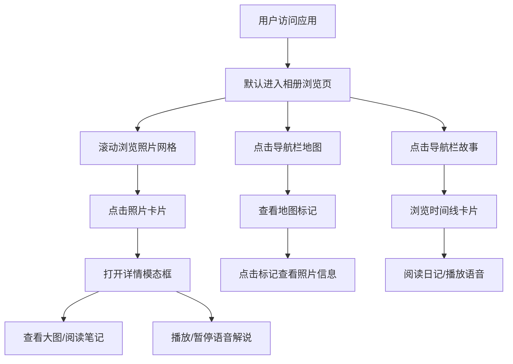

## 1. 产品概述

旅行时光相册是一款面向独立旅游博主和其粉丝的交互式浏览器应用，让访客能像翻阅实体书一样浏览按时间线排列的旅行照片，体验沉浸式的旅行分享。

- **核心目标**：为旅游博主提供一个兼具视觉美感和交互体验的在线相册平台，让粉丝能够以多维度（相册网格、地图轨迹、时间线故事）的方式探索旅行记忆
- **目标用户**：小型独立旅游博主及其粉丝群体
- **产品价值**：通过复古暖色调的视觉设计和丰富的交互体验（语音解说、地图轨迹、时间线故事），将静态照片转化为有温度、有故事的沉浸式旅行回忆

## 2. 核心功能

### 2.1 用户角色

| 角色 | 访问方式 | 核心权限 |
|------|---------|----------|
| 访客用户 | 浏览器直接访问 | 浏览相册、查看地图、阅读故事、播放语音解说 |

### 2.2 功能模块

1. **相册浏览页**：三列网格展示照片卡片，支持滚动加载更多、全屏详情模态框、语音播放
2. **地图标注页**：基于Leaflet的交互式地图，按地理位置标记照片，点击查看缩略图和信息
3. **旅行故事页**：垂直时间线展示，左右交替排列照片卡片，配合文字日记和语音解说

### 2.3 页面详情

| 页面名称 | 模块名称 | 功能描述 |
|---------|---------|-----------|
| 相册浏览页 | 照片网格 | 三列响应式网格、图片懒加载、滚动到底部自动加载更多（5张一组）、卡片悬停动画 |
| 相册浏览页 | 详情模态框 | 全屏半透明背景、大图展示、标题和文字笔记、语音播放/暂停按钮、波形动画 |
| 地图标注页 | 交互式地图 | Leaflet OpenStreetMap瓦片、自动计算地图中心点、自定义圆形缩略图标记、信息弹窗 |
| 旅行故事页 | 时间线展示 | 居中竖线时间线、左右交替卡片、文字日记摘要（100字截断）、圆形播放按钮 |

## 3. 核心流程

用户访问应用后，默认进入相册浏览页，可通过顶部导航栏切换视图：
- 在相册页点击任意照片卡片，弹出详情模态框，可查看大图、阅读笔记、播放语音
- 切换到地图页，可看到所有照片的地理位置标记，点击标记查看详情
- 切换到故事页，可按时间线顺序浏览完整旅行故事，配合语音解说

## 4. 用户界面设计

### 4.1 设计风格

- **主色调**：#d4a373（土黄色）- 用于按钮、时间线、强调色
- **辅助色**：#f9f4e8（米白）- 背景色、卡片背景、导航栏
- **文字色**：#5c4a3d（深棕）- 主要文字；#666（灰色）- 次要文字、笔记文字
- **字体**：思源宋体 - 整体采用，营造复古文艺氛围
- **按钮风格**：圆角设计，点击缩放反馈（scale 0.95），主色填充
- **布局风格**：卡片式布局，顶部导航栏（高60px，带细微阴影）
- **动效风格**：
  - 卡片悬停：向上平移4px，阴影加深，过渡0.2s
  - 模态框：淡入淡出0.3s
  - 页面加载：卡片交错延迟滑入（0.1s间隔，translateY 30px→0）
  - 地图弹窗：缩放进入（0.9→1.0，0.2s）

### 4.2 页面设计概览

| 页面名称 | 模块名称 | UI元素 |
|---------|---------|--------|
| 相册浏览页 | 导航栏 | 米白背景、60px高度、左侧logo"时光相册"、右侧三个路由链接（相册/地图/故事）、活跃链接下划线#d4a373 |
| 相册浏览页 | 照片网格 | 三列响应式网格、间距20px、卡片4:3比例、圆角8px、阴影#888、悬停上浮4px |
| 相册浏览页 | 详情模态框 | 半透明黑色背景（0.6）、最大宽80vw大图、灰色#666笔记行高1.8、底部语音按钮 |
| 地图标注页 | 地图容器 | Leaflet全屏地图、OpenStreetMap瓦片、自定义圆形标记（32px直径，白色边框2px） |
| 地图标注页 | 标记弹窗 | 宽80px缩略图、拍摄日期、地点名称、缩放进入动画 |
| 旅行故事页 | 时间线 | 居中竖线#d4a373、宽3px、左右交替卡片 |
| 旅行故事页 | 故事卡片 | 左对齐缩略图、标题、100字日记摘要、圆形播放按钮（40px，#d4a373背景白色字体） |
| 全局 | 波形动画 | 三条竖线交替伸缩、颜色#d4a373、CSS animation实现 |

### 4.3 响应式设计

采用Desktop-first设计策略：

- **大屏（>=1024px）**：三列网格布局，地图全宽，时间线左右交替
- **平板（768-1023px）**：两列网格布局，适当调整间距
- **手机（<768px）**：单列网格，间距减小至12px，模态框全屏宽度，故事视图时间线隐藏，卡片全宽堆叠
- **全局适配**：使用CSS clamp()实现照片卡片和字体大小的流畅缩放

### 4.4 性能指标

- 相册视图滚动保持60fps（虚拟滚动/可见区域渲染）
- 地图视图10个标记加载响应<500ms
- 故事视图音频播放延迟<200ms
- 首次加载总大小<2MB
