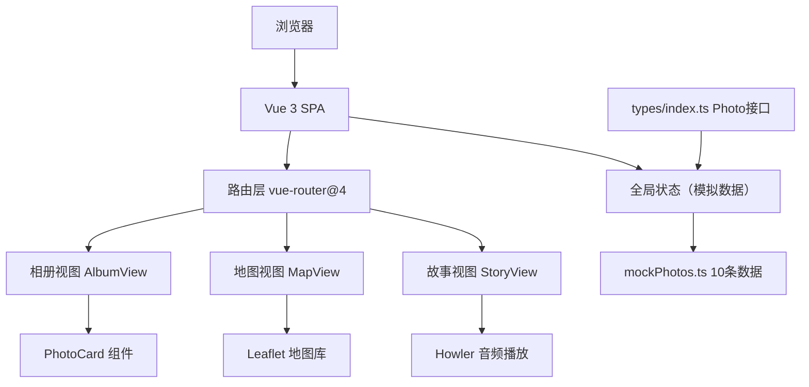

## 1. 架构设计



## 2. 技术描述

- **前端框架**：Vue 3 + Composition API + `<script setup>`
- **构建工具**：Vite 5
- **语言**：TypeScript（严格模式）
- **路由**：vue-router@4
- **地图**：Leaflet.js（轻量地图库，OpenStreetMap瓦片）
- **音频播放**：howler@2
- **工具库**：uuid、lodash
- **样式方案**：原生CSS + CSS变量 + 响应式媒体查询

## 3. 项目文件结构与调用关系

```
├── index.html                 # 入口页面，暖白渐变背景，思源宋体
├── package.json               # 项目依赖与脚本
├── vite.config.js             # Vite构建配置（端口3000，支持TS，路径别名）
├── tsconfig.json              # TS配置（严格模式，ES2020，路径别名@->src）
└── src/
    ├── main.ts                # 应用入口，挂载App，引入全局样式
    ├── App.vue                # 根组件：导航栏 + <router-view>
    │                            调用关系：引入路由配置，渲染三个子视图
    ├── styles/
    │   └── global.css         # 全局样式、CSS变量、响应式断点、动画
    ├── router/
    │   └── index.ts           # 路由定义：/album, /map, /story
    ├── types/
    │   └── index.ts           # Photo接口类型定义
    ├── data/
    │   └── mockPhotos.ts      # 10条模拟照片数据（3个月跨度，3个城市）
    │                            被 AlbumView, MapView, StoryView 引用
    ├── components/
    │   ├── PhotoCard.vue      # 可复用照片卡片（props: Photo对象）
    │   │                        被 AlbumView, StoryView 引用
    │   ├── PhotoModal.vue     # 照片详情模态框
    │   │                        被 AlbumView 引用
    │   ├── AudioPlayer.vue    # 语音播放组件（Howler封装）
    │   │                        被 PhotoModal, StoryView 引用
    │   └── WaveAnimation.vue  # 波形动画组件
    │                            被 AudioPlayer 引用
    └── views/
        ├── AlbumView.vue      # 相册浏览页
        │                        数据流向：mockPhotos → 过滤分页 → PhotoCard列表 → 点击→PhotoModal
        ├── MapView.vue        # 地图标注页
        │                        数据流向：mockPhotos → 提取经纬度 → Leaflet标记 → 点击→信息弹窗
        └── StoryView.vue      # 旅行故事页
                                 数据流向：mockPhotos → 按日期排序 → 时间线卡片 → AudioPlayer
```

## 4. 路由定义

| 路由 | 目的 | 默认 |
|------|------|------|
| /album | 相册浏览页 | 是（默认重定向） |
| /map | 地图标注页 | 否 |
| /story | 旅行故事页 | 否 |

## 5. 数据模型

### 5.1 Photo 接口定义

```typescript
interface Photo {
  id: string;           // 唯一标识（uuid）
  title: string;        // 照片标题
  date: string;         // 拍摄日期（YYYY-MM-DD格式）
  location: string;     // 地点名称
  lat: number;          // 纬度
  lng: number;          // 经度
  imageUrl: string;     // 图片URL（占位图）
  note: string;         // 文字笔记/日记
  audioData: string | null;  // Base64编码音频数据
}
```

### 5.2 模拟数据规格

- **数据量**：10条
- **时间跨度**：3个月
- **城市覆盖**：3个不同城市
- **坐标分布**：每个城市分配合理的经纬度范围
- **音频数据**：Base64短音频占位符

## 6. 性能优化策略

### 6.1 相册视图虚拟滚动
- 使用Intersection Observer API检测可见区域
- 仅渲染视口内的照片卡片
- 不可见区域用固定高度占位符替代
- 图片使用原生 `loading="lazy"` 懒加载

### 6.2 地图视图优化
- Leaflet地图按需加载
- 10个标记点使用Canvas渲染模式
- 标记图标预加载
- 信息弹窗内容缓存

### 6.3 音频播放优化
- Howler.js预加载音频数据
- Base64直接解码，避免网络请求
- 播放状态缓存，减少重复初始化

### 6.4 构建优化
- Vite代码分割
- 路由级懒加载
- CSS提取为单独文件
- Tree-shaking移除未使用代码
