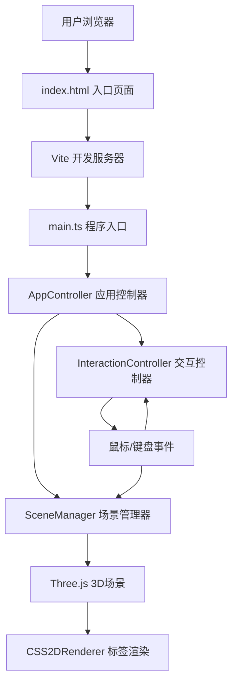

## 1. 架构设计



## 2. 技术说明

- **前端框架**：TypeScript + Three.js@0.160 + Vite@5
- **构建工具**：Vite@5（dev server端口3000）
- **编程语言**：TypeScript（严格模式，target ES2020，module ESNext）
- **3D渲染**：Three.js@0.160
- **标签渲染**：CSS2DRenderer（Three.js扩展）
- **UI面板**：原生HTML/CSS（浅色工业风主题）
- **工具库**：lodash（防抖等工具函数）
- **调试面板**：tweakpane@4（可选调试用）
- **性能监测**：stats.js
- **后端**：无，纯前端应用

## 3. 文件结构

```
├── package.json
├── index.html
├── tsconfig.json
├── vite.config.js
└── src/
    ├── main.ts              # 程序入口：初始化Three.js、相机、渲染器、UI
    ├── sceneManager.ts      # 场景管理：楼层生成、材质、几何体、高亮、标注
    └── interactionController.ts  # 交互控制：视角、点击、标注模式、测量模式
```

## 4. 核心模块定义

### 4.1 SceneManager（场景管理器）

```typescript
interface RoomData {
  id: string;
  name: string;
  floor: number;
  position: { x: number; y: number; z: number };
  size: { width: number; depth: number; height: number };
  area: number;
}

interface FloorData {
  level: number;
  rooms: RoomData[];
  corridor: { x: number; z: number; width: number; depth: number };
  windows: Array<{ position: { x: number; y: number; z: number }; size: { width: number; height: number } }>;
}

interface Annotation {
  id: string;
  position: THREE.Vector3;
  text: string;
  marker: THREE.Mesh;
  label: CSS2DObject;
}

interface Measurement {
  id: string;
  start: THREE.Vector3;
  end: THREE.Vector3;
  line: THREE.Line;
  label: CSS2DObject;
}

class SceneManager {
  constructor(scene: THREE.Scene, css2dRenderer: CSS2DRenderer);
  generateBuilding(): FloorData[];
  updateLayout(floors: FloorData[]): void;
  highlightRoom(roomId: string | null): void;
  getRoomAtPosition(position: THREE.Vector3): RoomData | null;
  addAnnotation(position: THREE.Vector3, text: string): Annotation | null;
  removeAnnotation(id: string): void;
  clearAnnotations(): void;
  addMeasurement(start: THREE.Vector3, end: THREE.Vector3): Measurement;
  clearMeasurements(): void;
  getIntersectables(): THREE.Object3D[];
}
```

### 4.2 InteractionController（交互控制器）

```typescript
type InteractionMode = 'view' | 'annotate' | 'measure';

interface CameraState {
  position: THREE.Vector3;
  target: THREE.Vector3;
}

class InteractionController {
  constructor(
    camera: THREE.PerspectiveCamera,
    domElement: HTMLElement,
    sceneManager: SceneManager
  );
  setMode(mode: InteractionMode): void;
  getMode(): InteractionMode;
  resetCamera(): void;
  update(): void;  // 每帧调用，处理平滑过渡
  onRoomSelect(callback: (room: RoomData | null) => void): void;
  onAnnotationRequest(callback: (position: THREE.Vector3) => void): void;
  onMeasurementComplete(callback: (start: THREE.Vector3, end: THREE.Vector3) => void): void;
  dispose(): void;
}
```

## 5. 数据模型

### 5.1 楼宇生成规则

- **楼层数量**：3层
- **每层房间数**：4-6个（随机）
- **房间尺寸**：宽度4-8m，深度4-6m，高度3m
- **走廊**：每层1条，宽度2m，贯穿楼层长度
- **窗户**：每层2扇，宽度1.5m，高度1.8m
- **楼层间距**：层高3.5m

### 5.2 材质配置

| 对象 | 颜色 | 透明度 | 其他 |
|------|------|--------|------|
| 墙体 | #a0c4ff | 0.7 | MeshPhysicalMaterial, 半透明 |
| 墙体高亮 | #ffd166 | 0.9 | MeshPhysicalMaterial |
| 地板 | #d0d5dd | 1.0 | MeshStandardMaterial |
| 窗户 | #ffffff | 0.3 | MeshPhysicalMaterial, 透明 |
| 标注点 | #118ab2 | 1.0 | MeshStandardMaterial, 半径0.3 |
| 测量线 | #ef476f | 1.0 | LineDashedMaterial, 间隔2 |

## 6. 性能优化策略

1. **几何体复用**：相同尺寸的墙体/地板使用共享的BufferGeometry
2. **材质复用**：同类型对象共享材质实例
3. **防抖处理**：鼠标点击事件使用lodash debounce，避免重复生成
4. **按需渲染**：相机静止时降低渲染频率
5. **标签优化**：CSS2DObject使用简单DOM结构，避免复杂布局
6. **线段优化**：测量线使用BufferGeometry，减少draw call
