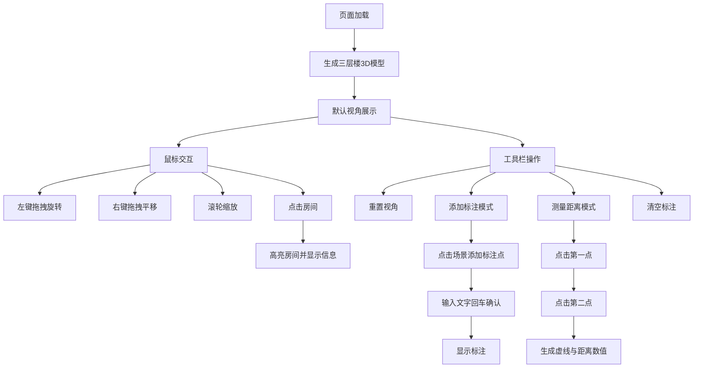

## 1. 产品概述

基于浏览器的3D楼宇内部结构漫游与空间标注应用，用户可加载随机生成的楼层平面图，通过拖拽旋转/缩放视角查看房间、走廊和门窗布局，并能在指定位置添加文字标注、测量两点间距离。

- 主要用途：建筑可视化、空间规划、室内设计辅助、楼宇导览
- 目标用户：建筑师、室内设计师、房产经纪人、物业管理人员
- 产品价值：无需安装软件，在浏览器中即可直观查看楼宇3D结构，支持空间标注与距离测量，提升沟通效率

## 2. 核心功能

### 2.1 功能模块

1. **3D楼宇可视化**：随机生成三层楼房剖面示意图，包含房间、走廊、门窗
2. **视角漫游控制**：鼠标拖拽旋转、右键平移、滚轮缩放
3. **房间高亮与信息展示**：点击房间高亮并显示房间名称与面积
4. **空间标注系统**：在墙面/地板任意位置添加文字标注
5. **距离测量工具**：测量两点间距离并显示数值
6. **工具栏操作**：重置视角、添加标注、测量距离、清空标注

### 2.2 功能详情

| 模块名称 | 子功能 | 功能描述 |
|-----------|--------|----------|
| 3D楼宇可视化 | 楼层生成 | 随机生成三层楼房，每层4-6个房间、1条走廊、2扇窗户 |
| | 材质渲染 | 墙体半透明浅蓝#a0c4ff，地板浅灰#d0d5dd，窗户玻璃#ffffff透明度0.3 |
| | 相机初始位置 | 楼体正前方30度俯视角 |
| 视角漫游控制 | 旋转视角 | 鼠标左键拖拽旋转，灵敏平滑 |
| | 平移视角 | 鼠标右键拖拽平移 |
| | 缩放视角 | 滚轮缩放，范围5-50单位 |
| | 光照保持 | 视角变化时光照方向不变 |
| 房间高亮与信息 | 房间选中 | 点击房间墙体高亮为黄色#ffd166 |
| | 信息标签 | 房间中心上方悬浮显示"房间名-面积m²" |
| | 单选逻辑 | 点击其他房间时取消前一个高亮 |
| 空间标注系统 | 标注模式 | 点击"添加标注"按钮进入标注模式 |
| | 标注点生成 | 点击场景生成蓝色小球（半径0.3） |
| | 文字输入 | 弹出文本输入框，回车确认 |
| | 标注显示 | 小球上方显示文字，24px白色带深色背景遮罩 |
| | 数量限制 | 最多20个标注 |
| 距离测量工具 | 测量模式 | 点击"测量距离"按钮进入测量模式 |
| | 测量线生成 | 两点间红色虚线，线宽2，间隔2单位 |
| | 距离显示 | 虚线中间显示数值，单位米，1位小数 |
| | 退出测量 | ESC键退出并清除所有测量线 |
| 工具栏操作 | 重置视角 | 恢复默认相机位置与角度 |
| | 清空标注 | 移除所有标注与测量线 |

## 3. 核心流程

用户打开页面 → 自动加载随机三层楼3D模型 → 默认30度俯视视角
→ 鼠标拖拽旋转/缩放查看楼宇结构
→ 点击房间查看高亮与房间信息
→ 点击工具栏按钮进入标注/测量模式
→ 在场景中点击添加标注或测量距离
→ ESC键退出特殊模式或点击重置恢复初始状态

## 4. 用户界面设计

### 4.1 设计风格

- **主题风格**：浅色工业风，现代简洁
- **主色调**：背景#eef2f7，面板#ffffff
- **按钮配色**：
  - 重置视角：#457b9d
  - 添加标注：#ef476f
  - 测量距离：#118ab2
  - 清空标注：#6c757d
- **高亮色**：房间高亮#ffd166，测量线#ef476f
- **文字色**：深灰#2b2d42，白色#ffffff
- **按钮样式**：圆形（直径44px），hover放大1.1倍，按下缩小0.95，过渡0.2s
- **面板样式**：圆角8px，阴影rgba(0,0,0,0.1)

### 4.2 页面布局

| 区域 | 模块名称 | UI元素 |
|------|----------|--------|
| 全屏 | 3D场景 | Three.js渲染画布，背景#eef2f7 |
| 左上角 | 标题栏 | "楼宇漫游-空间标注"，深灰#2b2d42字体，半透明玻璃背景 |
| 右下角 | 工具栏 | 垂直排列4个圆形按钮，圆角6px文字白色 |
| 场景中 | 悬浮标签 | CSS2DRenderer渲染，始终面向屏幕，圆角6px，深灰背景白色文字 |
| 场景中 | 标注输入框 | 背景#f8f9fa，圆角4px，边框#ced4da |

### 4.3 响应式设计

- **桌面端**（≥768px）：工具栏按钮44px直径，右下角垂直排列
- **平板端**（<768px）：工具栏按钮缩小至34px直径，增加间距
- **移动端**（<480px）：工具栏移至左下角

### 4.4 3D场景指导

- **环境与氛围**：明亮的室内建筑可视化风格，清晰展示结构
- **光照设置**：方向光+环境光组合，方向光位置固定不随相机变化
- **相机设置**：透视相机，默认30度俯视，位置在楼体正前方
- **交互与动画**：平滑的相机控制过渡，按钮微交互动画
- **性能要求**：30个房间+10个标注+5条测量线时帧率≥50fps
