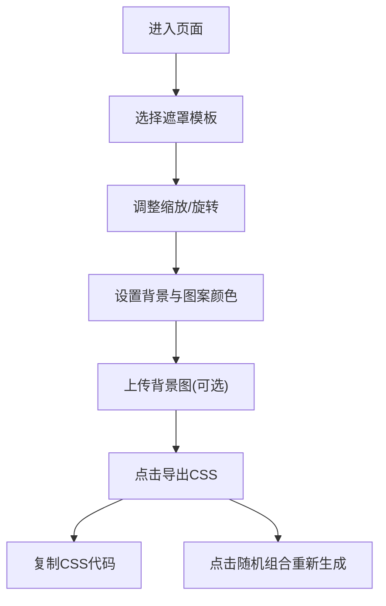

## 1. 产品概述

CSS镂空遮罩图案库是一款面向前端开发者和设计爱好者的在线工具，旨在帮助用户快速生成、预览和导出各类几何镂空与纹理遮罩图案，解决手动编写clip-path或mask-image SVG路径繁琐、难以直观预览叠加效果的痛点。

- 目标用户：前端开发者、UI设计师、设计爱好者
- 核心价值：降低CSS遮罩使用门槛，提供可视化预览与一键导出能力

## 2. 核心功能

### 2.1 功能模块

1. **图案选择区**：8种预设几何镂空模板横向排列，支持点击切换
2. **主预览区**：实时展示遮罩叠加效果，支持缩放、旋转调节
3. **控制面板**：背景色/图案色拾取、背景图上传、导出CSS、随机组合
4. **代码导出模块**：弹窗展示完整CSS代码，支持一键复制

### 2.2 页面详情

| 页面名称 | 模块名称 | 功能描述 |
|---------|---------|---------|
| 主页面 | 图案选择区 | 8种模板（圆形、星形、波浪、菱形、网格、花瓣、闪电、斜条纹）卡片展示，选中状态高亮缩放 |
| 主页面 | 主预览区 | 800x480px预览画布，蓝紫渐变背景，遮罩实时叠加显示 |
| 主页面 | 滑块控件 | 缩放（50%-150%，步长5%）和旋转（0-360°）滑块，实时更新 |
| 主页面 | 控制面板 | 背景色拾取、图案色拾取、自定义背景图上传 |
| 主页面 | 操作按钮 | 导出CSS（弹窗展示mask-image和clip-path方案）、随机组合 |

## 3. 核心流程

用户进入页面 → 浏览并点击选择模板 → 调整缩放/旋转参数 → 切换背景色/图案色或上传背景图 → 点击导出CSS → 复制代码到项目中使用

## 4. 用户界面设计

### 4.1 设计风格

- **主色调**：#6366f1（靛蓝），#4f46e5 到 #7c3aed（蓝紫渐变背景）
- **深色主题**：页面背景 #0f172a，内容区居中
- **卡片样式**：圆角8px，边框 #e0e0e0，选中时边框 #6366f1 并缩放1.05
- **按钮悬浮效果**：box-shadow由 0 2px 4px rgba(0,0,0,0.1) 变为 0 6px 12px rgba(99,102,241,0.3)，过渡0.3s
- **滑块样式**：手柄圆形#6366f1，轨道渐变色

### 4.2 页面设计概述

| 页面名称 | 模块名称 | UI元素 |
|---------|---------|--------|
| 主页面 | 图案选择区 | 60x60px卡片，圆角8px，选中缩放1.05，过渡动画0.2s |
| 主页面 | 主预览区 | 最大宽度800px，高度480px，蓝紫渐变背景，白色半透明遮罩叠加 |
| 主页面 | 控制面板 | 宽度280px，右侧布局，含拾色器和虚线边框上传按钮 |
| 主页面 | 操作按钮 | 导出CSS(#6366f1背景白字)、随机组合(无背景#6366f1文字) |

### 4.3 响应式设计

- 桌面端：控制面板位于预览区右侧，横向排列
- 移动端（<768px）：控制面板自动移至预览区下方，滑块宽度自适应
- 采用桌面优先设计原则

### 4.4 性能要求

- 滑块调节或模板切换时，遮罩重渲染必须在16ms内完成
- 保证60fps流畅滑动体验
