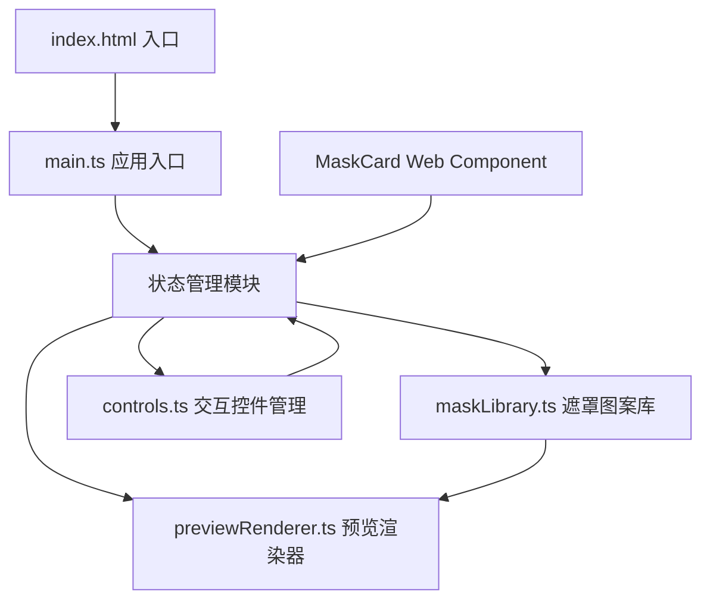

## 1. 架构设计



## 2. 技术栈说明

- **前端框架**：原生Web Components（Shadow DOM封装模板卡片）
- **编程语言**：TypeScript（严格模式，target ES2020）
- **构建工具**：Vite 5
- **开发服务器**：Vite Dev Server，端口3000
- **样式方案**：原生CSS + CSS自定义属性 + Shadow DOM样式隔离

## 3. 文件结构

| 文件路径 | 职责说明 |
|---------|---------|
| package.json | 项目依赖配置（typescript、vite@5） |
| vite.config.js | Vite配置，支持TypeScript，端口3000 |
| tsconfig.json | TypeScript严格模式配置，target ES2020 |
| index.html | 入口HTML，深色背景全局样式，引入主脚本 |
| src/main.ts | 应用入口，DOM初始化、事件绑定、全局状态管理 |
| src/maskLibrary.ts | 8种遮罩模板SVG/clip-path数据，生成mask-image CSS值 |
| src/previewRenderer.ts | 更新预览区遮罩样式和背景，接收状态参数 |
| src/controls.ts | 滑块、拾色器、按钮等交互控件事件绑定和值读取 |

## 4. 数据模型

### 4.1 应用状态接口

```typescript
interface AppState {
  template: string;           // 当前选中模板ID
  scale: number;              // 缩放比例 50-150
  rotation: number;           // 旋转角度 0-360
  backgroundColor: string;    // 背景色(渐变或纯色)
  patternColor: string;       // 图案颜色
  backgroundImage: string | null; // 自定义背景图base64
}
```

### 4.2 遮罩模板接口

```typescript
interface MaskTemplate {
  id: string;
  name: string;
  svgPath: string;        // SVG路径数据
  clipPath: string;       // clip-path备用方案
  viewBox: string;        // SVG视口
}
```

## 5. 性能优化策略

- **DOM缓存**：预览区DOM元素引用缓存，避免重复查询
- **requestAnimationFrame**：滑块调节使用rAF节流，确保16ms内完成渲染
- **CSS变量驱动**：使用CSS自定义属性传递缩放/旋转值，避免频繁style操作
- **Shadow DOM隔离**：模板卡片使用Shadow DOM减少样式重计算范围
- **事件委托**：图案选择区使用事件委托处理卡片点击
