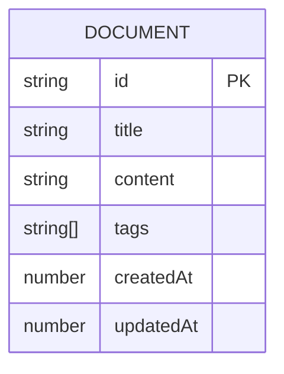

## 1. 架构设计

```mermaid
flowchart LR
    "UI层" --> "状态管理层"
    "状态管理层" --> "数据存储层"
    "UI层" --> "组件层"
    "组件层" --> "Editor组件"
    "组件层" --> "Sidebar组件"
    "组件层" --> "DocumentList组件"
    "组件层" --> "SearchBar组件"
    "组件层" --> "RecentDocs组件"
    "数据存储层" --> "localStorage"
```

## 2. 技术描述

- **前端框架**：React@18 + TypeScript@5
- **构建工具**：Vite@5 + @vitejs/plugin-react
- **样式方案**：原生CSS（CSS变量 + CSS动画）
- **数据存储**：localStorage（本地持久化）
- **编辑器方案**：contenteditable 实现富文本编辑

## 3. 文件组织

| 文件路径 | 用途 |
|----------|------|
| `package.json` | 项目依赖与脚本配置 |
| `vite.config.ts` | Vite构建配置，端口3000 |
| `tsconfig.json` | TypeScript严格模式配置，target ES2020 |
| `index.html` | HTML根入口 |
| `src/main.tsx` | React根渲染入口 |
| `src/components/App.tsx` | 主布局组件，组合所有子组件 |
| `src/components/Editor.tsx` | 富文本编辑器组件 |
| `src/types/index.ts` | TypeScript类型定义 |
| `src/data/mockData.ts` | 20篇模拟文档数据 |
| `src/utils/storage.ts` | localStorage工具函数 |
| `src/styles/App.css` | 全局样式与动画定义 |

## 4. 数据模型

### 4.1 数据定义



### 4.2 TypeScript类型

```typescript
interface Document {
  id: string;
  title: string;
  content: string;
  tags: string[];
  createdAt: number;
  updatedAt: number;
}

interface RecentDoc {
  id: string;
  title: string;
  viewedAt: number;
}

interface AppState {
  documents: Document[];
  recentDocs: RecentDoc[];
  currentDocId: string | null;
  searchQuery: string;
  selectedTag: string | null;
  sidebarCollapsed: boolean;
}
```

## 5. 性能优化策略

- **搜索性能**：使用防抖（debounce）优化搜索输入，<300ms响应
- **渲染性能**：React.memo 优化列表项渲染，虚拟滚动（如需）
- **自动保存**：防抖保存策略，避免频繁写入localStorage
- **首屏加载**：<800ms DOM渲染时间，懒加载非关键组件
- **动画性能**：CSS transform/opacity 动画，避免重排重绘

## 6. 核心功能实现方案

| 功能 | 实现方案 |
|------|----------|
| 富文本编辑 | contenteditable + document.execCommand |
| 自动保存 | useEffect + debounce写入localStorage |
| 实时搜索 | 数组filter + 正则高亮匹配 |
| 标签筛选 | 状态管理 + 按标签分组展示 |
| 最近浏览 | 栈结构存储，最多5条记录 |
| 自动排版 | 正则格式化内容 + CSS过渡对比 |
| 响应式布局 | CSS媒体查询，桌面优先 |

