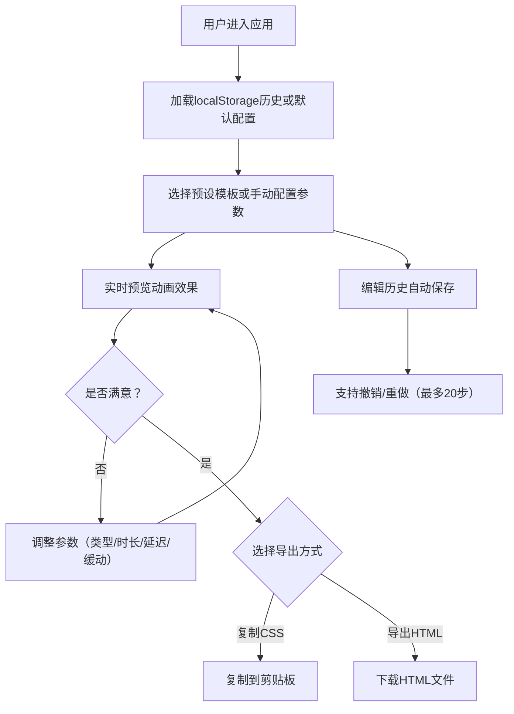

## 1. 产品概述
CSS动画可视化构建工具，解决前端开发中手动编写与调试CSS动画效率低下的问题。
- 目标用户：前端开发者、UI设计师、网页制作爱好者
- 核心价值：通过可视化界面快速生成CSS动画代码，实时预览效果，一键导出使用

## 2. 核心功能

### 2.1 用户角色
无需用户登录，所有功能对所有访问者开放。

### 2.2 功能模块
1. **动画编辑器**：参数控制面板，支持动画类型、持续时间、延迟、缓动函数配置
2. **预览与播放控制**：实时动画预览区域，支持播放/暂停、循环、速度调节
3. **代码导出**：CSS代码实时生成与展示，支持一键复制和HTML文件导出
4. **动画库管理**：预设动画模板、编辑历史记录、撤销/重做功能

### 2.3 页面详情
| 页面名称 | 模块名称 | 功能描述 |
|---------|---------|---------|
| 主界面 | 动画参数控制区 | 下拉菜单选择动画类型，滑块调节持续时间/延迟，下拉选择缓动函数 |
| 主界面 | 预览区域 | 可拖拽的示例元素展示动画效果，播放/暂停/循环/速度控制按钮 |
| 主界面 | 代码展示区 | 实时显示生成的CSS @keyframes代码，复制和导出按钮 |
| 主界面 | 预设模板区 | 5个内置动画模板快速加载，撤销/重做历史操作 |

## 3. 核心流程
用户进入应用后，可选择预设模板或从零开始配置动画参数，实时预览效果，调整满意后复制CSS代码或导出HTML文件。编辑过程中所有操作自动保存到localStorage，支持撤销/重做。

## 4. 用户界面设计

### 4.1 设计风格
- 主色调：深色渐变背景（#1a1a2e → #16213e）
- 卡片风格：毛玻璃Glassmorphism效果，rgba(255,255,255,0.1)半透明背景，模糊边框
- 交互反馈：控件悬浮高亮 + 0.2秒缩放点击动画
- 字体：现代无衬线字体，清晰可读

### 4.2 页面设计概览
| 页面名称 | 模块名称 | UI元素 |
|---------|---------|---------|
| 主界面 | 参数控制区 | 玻璃卡片、下拉菜单、范围滑块、标签文字、数值显示 |
| 主界面 | 预览区 | 居中展示区、可拖拽彩色方块/圆形、播放控制栏（播放/暂停按钮、循环开关、速度滑块） |
| 主界面 | 代码展示区 | 玻璃卡片、语法高亮代码块、复制按钮、导出按钮 |
| 主界面 | 预设与历史 | 预设动画按钮组、撤销/重做按钮 |

### 4.3 响应式
- 桌面端优先（最小宽度1024px）：三栏布局，宽度比例1:2:1
- 移动端：控制区和代码区折叠为可横向滚动的选项卡，预览区全屏展示
- 触控优化：移动端按钮尺寸增大，支持触摸拖拽

### 4.4 性能要求
- 预览区动画帧率 ≥ 30fps
- 代码高亮更新延迟 ≤ 200ms
- 参数调整响应时间 < 100ms
