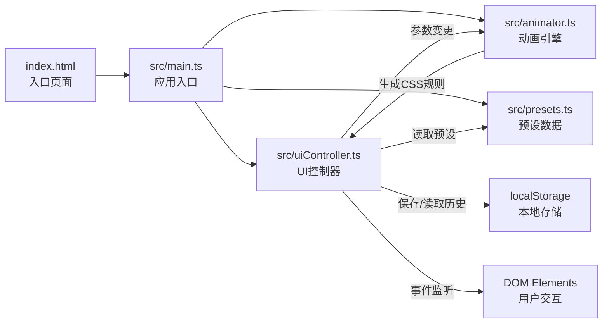

## 1. 架构设计
纯前端应用，采用模块化TypeScript架构，无后端服务，数据存储在浏览器localStorage中。



## 2. 技术说明
- 前端框架：纯TypeScript，无UI框架
- 构建工具：Vite 5.x + TypeScript（ES2020目标，严格模式）
- 样式方案：原生CSS + CSS变量，实现Glassmorphism毛玻璃效果
- 动画方案：原生CSS @keyframes，通过动态注入style标签实现
- 数据存储：localStorage保存编辑历史
- 开发服务器：Vite devServer，端口3000，开启HMR热更新

## 3. 文件结构
| 文件路径 | 作用 |
|---------|------|
| package.json | 项目依赖与脚本配置 |
| vite.config.js | Vite构建配置 |
| tsconfig.json | TypeScript编译配置 |
| index.html | 应用入口页面 |
| src/main.ts | 应用入口，初始化UI和事件绑定 |
| src/animator.ts | 核心动画引擎，生成@keyframes规则，控制播放 |
| src/uiController.ts | UI控制器，管理DOM事件，参数读取，代码更新 |
| src/presets.ts | 预设动画模板数据 |
| src/styles.css | 全局样式，Glassmorphism设计 |

## 4. 接口定义
```typescript
// 动画参数接口
interface AnimationConfig {
  type: string;           // 动画类型
  duration: number;       // 持续时间（秒）
  delay: number;          // 延迟（秒）
  easing: string;         // 缓动函数
  iterationCount: string; // 播放次数 'infinite' 或数字
  direction: string;      // 播放方向
  fillMode: string;       // 填充模式
}

// 预设模板接口
interface AnimationPreset {
  name: string;
  config: AnimationConfig;
}

// Animator公共接口
interface IAnimator {
  start(): void;
  stop(): void;
  reset(): void;
  setSpeed(speed: number): void;
  getKeyframesCSS(): string;
  getAnimationCSS(): string;
  updateConfig(config: Partial<AnimationConfig>): void;
}
```

## 5. 性能优化策略
- 使用requestAnimationFrame确保动画帧率≥30fps
- 滑块事件使用节流（throttle）优化，减少不必要的重渲染
- CSS代码生成采用缓存机制，参数未变化时不重新生成
- 动态style标签复用，避免频繁创建销毁DOM节点
- 使用CSS transform和opacity实现动画，触发GPU加速
