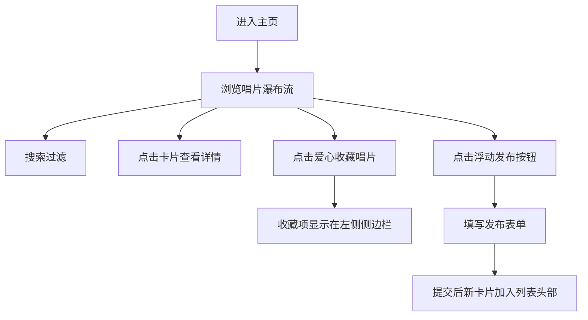

## 1. 产品概述

黑胶唱片收藏管理与二手交易平台，面向小型独立唱片店和黑胶收藏爱好者，帮助其高效管理唱片收藏、展示与交易。解决传统方式下翻箱倒柜查找唱片和Excel手动维护的痛点，让唱片整理和交易意向匹配像听歌一样顺畅。

## 2. 核心功能

### 2.1 用户角色
| 角色 | 注册方式 | 核心权限 |
|------|----------|----------|
| 唱片店/收藏者 | 无需注册，本地使用 | 浏览、搜索、发布、收藏唱片 |

### 2.2 功能模块
1. **唱片瀑布流展示**：3列瀑布流网格展示唱片卡片，支持悬停动效和详情侧栏
2. **实时搜索过滤**：顶部搜索框，关键词实时过滤，防抖处理
3. **发布新唱片**：浮动发布按钮，模态框表单支持拖拽上传封面
4. **收藏管理**：每张卡片可收藏，左侧可收起收藏夹侧边栏
5. **唱片详情面板**：点击卡片从右侧滑入详情面板，展示完整信息

### 2.3 页面详情
| 页面名称 | 模块名称 | 功能描述 |
|----------|----------|----------|
| 主页面 | 导航栏 | 高度56px，深棕背景#3d2b1f，米白字体#f5e6c8，左侧搜索框 |
| 主页面 | 瀑布流卡片网格 | 3列瀑布流，卡片宽280px，米白背景#f5f0e8，圆角10px，悬停上移6px+暖黄高亮 |
| 主页面 | 详情侧栏 | 宽380px，纯白背景，从右侧滑入，显示唱片完整信息 |
| 主页面 | 收藏夹侧边栏 | 宽220px，米色背景#e8dcc8，从左侧滑入，按收藏时间倒序 |
| 主页面 | 浮动发布按钮 | 直径56px圆形，渐变背景#e76f51→#d45d3a，点击弹出模态框 |
| 主页面 | 发布模态框 | 宽560px，圆角16px，半透明黑色遮罩，含表单和拖拽上传 |

## 3. 核心流程

用户进入应用后，可浏览唱片瀑布流列表 → 通过搜索框关键词实时过滤 → 点击卡片查看详情侧栏 → 点击爱心按钮收藏唱片（收藏项进入左侧侧边栏） → 点击浮动按钮发布新唱片（填写表单、上传封面、提交后新卡片弹出加入列表头部）。

## 4. 用户界面设计

### 4.1 设计风格
- **主色调**：深棕#3d2b1f、米白#f5f0e8、米色#e8dcc8
- **强调色**：珊瑚橙#e76f51、红#e63946、青#2a9d8f、蓝绿#4ecdc4
- **版本标签色**：首版#d4a373、再版#8d6e63、彩胶#5d4037
- **字体**：深棕色为主，米白用于深色背景
- **圆角风格**：卡片10px、搜索框20px、模态框16px、按钮圆形
- **动效风格**：ease-out缓动，卡片上移6px，详情侧栏滑入0.3秒

### 4.2 页面设计概述
| 页面名称 | 模块名称 | UI元素 |
|----------|----------|--------|
| 主页面 | 导航栏 | 深棕背景、米白字体、圆角搜索框、占位符上移动画 |
| 主页面 | 卡片网格 | 3列瀑布流、米白卡片、浅灰阴影#ccc、悬停阴影加深到#999、半透明暖黄rgba(245,200,120,0.15) |
| 主页面 | 详情侧栏 | 从右侧滑入、纯白背景、版本彩色标签、状态小圆点、收藏故事 |
| 主页面 | 收藏侧边栏 | 从左侧滑入、米色背景、缩略图+名称、按时间倒序、点击高亮主卡片 |
| 主页面 | 发布按钮 | 圆形渐变、固定右下角、悬停效果 |
| 主页面 | 发布模态框 | 居中显示、半透明遮罩、拖拽上传区域、表单输入、提交动画 |

### 4.3 响应式
- **桌面端（≥768px）**：3列瀑布流、导航栏正常、搜索框240px、按钮56px
- **移动端（<768px）**：2列瀑布流、导航栏固定顶部、搜索框缩窄至120px、按钮缩小到44px、模态框宽度90%

### 4.4 性能指标
- 首次加载渲染60张卡片 ≤ 800ms
- 瀑布流滚动加载每批 ≤ 100ms
- 卡片hover动画保持 60FPS
