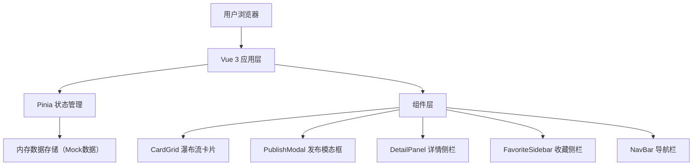
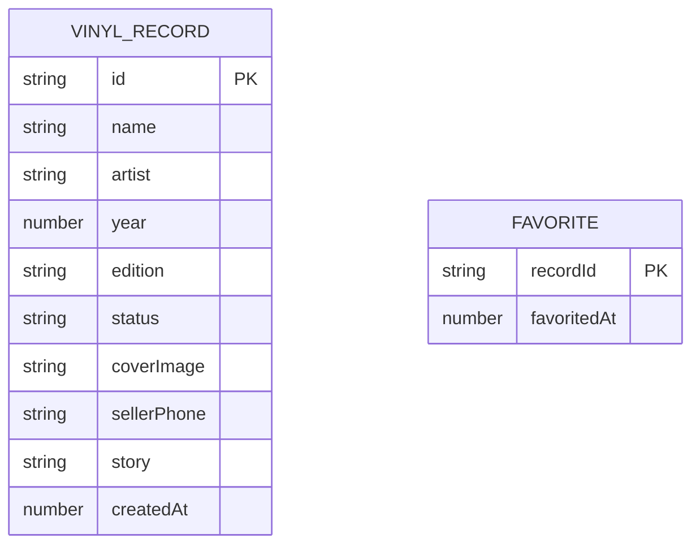

## 1. 架构设计



## 2. 技术描述
- **前端框架**：Vue 3 + TypeScript
- **构建工具**：Vite 5
- **状态管理**：Pinia
- **路由**：Vue Router 4（预留）
- **工具库**：uuid（生成唯一ID）、lodash（防抖等工具函数）
- **后端**：无，使用内存Mock数据，预留API切换接口
- **数据库**：无，数据存储于Pinia store内存中

## 3. 路由定义
| 路由 | 用途 |
|------|------|
| / | 主页面（唱片瀑布流、搜索、发布、收藏） |

## 4. API 定义（预留）
当前使用内存Mock数据，未来可切换为真实API。数据结构定义如下：

```typescript
// 唱片版本类型
type EditionType = 'first' | 'reprint' | 'colored';

// 唱片状态类型
type StatusType = 'for_sale' | 'for_trade' | 'show_only';

// 唱片信息接口
interface VinylRecord {
  id: string;
  name: string;
  artist: string;
  year: number;
  edition: EditionType;
  status: StatusType;
  coverImage: string; // base64
  sellerPhone: string;
  story: string;
  createdAt: number;
}

// 收藏项接口
interface FavoriteItem {
  recordId: string;
  favoritedAt: number;
}
```

## 5. 数据模型
### 5.1 数据模型定义


## 6. 项目文件结构
```
├── package.json          # 项目依赖与脚本
├── index.html            # 入口HTML
├── vite.config.js        # Vite配置
├── tsconfig.json         # TypeScript配置
└── src/
    ├── main.ts           # 应用入口
    ├── App.vue           # 根组件
    ├── 组件/
    │   ├── CardGrid.vue      # 瀑布流卡片网格
    │   └── PublishModal.vue  # 发布唱片模态框
    ├── store/
    │   └── useCollection.ts  # Pinia状态管理
    └── 数据类型/
        └── types.ts          # TypeScript类型定义
```

## 7. 性能优化策略
- 使用CSS transform/opacity实现动画，触发GPU加速
- 搜索过滤使用lodash防抖（0.2秒）
- 卡片列表使用v-show控制显隐，配合CSS过渡动画
- 所有动画使用CSS transition/animation，避免JS计算
- 图片使用base64内嵌避免网络请求（Mock数据阶段）
