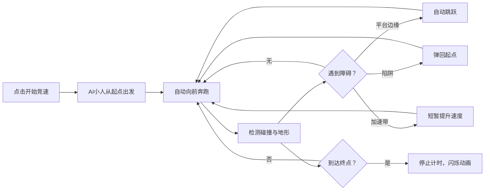

## 1. 产品概述

本项目是一个基于浏览器的2D跑酷游戏关卡编辑器与自动竞速模拟应用，用户可自由设计包含平台、陷阱和加速带的横版关卡，并让AI控制的小人自动完成赛道并记录通关时间。

- 主要目的：提供一个可视化的关卡设计工具，让用户无需编程即可创建跑酷关卡，并通过AI模拟验证关卡可行性
- 目标用户：游戏爱好者、关卡设计师、教育场景中的学习者
- 市场价值：降低关卡设计门槛，提供即时可视化反馈，支持关卡的保存与分享

## 2. 核心功能

### 2.1 功能模块

1. **关卡编辑器**：画布区域、工具栏、元素创建/选择/移动/删除
2. **AI竞速模拟**：自动控制小人移动、跳跃、碰撞检测、加速带效果、陷阱惩罚
3. **关卡保存/加载**：JSON序列化导出、文件上传还原
4. **计时器与状态管理**：实时计时显示、完成闪烁动画、重置功能
5. **响应式UI**：桌面端与移动端适配布局

### 2.2 页面详情

| 页面名称 | 模块名称 | 功能描述 |
|-----------|-------------|---------------------|
| 主页面 | 标题区域 | 显示"跑酷关卡工坊"标题，居中展示 |
| 主页面 | 工具栏 | 垂直/水平排列三个工具按钮（平台、陷阱、加速带），支持选中高亮 |
| 主页面 | 画布区域 | 800x500px画布，浅蓝色天空背景，支持编辑模式与竞速模式 |
| 主页面 | 操作按钮栏 | 开始竞速、保存、加载、重置、清除全部按钮 |
| 主页面 | 计时器 | 画布右上角显示当前通关时间，精确到毫秒 |

## 3. 核心流程

### 3.1 关卡编辑流程

### 3.2 AI竞速流程

## 4. 用户界面设计

### 4.1 设计风格

- **主色调**：深灰 #2c3e50（页面背景），浅蓝 #d4e6f1（画布背景）
- **功能色**：
  - 平台：绿色矩形
  - 陷阱：红色菱形
  - 加速带：橙色梯形
  - 小人：紫色圆形，白色眼睛，红色帽子
  - 操作按钮：蓝色 #2980b9（开始）、灰色 #95a5a6（重置）、红色 #e74c3c（清除）
  - 选中边框：蓝色 #3498db 虚线
  - 工具栏选中：#f39c12 高亮边框
- **按钮样式**：圆角8px，悬停背景变亮20%，点击时缩放0.98倍（0.1秒动画）
- **字体**：Arial，标题28px，计时18px，带文字阴影效果
- **布局风格**：居中布局，画布为核心，工具栏在左侧，操作按钮在下方

### 4.2 页面设计概述

| 页面名称 | 模块名称 | UI元素 |
|-----------|-------------|-------------|
| 主页面 | 标题区域 | 白色字体28px，文字阴影#000偏移2px，居中显示 |
| 主页面 | 工具栏 | 50x50px按钮，圆角8px，垂直排列（桌面端），选中时#f39c12边框高亮 |
| 主页面 | 画布区域 | 800x500px，浅蓝#d4e6f1背景，元素可编辑，计时器在右上角 |
| 主页面 | 操作按钮栏 | 按钮间距10px，圆角8px，悬停与点击动画效果 |
| 主页面 | 计时器 | 白色18px Arial字体，精确到毫秒，完成时闪烁3次 |

### 4.3 响应式设计

- **桌面端（≥768px）**：工具栏在画布左侧垂直排列，操作按钮在画布下方水平排列
- **移动端（<768px）**：工具栏移到画布上方水平排列，操作按钮分为两行显示
- 所有元素保持合理的触摸操作区域

## 5. 性能要求

- Canvas渲染帧率稳定在30fps以上
- 动画循环使用requestAnimationFrame
- 编辑器拖拽操作响应延迟小于50ms
