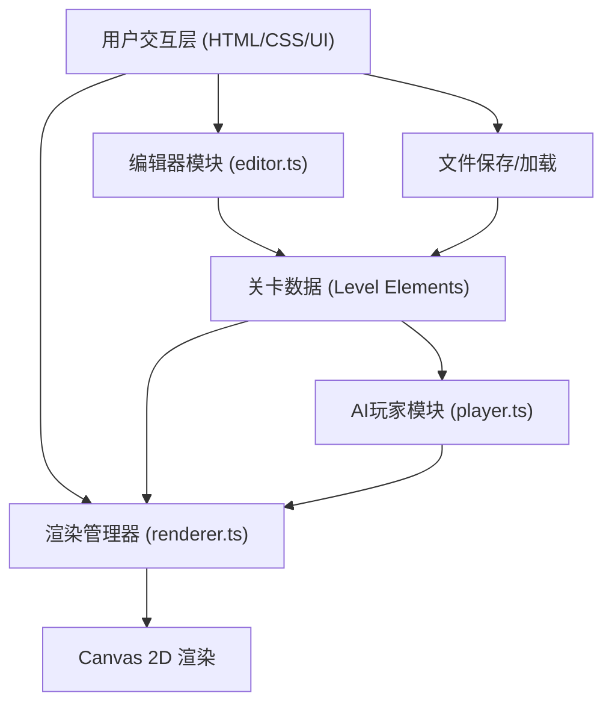

## 1. 架构设计



## 2. 技术说明

- **前端框架**：原生TypeScript + Canvas 2D + Vite 5
- **开发语言**：TypeScript 5（严格模式，target ES2020）
- **构建工具**：Vite 5
- **工具库**：lodash（工具函数）、uuid（元素唯一标识）
- **无后端**：纯前端应用，数据保存在本地/JSON文件

## 3. 模块职责

### 3.1 src/editor.ts - 关卡编辑器核心逻辑
- 处理鼠标事件（mousedown/mousemove/mouseup/click）
- 管理当前选中的工具类型（platform/trap/boost）
- 创建、选择、拖拽移动、删除关卡元素
- 维护关卡元素数据数组
- 碰撞检测（元素选择）

### 3.2 src/player.ts - AI小人移动逻辑
- 物理模拟：位置、速度、重力加速度
- AI决策：平台边缘检测、自动跳跃
- 碰撞检测：与平台、陷阱、加速带的交互
- 速度控制：基础速度、加速带效果（1.5倍持续2秒）
- 状态管理：奔跑、跳跃、死亡状态

### 3.3 src/renderer.ts - 渲染管理器
- Canvas 2D绘制：背景、关卡元素、AI小人、计时器
- 动画循环：requestAnimationFrame驱动
- 帧同步：编辑器与竞速模式的渲染更新
- 选中状态绘制：虚线边框
- 完成动画：计时器闪烁效果

## 4. 数据模型定义

### 4.1 关卡元素类型

```typescript
type ElementType = 'platform' | 'trap' | 'boost';

interface LevelElement {
  id: string;
  type: ElementType;
  x: number;
  y: number;
  width: number;
  height: number;
}

interface EditorState {
  selectedTool: ElementType | null;
  selectedElementId: string | null;
  isDragging: boolean;
  dragOffset: { x: number; y: number };
  elements: LevelElement[];
}

interface PlayerState {
  x: number;
  y: number;
  vx: number;
  vy: number;
  radius: number;
  isJumping: boolean;
  boostEndTime: number;
  isRunning: boolean;
  hasFinished: boolean;
}

interface GameState {
  mode: 'edit' | 'racing';
  startTime: number;
  currentTime: number;
  flashCount: number;
  flashPhase: number;
}
```

## 5. 文件结构

```
├── package.json          # 项目依赖与脚本
├── index.html            # 入口页面
├── tsconfig.json         # TypeScript配置
├── vite.config.js        # Vite构建配置
└── src/
    ├── editor.ts         # 编辑器逻辑
    ├── player.ts         # AI玩家逻辑
    └── renderer.ts       # 渲染管理器
```

## 6. 关键技术点

### 6.1 Canvas渲染优化
- 使用requestAnimationFrame保证流畅动画
- 分层绘制：背景→元素→玩家→UI
- 最小化重绘区域

### 6.2 物理模拟
- 重力加速度：约980 px/s²
- 跳跃初速度：根据目标高度60px计算
- 速度积分：每帧更新位置与速度

### 6.3 AI决策逻辑
- 前方检测：预测平台边缘位置
- 跳跃时机：当检测到前方无平台且有目标平台时起跳
- 碰撞响应：AABB碰撞检测，陷阱触发重置，加速带触发buff

### 6.4 响应式布局
- CSS媒体查询：@media (max-width: 768px)
- Flexbox布局：动态切换工具栏排列方向
