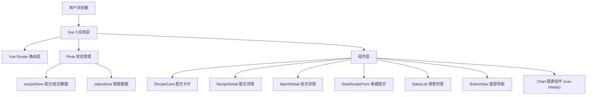
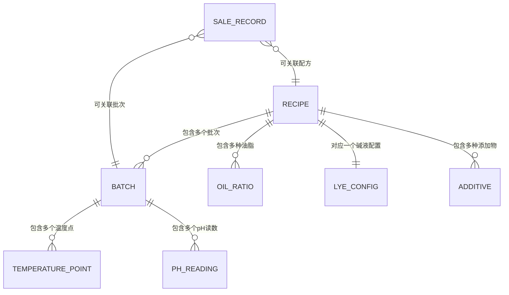

## 1. 架构设计



## 2. 技术说明

- **前端框架**：Vue 3 + TypeScript + Vite 5
- **路由管理**：vue-router@4
- **状态管理**：pinia
- **图表库**：chart.js + vue-chartjs
- **工具库**：uuid（ID生成）、lodash（数据处理）
- **构建工具**：Vite 5 + @vitejs/plugin-vue
- **数据存储**：前端 Mock 数据，使用 Pinia store 管理内存状态

## 3. 路由定义

| 路由路径 | 页面组件 | 用途 |
|-------|---------|---------|
| / | RecipeLibrary.vue | 配方库首页，卡片网格展示 |
| /recipe/:id | RecipeDetail.vue | 配方详情页，油脂比例+批次历史 |
| /batch/:id | BatchDetail.vue | 批次详情页，温度记录+pH值 |
| /new-recipe | NewRecipeForm.vue | 新建配方分步表单 |
| /sales | SalesList.vue | 销售记录列表页 |

## 4. 数据模型定义

### 4.1 TypeScript 类型定义

```typescript
// 皂化类型
type SoapType = 'cold' | 'hot' | 'liquid';

// 肤质类型
type SkinType = 'oily' | 'dry' | 'normal' | 'sensitive' | 'combination';

// 油脂配方
interface OilRatio {
  id: string;
  name: string;
  percentage: number;
  color: string;
}

// 碱液配置
interface LyeConfig {
  type: 'NaOH' | 'KOH';
  concentration: number;
  waterAmount: number;
  superFat: number;
}

// 添加物
interface Additive {
  id: string;
  name: string;
  type: 'essential_oil' | 'herb' | 'colorant' | 'other';
  amount: number;
  unit: string;
}

// 温度记录点
interface TemperaturePoint {
  time: string;
  temperature: number;
  note?: string;
}

// pH记录
interface PHReading {
  time: string;
  value: number;
}

// 批次
interface Batch {
  id: string;
  recipeId: string;
  batchNumber: string;
  date: string;
  temperatureLog: TemperaturePoint[];
  phReadings: PHReading[];
  finalPH: number;
  status: 'in_progress' | 'curing' | 'completed';
  yieldAmount: number;
  notes: string;
}

// 配方
interface Recipe {
  id: string;
  name: string;
  type: SoapType;
  skinType: SkinType;
  description: string;
  oils: OilRatio[];
  lye: LyeConfig;
  additives: Additive[];
  totalOilWeight: number;
  createdAt: string;
  updatedAt: string;
  batches: Batch[];
}

// 销售记录
interface SaleRecord {
  id: string;
  productName: string;
  recipeId?: string;
  batchId?: string;
  saleDate: string;
  price: number;
  cost: number;
  profitMargin: number;
  quantity: number;
  buyerNote?: string;
}
```

### 4.2 数据模型关系图



## 5. 文件结构

```
src/
├── main.ts              # 应用入口
├── App.vue              # 根组件
├── router/
│   └── index.ts         # 路由配置
├── stores/
│   └── recipeStore.ts   # Pinia状态管理
├── components/
│   ├── RecipeCard.vue   # 配方卡片组件
│   ├── RecipeDetail.vue # 配方详情组件
│   ├── RecipeLibrary.vue# 配方库首页
│   ├── NewRecipeForm.vue# 新建配方表单
│   ├── BatchDetail.vue  # 批次详情组件
│   ├── SalesList.vue    # 销售记录列表
│   └── BottomNav.vue    # 底部导航组件
├── types/
│   └── index.ts         # TypeScript类型定义
└── mock/
    └── data.ts          # Mock初始数据
```

## 6. 性能优化策略

- **图表性能**：温度折线图数据点限制200个，使用 Chart.js 的 decimation 插件进行降采样，保证30fps以上
- **懒加载**：路由级别懒加载，图表组件按需加载
- **状态优化**：Pinia store 使用合理的模块拆分，避免不必要的响应式更新
- **过渡动画**：使用 Vue Transition 组件，页面切换动画控制在0.3s内完成
- **响应式**：768px断点下切换单列布局，减少重排开销
