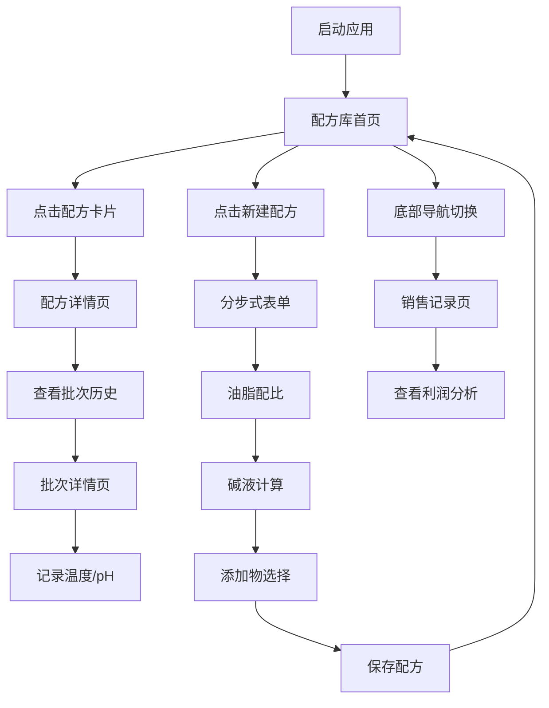

## 1. 产品概述

"皂方录"是一款面向小型手工皂工作室的配方与批次管理系统，帮助工作室从纸质笔记本转向数字化管理，提升配方迭代效率和批次追踪能力。

- 解决手工皂配方数据分散、批次追溯困难、成本核算繁琐的痛点
- 目标用户为独立手工皂制作师、小型工作室经营者，追求自然手工的品牌调性

## 2. 核心功能

### 2.1 用户角色
本产品为单用户场景，无需复杂的角色权限区分。

### 2.2 功能模块
1. **配方库首页**：卡片网格展示所有配方，支持按类型筛选，点击进入详情
2. **配方详情页**：展示完整油脂比例、批次历史表格，支持查看批次详情
3. **新建配方页**：分步式引导创建新配方（油脂配比→碱液计算→添加物选择）
4. **批次详情页**：实时温度记录折线图、pH值记录与进度环展示
5. **销售记录页**：已售出皂块列表，含成本、售价、利润率计算

### 2.3 页面详情
| 页面名称 | 模块名称 | 功能描述 |
|-----------|-------------|---------------------|
| 配方库首页 | 配方卡片网格 | 280x160px卡片，#faf3e0背景，悬停上浮8px，展示名称/类型/肤质/前3种油脂 |
| 配方库首页 | 类型色块标注 | 冷制皂#7fb3a2、热制皂#c9a87c、液体皂#b8a9c9 |
| 配方详情页 | 基本信息区 | #f0e6d3背景，圆角16px，横向堆叠条展示油脂比例（橄榄#9ac4a3/椰子#e8c4a0/棕榈#d4a373） |
| 配方详情页 | 批次历史表格 | 批次号/日期/温度缩略折线图/pH进度环，悬停#e8dbc4高亮 |
| 新建配方页 | 分步引导 | 3步引导（油脂配比→碱液计算→添加物选择），底部圆点进度指示 |
| 新建配方页 | 步骤按钮 | #8b6f47背景圆角8px白色文字，已完成圆点实心#8b6f47，未完成空心#d4c5a9 |
| 批次详情页 | 温度折线图 | 8小时温度记录，#1e2a38背景，#3a4a5a刻度线，可手动添加标记点 |
| 批次详情页 | pH值记录 | 圆形进度环展示最终pH值，红→绿渐变色 |
| 销售记录页 | 销售表格 | 产品名/售价/成本/利润率标签，利润率使用绿→红渐变背景 |
| 全局导航 | 底部导航栏 | 固定高56px，#2c2c2c背景，圆角20px，三个图标按钮（配方库/批次追踪/销售记录） |

## 3. 核心流程

## 4. 用户界面设计

### 4.1 设计风格
- **主色调**：暖木色#8b6f47、米白色#faf3e0、浅棕#d4c5a9
- **辅助色**：冷制皂#7fb3a2、热制皂#c9a87c、液体皂#b8a9c9
- **强调色**：油脂类专用色（橄榄#9ac4a3、椰子#e8c4a0、棕榈#d4a373）
- **按钮风格**：圆角8px，暖木色填充，白色文字，0.2s缓动过渡
- **字体**：使用思源宋体/Noto Serif SC营造手工自然感，标题加粗
- **布局风格**：卡片式布局，圆角设计，大量留白，温暖手账风格
- **图标风格**：线性图标，米色系为主，与手工自然调性一致

### 4.2 页面设计概览
| 页面名称 | 模块名称 | UI元素 |
|-----------|-------------|-------------|
| 配方库首页 | 卡片网格 | 卡片280x160px、#faf3e0背景、圆角12px、边框#d4c5a9、悬停transform: translateY(-8px)、box-shadow加深 |
| 配方详情页 | 油脂比例图 | 横向堆叠条形图，不同油脂颜色区分，#f0e6d3信息区背景 |
| 批次详情页 | 温度折线图 | #1e2a38深色背景，折线使用暖色调，可交互添加数据点 |
| 新建配方页 | 步骤指示 | 底部圆点进度条，直径12px，实心/空心状态区分 |
| 全局导航 | 底部导航栏 | #2c2c2c深色背景，圆角20px，内边距8px，按钮60x40px圆形，悬停半透明白 |

### 4.3 响应式设计
- 桌面端优先设计，768px以下自动切换为单列布局
- 移动端卡片宽度占满容器，底部导航自适应
- 图表组件在小屏下自动调整尺寸，保证可读性
- 触摸操作优化，按钮点击区域不小于44px

### 4.4 动效设计
- 所有悬停/点击反馈使用0.2s ease-in-out缓动过渡
- 卡片悬停上浮8px并加深阴影
- 页面切换使用淡入淡出过渡，目标1秒内完成
- 数据点添加有轻微的缩放弹动效果
