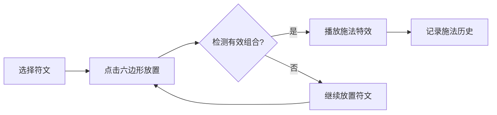

## 1. 产品概述

魔法阵工坊是一个基于浏览器的2D魔法阵绘制与施法模拟应用，用户可通过组合不同魔法符文在六边形法阵中绘制图案，触发丰富的施法动画和特效，并记录施法历史。

- 核心目标：提供沉浸式的魔法施法体验，让用户通过简单的交互创造独特的魔法组合
- 目标用户：魔法/奇幻爱好者、创意交互体验用户、休闲玩家
- 市场价值：探索Canvas 2D粒子特效与交互设计的创意应用，展示前端图形渲染能力

## 2. 核心功能

### 2.1 用户角色
| 角色 | 注册方式 | 核心权限 |
|------|----------|----------|
| 普通用户 | 无需注册 | 绘制符文、触发法术、查看历史记录 |

### 2.2 功能模块
1. **主界面**：六边形法阵网格、符文选择面板、施法历史记录、操作按钮
2. **符文系统**：5种魔法符文（火焰、冰霜、雷电、治愈、暗影）的选择与放置
3. **施法系统**：符文组合检测、粒子特效播放、法术名称展示
4. **历史记录**：施法组合记录、时间戳、本地存储持久化

### 2.3 页面详情
| 页面名称 | 模块名称 | 功能描述 |
|----------|----------|----------|
| 主界面 | 六边形法阵网格 | 3层蜂窝状六边形网格，支持点击高亮、放置符文、脉冲动画 |
| 主界面 | 符文选择面板 | 左侧竖向排列5个符文图标，点击选中后可放置到法阵 |
| 主界面 | 施法特效系统 | 检测有效符文组合，播放对应的粒子动画和文字提示 |
| 主界面 | 施法历史记录 | 右侧滚动显示最近20次施法记录，支持本地存储 |
| 主界面 | 操作按钮 | 清空法阵（带扩散淡出动画）、撤销上一步（带淡出动画） |

## 3. 核心流程

用户选择符文 → 点击六边形放置 → 系统检测符文序列 → 匹配到有效组合 → 播放施法特效 → 记录施法历史

## 4. 用户界面设计

### 4.1 设计风格
- **主色调**：深紫渐变背景 (#1a0a2e → #2d1b4e)
- **辅助色**：浅蓝边框 (#4a90d9)、金色高亮 (#ffd700)、符文五色（红/蓝/黄/绿/紫）
- **按钮风格**：圆角6px，悬停亮度提升20%，0.2秒过渡
- **字体**：银白色，标题带微弱光晕效果
- **布局风格**：三栏布局（左20%符文面板 / 中60%法阵 / 右20%历史记录）
- **视觉效果**：玻璃拟态面板、粒子特效、发光边框、脉冲动画

### 4.2 页面设计概览
| 页面名称 | 模块名称 | UI元素 |
|----------|----------|--------|
| 主界面 | 标题区 | "魔法阵工坊" 居中上方，银白色光晕文字 |
| 主界面 | 符文面板 | 半透明玻璃效果，5个圆形符文图标竖向排列 |
| 主界面 | 法阵区域 | 六边形蜂窝网格，浅蓝边框，支持符文放置 |
| 主界面 | 操作按钮 | 清空法阵（红色）、撤销上一步（灰色），位于法阵上方 |
| 主界面 | 历史记录 | 右侧滚动列表，符文组合小圆点 + 时间戳 |
| 主界面 | 特效层 | Canvas粒子动画、法术名称淡入淡出 |

### 4.3 响应式设计
- 桌面优先设计，最小宽度800px
- Canvas区域自适应中央容器
- 面板区域保持固定比例

## 5. 预设法术组合

| 组合名称 | 符文序列 | 特效描述 | 持续时间 |
|----------|----------|----------|----------|
| 爆裂 | 火+火+火 | 全屏红色爆炸粒子效果 | 2秒 |
| 冻结 | 冰+冰+冰 | 六边形网格覆盖冰晶扩散动画 | 2秒 |
| 闪电风暴 | 火+雷 | 从背景射下多个黄色闪电 | 1.5秒 |
| 地狱火 | 暗+暗+火 | 从地面升起暗红色火焰柱 | 2秒 |
| 风暴 | 雷+水+火 | 旋转的雷电水龙卷 | 2.5秒 |
