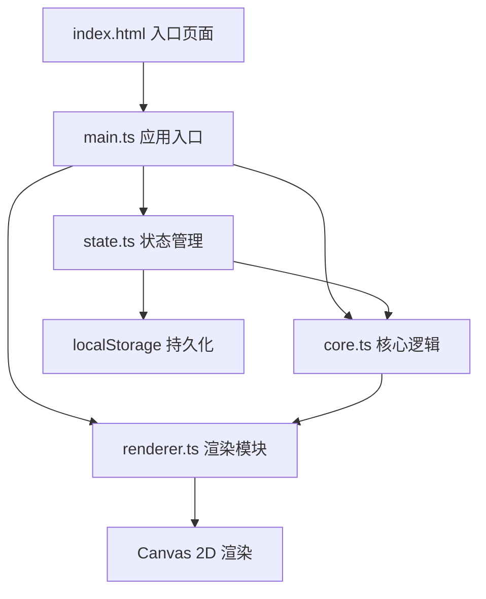

## 1. 架构设计



## 2. 技术描述

- **前端框架**：TypeScript + Vite@5
- **渲染引擎**：Canvas 2D API
- **工具库**：lodash、uuid
- **状态管理**：自研轻量状态模块（state.ts）
- **数据持久化**：浏览器 localStorage
- **动画系统**：requestAnimationFrame 帧循环 + 对象池粒子管理

## 3. 目录结构

```
auto216/
├── index.html              # 入口HTML页面
├── package.json            # 项目依赖与脚本
├── tsconfig.json           # TypeScript配置
├── vite.config.js          # Vite构建配置
└── src/
    ├── main.ts             # 应用入口，初始化画布和UI
    ├── core.ts             # 核心逻辑：法阵网格、符文管理、路径检测、动画调度
    ├── renderer.ts         # 渲染模块：六边形网格、符文、粒子特效、帧循环
    └── state.ts            # 状态管理：符文序列、组合记录、施法历史
```

## 4. 核心数据模型

### 4.1 符文类型定义

| 字段 | 类型 | 说明 |
|------|------|------|
| type | 'fire' \| 'ice' \| 'thunder' \| 'heal' \| 'shadow' | 符文类型 |
| color | string | 符文颜色值 |
| name | string | 符文中文名称 |
| icon | string | 符文图标标识 |

### 4.2 六边形节点

| 字段 | 类型 | 说明 |
|------|------|------|
| id | string | 唯一标识 |
| q | number | 六边形轴向坐标q |
| r | number | 六边形轴向坐标r |
| x | number | 画布像素x坐标 |
| y | number | 画布像素y坐标 |
| rune | RuneType \| null | 放置的符文 |
| isHighlighted | boolean | 是否高亮 |
| pulseProgress | number | 脉冲动画进度 0-1 |
| fadeProgress | number | 淡出动画进度 0-1 |

### 4.3 法术组合

| 字段 | 类型 | 说明 |
|------|------|------|
| id | string | 唯一标识 |
| name | string | 法术名称 |
| pattern | RuneType[] | 触发的符文序列 |
| description | string | 效果描述 |
| duration | number | 特效持续时间（毫秒） |
| effectType | EffectType | 特效类型 |

### 4.4 施法记录

| 字段 | 类型 | 说明 |
|------|------|------|
| id | string | 唯一标识 |
| spellId | string | 触发的法术ID |
| spellName | string | 法术名称 |
| runes | RuneType[] | 符文序列 |
| timestamp | number | 时间戳 |

## 5. 粒子系统设计

### 5.1 粒子对象池
- 预分配100个粒子对象，避免频繁GC
- 粒子复用通过 active 标志位控制
- 支持按特效类型分配不同粒子参数

### 5.2 粒子属性
| 字段 | 类型 | 说明 |
|------|------|------|
| active | boolean | 是否激活 |
| x, y | number | 当前位置 |
| vx, vy | number | 速度向量 |
| size | number | 粒子大小 |
| color | string | 粒子颜色 |
| alpha | number | 透明度 |
| life | number | 剩余生命周期 |
| maxLife | number | 最大生命周期 |

## 6. 性能优化策略

1. **对象池管理**：粒子对象预分配，复用而非销毁重建
2. **脏矩形渲染**：仅重绘变化区域（可选优化）
3. **帧率控制**：requestAnimationFrame 稳定60fps
4. **事件节流**：鼠标移动事件节流处理
5. **localStorage读写优化**：批量写入，避免频繁IO

## 7. 预设法术组合配置

| 法术ID | 名称 | 符文序列 | 特效类型 | 持续时间 |
|--------|------|----------|----------|----------|
| explosion | 爆裂 | fire, fire, fire | EXPLOSION | 2000ms |
| freeze | 冻结 | ice, ice, ice | FREEZE | 2000ms |
| thunderstorm | 闪电风暴 | fire, thunder | THUNDERSTORM | 1500ms |
| hellfire | 地狱火 | shadow, shadow, fire | HELLFIRE | 2000ms |
| tempest | 风暴 | thunder, ice, fire | TEMPEST | 2500ms |
