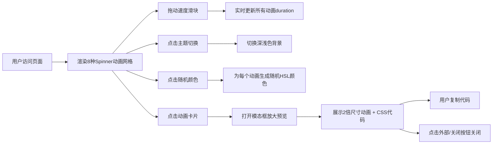

## 1. 产品概述

CSS旋转加载动画（Spinner）可视化展示与对比工具，帮助前端开发者和UI设计师快速浏览、预览和对比多种加载动画效果，减少反复修改代码的繁琐过程。

- 目标用户：前端开发者、UI设计师
- 核心价值：直观对比8种以上CSS加载动画，实时调整速度、颜色、主题，一键复制关键帧代码

## 2. 核心功能

### 2.1 用户角色
| 角色 | 注册方式 | 核心权限 |
|------|----------|----------|
| 访客用户 | 无需注册 | 浏览动画、调整参数、复制代码 |

### 2.2 功能模块
1. **动画展示网格**：4列网格展示所有预设加载动画卡片
2. **参数控制面板**：速度滑块、主题切换、随机颜色
3. **放大预览模态框**：2倍尺寸展示动画，显示可复制的CSS代码

### 2.3 页面详情
| 页面名称 | 模块名称 | 功能描述 |
|----------|----------|----------|
| 主页面 | 动画展示网格 | 4列网格（列宽240px，间距20px）展示8种Spinner，卡片高200px，圆角12px，背景#2a2b3d，悬停上移6px加深阴影 |
| 主页面 | 控制面板 | 右侧悬浮面板（宽280px），速度滑块0.5-3.0实时调整animation-duration，太阳/月亮图标切换深浅主题，红色按钮随机HSL颜色 |
| 主页面 | 模态框预览 | 点击卡片弹出500px宽模态框，2倍尺寸播放动画，显示CSS @keyframes代码片段可复制，点击外部或关闭按钮关闭 |

## 3. 核心流程

用户打开页面 → 浏览8种预设Spinner动画 → 拖动速度滑块调整全局动画速度 → 点击主题切换按钮切换深浅色背景 → 点击随机颜色按钮刷新所有动画配色 → 点击感兴趣的动画卡片 → 模态框放大展示并查看CSS代码 → 复制代码到剪贴板 → 关闭模态框继续浏览

## 4. 用户界面设计

### 4.1 设计风格
- 主色调：深色#12131f，卡片#2a2b3d，面板#1e1f2e
- 强调色：#ff6b6b（悬停#ff4757），文字#e0e0e0/#c7c9d6
- 按钮：圆角8px，毛玻璃面板效果
- 字体：现代无衬线字体（16px标题，14px副标题）
- 布局：桌面端4列网格+右侧悬浮面板，移动端面板折叠为顶部横条
- 动效：卡片悬停上移6px（0.2s ease），主题切换0.3s过渡

### 4.2 页面设计概览
| 页面名称 | 模块名称 | UI元素 |
|----------|----------|--------|
| 主页面 | 动画展示网格 | 4列×2行卡片布局，卡片含居中旋转动画+名称标签，悬停状态有边框#4a4b5e和阴影变化 |
| 主页面 | 控制面板 | 毛玻璃悬浮面板，速度值16px展示，滑块轨道，太阳/月亮图标按钮，红色随机按钮 |
| 主页面 | 模态框 | 居中圆角弹窗，关闭按钮，放大动画区，代码块带复制功能 |

### 4.3 响应式设计
- 桌面端（>1080px）：网格左侧展示，右侧预留280px面板空间，面板悬浮在右侧
- 平板/移动端（≤1080px）：面板折叠为顶部横条，网格自适应列数
- 所有触控元素保证最小44×44px触控区域

### 4.4 性能设计
- 所有@keyframes仅使用transform和opacity属性，避免触发重排
- 8个动画同时展示时FPS不低于55
- 使用CSS变量统一控制动画参数，批量更新时减少DOM操作
