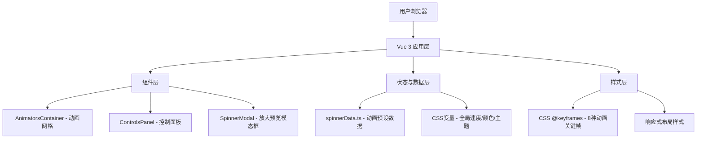

## 1. 架构设计



## 2. 技术选型

- 前端框架：Vue 3 + TypeScript（严格模式）
- 构建工具：Vite 5 + @vitejs/plugin-vue
- 路由：Vue Router 4
- 工具库：uuid（唯一标识）、lodash（工具函数）
- 样式方案：原生CSS + CSS变量，无额外CSS框架

## 3. 项目文件结构

```
auto219/
├── package.json
├── index.html
├── tsconfig.json
├── vite.config.js
└── src/
    ├── main.ts              # 应用入口
    ├── App.vue              # 根组件
    ├── spinnerData.ts       # 8种动画预设数据
    ├── AnimatorsContainer.vue   # 动画网格容器
    ├── ControlsPanel.vue    # 右侧控制面板
    ├── SpinnerModal.vue     # 放大预览模态框
    └── styles/
        └── spinners.css     # @keyframes动画定义
```

## 4. 数据模型定义

### 4.1 Spinner 数据结构

```typescript
interface SpinnerPreset {
  id: string;
  name: string;
  keyframeName: string;
  color: string;
  speed: number;
  type: 'rotate' | 'scale' | 'wave' | 'bounce' | 'dot' | 'ring' | 'dual' | 'pulse';
  cssCode: string;
}
```

### 4.2 8种动画预设类型

| 类型 | 名称 | 动画描述 |
|------|------|----------|
| rotate | 经典旋转 | 单元素360度旋转 |
| scale | 缩放脉冲 | 圆形元素循环缩放 |
| wave | 波浪条 | 3条竖条高度波浪变化 |
| bounce | 弹跳点 | 3个点上下弹跳 |
| dot | 追逐点 | 4个点沿轨迹追逐 |
| ring | 双环旋转 | 双层圆环差速旋转 |
| dual | 双向旋转 | 两元素反向旋转 |
| pulse | 脉冲扩散 | 圆形向外扩散透明 |

## 5. 状态管理策略

- **全局速度**：通过CSS变量 `--spinner-speed` 控制，值范围0.5-3.0
- **主题模式**：通过CSS变量 `--bg-color`、`--card-bg`、`--text-color` 切换深浅色
- **动画颜色**：每个spinner通过独立CSS变量 `--spinner-color-{id}` 控制
- **模态框状态**：Vue组件内部ref管理显示/隐藏及当前选中spinner

## 6. 性能优化方案

1. 所有@keyframes仅使用 `transform` 和 `opacity` 属性，触发GPU合成层
2. 使用CSS变量统一控制动画参数，修改时避免DOM重排
3. 动画元素设置 `will-change: transform, opacity` 提示浏览器优化
4. 模态框使用 `transform: translate(-50%, -50%)` 居中而非margin
5. 卡片悬停效果使用transform而非top/margin实现位移

## 7. 组件接口定义

### AnimatorsContainer 组件 Props
```typescript
props: {
  spinners: SpinnerPreset[];
  globalSpeed: number;
  theme: 'dark' | 'light';
}
emits: ['select-spinner']
```

### ControlsPanel 组件 Props
```typescript
props: {
  speed: number;
  theme: 'dark' | 'light';
}
emits: ['update:speed', 'toggle-theme', 'randomize-colors']
```

### SpinnerModal 组件 Props
```typescript
props: {
  visible: boolean;
  spinner: SpinnerPreset | null;
  speed: number;
}
emits: ['close']
```
