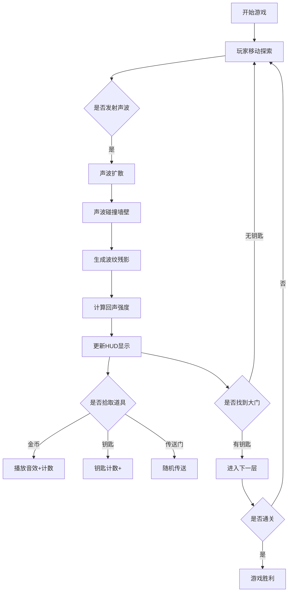

## 1. 产品概述

声纳地牢探险游戏——一款基于声波反弹定位的2D地牢探险游戏，玩家在完全黑暗的迷宫中通过发射声波脉冲来感知周围环境，声波碰到墙壁反弹并返回波形信号，玩家根据回声强度和时间推断地形和隐藏宝藏位置，营造声纳探测般的沉浸式体验。

- 目标用户：喜爱独立游戏玩家、地牢探索类游戏爱好者

- 产品价值：独特的声纳探测玩法结合赛博朋克美术风格，提供沉浸式盲探游戏体验

## 2. 核心功能

### 2.1 功能模块

1. **游戏主界面**：Canvas游戏区域、HUD信息面板、状态显示
2. **声纳系统**：声波脉冲发射、墙体反弹、回声强度计算、波纹残影
3. **地图系统**：程序化地牢生成（房间+走廊）、碰撞检测、回声计算、层间切换
4. **玩家系统**：角色移动、声波发射、状态管理
5. **道具系统**：金币收集、钥匙开门、传送门跳跃、本地存储持久化
6. **视觉特效系统**：屏幕震动、扫描线纹理、赛博朋克风格UI

### 2.2 页面详情

| 页面名称 | 模块名称 | 功能描述 |
|-----------|-------------|---------------------|
| 游戏主界面 | Canvas游戏区域 | 2D地牢渲染、玩家角色、声波脉冲、墙体波纹残影、扫描线叠加 |
| 游戏主界面 | HUD信息面板 | 右上角显示回声强度、地形密度、当前层数、金币数量、钥匙数量 |
| 游戏主界面 | 状态提示 | 道具拾取反馈、层间切换提示 |

## 3. 核心流程

玩家进入游戏 → 控制声纳角色移动（WASD/方向键） → 按空格键发射声波脉冲 → 声波扩散并碰到墙壁反弹 → 留下波纹残影 → 同时HUD更新回声数据 → 探索地图收集金币 → 找到钥匙 → 打开大门进入下一层 → 或通过传送门随机跳跃 → 通关浅层3层+深层3层

## 4. 用户界面设计

### 4.1 设计风格

- **主色调**：纯黑背景(#000000)、暗紫色墙体描边(#5D3FD3)、青色声波(#00FFFF)、白色玩家(#FFFFFF)、金色金币(#FFD700)

- **字体**：低保真数字感字体（如Courier New或VT323）

- **布局风格**：点阵风格边框、扫描线纹理叠加、发光效果

- **特效**：声波碰撞触发0.1秒屏幕震动、声波碰撞后留下淡蓝色波纹残影持续0.3秒

### 4.2 页面设计概述

| 页面名称 | 模块名称 | UI元素 |
|-----------|-------------|-------------|
| 游戏主界面 | Canvas游戏区域 | 纯黑背景、青色渐变扩散圆环声波、白色发光菱形体玩家、暗紫色描边墙体、金色金币、银色钥匙、紫色传送门 |
| 游戏主界面 | HUD信息面板 | 右上角点阵边框容器、回声强度数值、地形密度数值、当前层数、金币数、钥匙数 |
| 游戏主界面 | 状态提示 | 屏幕中央临时提示、道具拾取反馈 |

### 4.3 响应式适配

- 桌面端：全屏Canvas，保持正方形游戏区域，适配1:1比例

- 平板横屏：自适应缩放，保持游戏区域正方形居中，HUD固定右上角

### 4.4 性能要求

- Canvas渲染不低于45fps

- 声波物理模拟稳定运行
