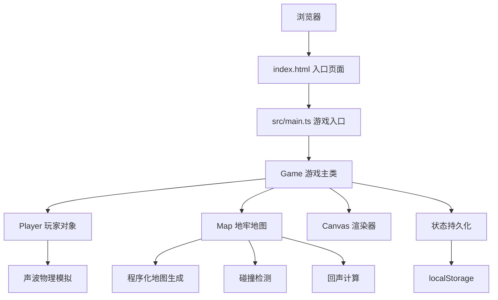

## 1. 架构设计



## 2. 技术描述

- **前端框架**：TypeScript + Vite + 纯Canvas API

- **构建工具**：Vite

- **编程语言**：TypeScript (严格模式，target ES2020)

- **无后端**：纯前端游戏

- **数据持久化**：localStorage

## 3. 文件结构

| 文件路径 | 用途 |
|-----------|------|
| /package.json | 项目依赖配置（typescript、vite） |
| /vite.config.js | Vite构建配置，支持TypeScript |
| /tsconfig.json | TypeScript严格模式配置 |
| /index.html | 入口页面，包含游戏标题和Canvas容器 |
| /src/main.ts | 游戏入口，初始化声纳引擎、启动游戏主循环 |
| /src/game.ts | 游戏主逻辑，管理地图渲染、声波物理、道具拾取、层间切换、状态持久化 |
| /src/player.ts | 玩家对象，处理键盘鼠标输入，生成声波脉冲，管理位置移动和状态 |
| /src/map.ts | 地牢地图生成器，噪声算法生成墙体房间走廊，碰撞检测和回声计算接口 |

## 4. 数据模型

### 4.1 游戏状态定义

```typescript
interface GameState {
  currentLevel: number;      // 当前层数 (1-6)
  coins: number;             // 已收集金币总数
  keys: number;              // 当前持有钥匙数
  playerPos: { x: number; y: number };
  collectedCoins: string[];  // 已收集金币ID列表（每层+坐标唯一标识）
  collectedKeys: string[];    // 已收集钥匙ID列表
  collectedCoinsByLevel: Record<number, string[]>;
  collectedKeysByLevel: Record<number, string[]>;
  totalCoinsByLevel: Record<number, number>;
}
```

### 4.2 声波脉冲定义

```typescript
interface SoundPulse {
  x: number;
  y: number;
  radius: number;
  maxRadius: number;
  speed: number;           // 每帧5像素
  opacity: number;
  active: boolean;
  echoes: EchoPoint[];
}

interface EchoPoint {
  x: number;
  y: number;
  time: number;
  intensity: number;
}
```

### 4.3 波纹残影定义

```typescript
interface Ripple {
  x: number;
  y: number;
  startTime: number;
  duration: number;      // 0.3秒
  opacity: number;
}
```

### 4.4 道具定义

```typescript
interface Item {
  id: string;
  type: 'coin' | 'key' | 'portal' | 'door';
  x: number;
  y: number;
  collected: boolean;
}
```

## 5. 核心算法

### 5.1 地图生成算法

- 20x20网格

- 程序化生成6个房间+3条走廊

- 使用简单房间随机放置+走廊连接

- 保证路径可达

- 浅层(1-3层)和深层(4-6层)，深层回声衰减慢30%

### 5.2 声波物理模拟

- 声波以每帧5像素速度圆形扩散

- 碰到墙壁立即消散，产生波纹残影

- 回声强度计算基于距离和墙壁数量

- 地形密度基于周围墙体数量

### 5.3 碰撞检测

- 网格碰撞检测（AABB）

- 玩家移动碰撞检测

- 声波扩散碰撞检测
