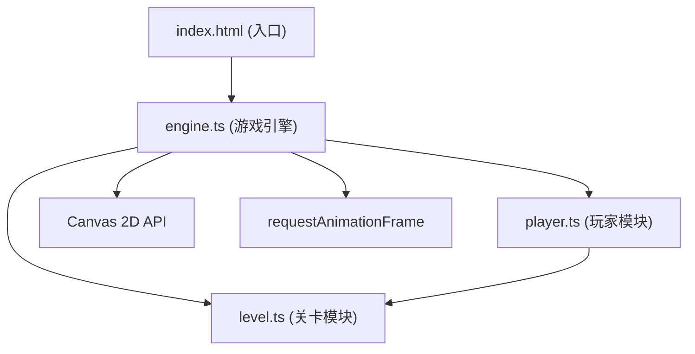

## 1. 架构设计



## 2. 技术说明

- **前端框架**：TypeScript + Vite 5 + Canvas 2D
- **工具库**：lodash（工具函数）、uuid（唯一标识）
- **构建工具**：Vite 5
- **目标环境**：现代浏览器，60FPS流畅运行
- **渲染方式**：纯Canvas 2D原生渲染，无额外游戏引擎

## 3. 模块定义

### 3.1 文件结构

| 文件 | 职责 |
|-----|------|
| package.json | 项目依赖和脚本配置 |
| index.html | 入口页面，挂载Canvas |
| tsconfig.json | TypeScript严格模式配置 |
| vite.config.js | Vite构建配置 |
| src/engine.ts | 游戏主循环、Canvas渲染、帧率管理、状态机、时间回溯逻辑 |
| src/player.ts | 玩家状态、位置/速度、残影数据、输入映射、碰撞检测 |
| src/level.ts | 关卡生成、平台/陷阱/终点定义、移动逻辑、重置接口 |

### 3.2 核心数据结构

```typescript
// 玩家状态
interface PlayerState {
  x: number;
  y: number;
  vx: number;
  vy: number;
  width: number;
  height: number;
  onGround: boolean;
  afterimages: Afterimage[];
  isRewinding: boolean;
}

// 时间快照（用于回溯）
interface TimeSnapshot {
  timestamp: number;
  playerX: number;
  playerY: number;
  playerVx: number;
  playerVy: number;
  trapPositions: Array<{ id: string; x: number; y: number }>;
}

// 操作记录
interface ActionRecord {
  type: '移动' | '跳跃' | '回溯';
  timestamp: number;
}

// 平台
interface Platform {
  x: number;
  y: number;
  width: number;
  height: number;
}

// 移动尖刺陷阱
interface SpikeTrap {
  id: string;
  x: number;
  y: number;
  baseX: number;
  minX: number;
  maxX: number;
  direction: 1 | -1;
  speed: number;
  size: number;
}

// 终点
interface Goal {
  x: number;
  y: number;
  width: number;
  height: number;
}

// 游戏状态
type GameState = 'playing' | 'dead' | 'victory' | 'rewinding';
```

## 4. 核心算法

### 4.1 时间回溯机制

1. 采用环形缓冲区存储最近3秒（180帧 @60FPS）的时间快照
2. 每帧记录玩家位置、速度和陷阱位置
3. 按T键时，从缓冲区末尾逆序重放，每帧恢复一个快照，持续3秒
4. 回溯期间冻结玩家输入，渲染半透明角色和残影

### 4.2 碰撞检测

- AABB（轴对齐包围盒）检测玩家与平台的碰撞
- 简化的点-三角形检测玩家与尖刺的碰撞
- 终点触发：玩家AABB与终点AABB重叠即判定通关

### 4.3 关卡生成

- 采用伪随机种子生成确定关卡
- 3个平台按递增高度分布，间距控制在跳跃可达范围
- 2个陷阱分别位于两个平台之间的水平轨道上
- 终点置于最高平台上方

## 5. 性能优化

- 对象池：避免每帧创建新的快照对象，复用预分配数组
- 增量渲染：仅更新必要区域，但Canvas全屏重绘在2D场景下足够高效
- 固定时间步长：逻辑更新60FPS，渲染与显示器刷新率同步
- 残影限制：最多保留8帧残影数据
