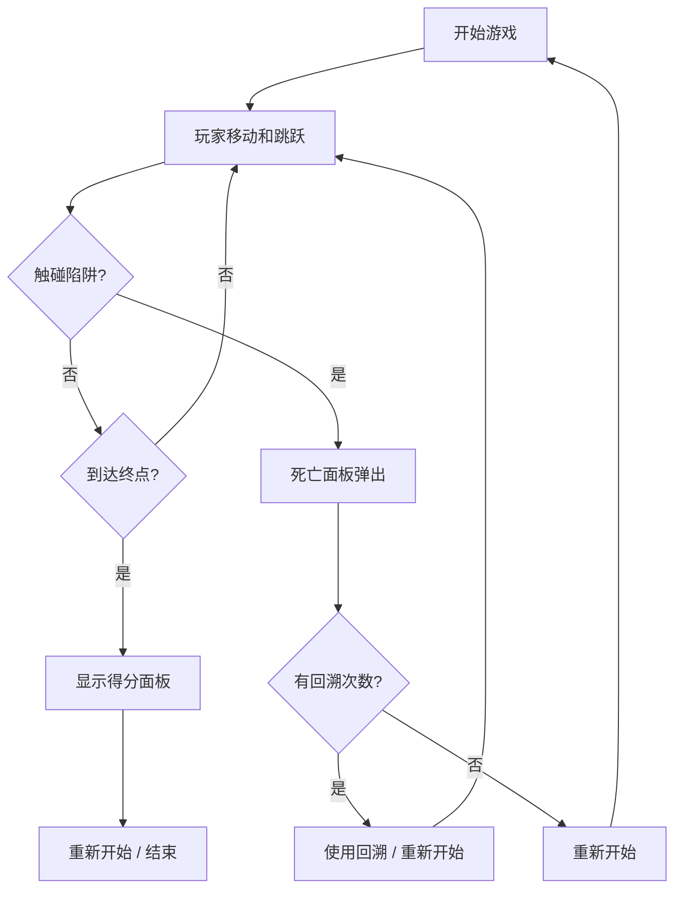

## 1. 产品概述

时间逆流2D平台跳跃游戏交互原型，用于验证时间操控与平台跳跃结合的核心玩法机制。玩家可以在失误后主动回溯3秒时间，而非立即重来，探索这种机制对游戏体验的影响。

- 主要用途：为游戏设计师提供快速验证时间回溯玩法趣味性的可交互原型
- 目标用户：游戏设计师、游戏开发者
- 产品价值：低成本验证"时间操控+平台跳跃"核心机制的可玩性

## 2. 核心特性

### 2.1 功能模块

1. **游戏主画面**：2D横版平台跳跃场景，包含玩家角色、平台、移动陷阱、终点
2. **时间回溯系统**：有限次数时间回溯（默认3次），8秒冷却，3秒录像倒放
3. **关卡系统**：随机关卡生成，包含3个平台、2个移动尖刺陷阱、1个终点旗帜
4. **计分系统**：基础分1000分，每秒减10分，每次回溯扣200分
5. **UI信息面板**：倒计时器、回溯次数显示、操作记录、操作提示

### 2.2 页面详情

| 页面名称 | 模块名称 | 功能描述 |
|---------|---------|---------|
| 游戏主界面 | 游戏画布 | 渲染2D平台跳跃场景，处理玩家输入 |
| 游戏主界面 | 顶部状态栏 | 显示回溯次数、冷却条、60秒倒计时 |
| 游戏主界面 | 操作记录面板 | 显示最近10条操作记录（类型+时间戳） |
| 游戏主界面 | 操作提示面板 | 左下角显示WASD/空格/T键操作说明 |
| 死亡弹窗 | 死亡选择面板 | 红色闪烁，显示"重新开始"和"使用回溯"按钮 |
| 通关弹窗 | 得分面板 | 显示总得分、回溯使用次数、通关用时 |

## 3. 核心流程

玩家从起点出发，使用WASD移动、空格跳跃，尝试到达终点旗帜。途中若触碰移动尖刺陷阱，触发死亡选择面板。玩家可选择使用回溯机会（若有剩余）回到3秒前状态，或重新开始关卡。到达终点后显示得分面板。

## 4. 用户界面设计

### 4.1 设计风格

- **主色调**：赛博朋克暗色风格，背景 #0d1b2a
- **平台**：#1b263b 填充，#415a77 2px边框
- **玩家**：#00b4d8 发光蓝色方块（32x32）
- **陷阱**：#e63946 红色三角形尖刺
- **文字**：#e0e1dd，font-family: 'Courier New', monospace
- **按钮**：重新开始 #e63946，回溯按钮 #457b9d

### 4.2 页面设计概览

| 页面名称 | 模块名称 | UI元素 |
|---------|---------|---------|
| 游戏主界面 | 游戏画布 | 全屏Canvas，背景#0d1b2a，赛博朋克风格 |
| 游戏主界面 | 状态栏 | 左上角：回溯次数图标+数字+冷却条；右上角：60秒倒计时+操作记录列表 |
| 游戏主界面 | 操作提示 | 左下角半透明面板rgba(13,27,42,0.85)，圆角8px |
| 死亡弹窗 | 选择面板 | 红色闪烁背景，两个按钮垂直排列 |
| 通关弹窗 | 得分面板 | 半透明暗色背景，三行统计信息 |

### 4.3 特效设计

- **回溯启动**：屏幕边缘淡蓝色扭曲光晕，持续约0.5秒
- **回溯中**：角色半透明+残影效果
- **死亡**：红色屏幕闪烁效果
- **玩家**：发光效果
