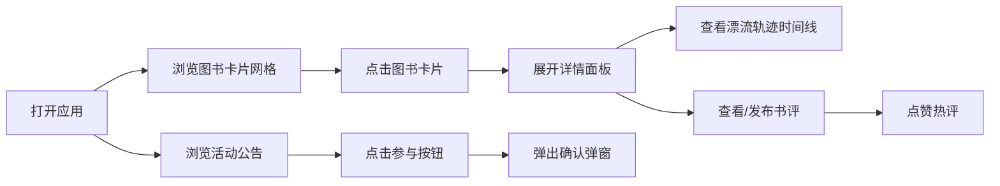

## 1. 产品概述
本产品是面向小型独立书店的图书漂流与读者社群应用，帮助店主管理图书漂流流程、发布活动通知，同时为读者提供图书浏览、书评发布和社群讨论功能。
- 主要目标：打造一个温馨、有温度的线上图书漂流社区，连接书店与读者
- 目标用户：小型独立书店店主、热爱阅读的读者群体
- 市场价值：为实体书店增加用户粘性，促进图书流通和读者社群建设

## 2. 核心功能

### 2.1 用户角色
| 角色 | 注册方式 | 核心权限 |
|------|---------|---------|
| 店主 | 管理员账号 | 管理图书漂流登记、发布书评排行榜、发布活动通知 |
| 读者 | 无需注册（模拟） | 查看漂流书状态、发布书评、参与讨论、参与活动 |

### 2.2 功能模块
1. **图书漂流主页**：3列瀑布流网格展示图书漂流卡片列表，卡片展示封面缩略图、书名、漂流次数、当前持有者头像、状态标签
2. **图书详情面板**：点击卡片展开详情，显示漂流轨迹时间线、书评区、书评输入框
3. **漂流轨迹时间线**：垂直时间线展示图书完整漂流记录（捐赠、领取、归还等节点）
4. **书评发布与排行榜**：短评输入（最多140字），按点赞数排序展示前5条热评，50赞以上显示金色火焰图标
5. **活动公告面板**：左侧固定竖排面板，按时间倒序列出活动，含"参与"按钮及确认弹窗

### 2.3 页面详情
| 页面名称 | 模块名称 | 功能描述 |
|---------|---------|---------|
| 主页面 | 活动公告面板 | 左侧固定220px宽面板，#e8dcca背景，12px圆角，展示近期活动列表，每项含标题、日期、参与按钮 |
| 主页面 | 图书漂流网格 | 中央3列瀑布流，卡片宽300px，#f9f5eb背景，#d6cbb3边框，12px圆角，点击展开详情 |
| 主页面 | 图书详情面板 | 右侧可收起面板，展示漂流轨迹时间线和书评区，底部浮层模式适配中等屏幕 |
| 详情面板 | 漂流轨迹时间线 | 垂直时间线，节点含用户头像、时间戳、事件类型标签（捐赠#9c27b0/领取#4caf50/归还#ff9800） |
| 详情面板 | 书评区 | 书评输入框（弹性缩放动画）、热评列表（按点赞排序前5条）、点赞功能、金色火焰图标 |

## 3. 核心流程
读者打开应用 → 浏览左侧活动公告 → 浏览中央图书漂流卡片网格 → 点击感兴趣的图书卡片 → 右侧展开详情面板 → 查看漂流轨迹时间线 → 查看/发布书评 → 点赞热评 → 点击活动"参与"按钮 → 弹出确认弹窗

## 4. 用户界面设计

### 4.1 设计风格
- 主背景色：#fcf6e8（暖米黄）
- 次要背景色：#f9f5eb（卡片背景）、#e8dcca（面板背景）
- 主色调：#8a6e53（深棕按钮）、#4a3b32（标题深褐）、#6b5a4a（正文）
- 边框色：#d6cbb3
- 状态色：可领取#4caf50、待归还#ff9800、已漂流中#2196f3、捐赠#9c27b0
- 按钮风格：圆角12px，悬停加深阴影，点击涟漪扩散动画
- 字体：采用衬线字体营造书香氛围，标题使用优雅的显示字体，正文使用易读的衬线字体
- 布局风格：三栏布局（左固定面板+中央网格+右可收起详情），卡片弥散阴影
- 图标风格：简约线条图标，配合暖色调

### 4.2 页面设计概述
| 页面名称 | 模块名称 | UI元素 |
|---------|---------|---------|
| 主页面 | 活动公告面板 | 220px宽固定左侧，#e8dcca背景，12px圆角，活动卡片按时间倒序，参与按钮#8a6e53，点击涟漪动画 |
| 主页面 | 图书漂流网格 | 3列瀑布流，卡片宽300px，#f9f5eb背景，#d6cbb3边框，12px圆角，逐张淡入动画（200ms延迟），悬停上浮6px加深阴影 |
| 详情面板 | 漂流轨迹时间线 | 垂直线条连接，节点圆形图标，事件类型彩色标签，时间戳显示 |
| 详情面板 | 书评区 | 输入框弹性缩放动画，评论按点赞排序，50赞+显示金色火焰图标，列表更新<200ms响应 |

### 4.3 响应式适配
- 桌面端（>1200px）：三栏完整显示（左活动面板+中央网格+右详情面板）
- 平板端（800-1200px）：左侧活动面板保留，右侧详情面板折叠为底部浮层
- 移动端（<800px）：左侧活动面板变为顶部抽屉，中央网格单列显示，详情面板底部浮层

### 4.4 性能要求
- 页面初始加载时间 ≤ 1.5秒
- 卡片列表滚动帧率 ≥ 55fps
- 书评提交后列表更新响应时间 < 200ms
