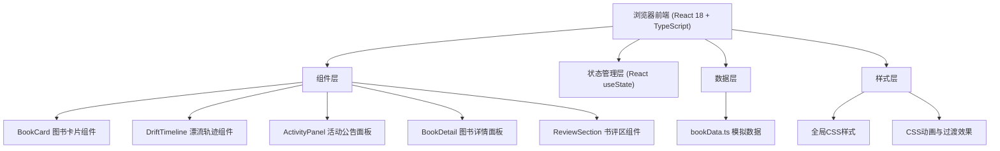
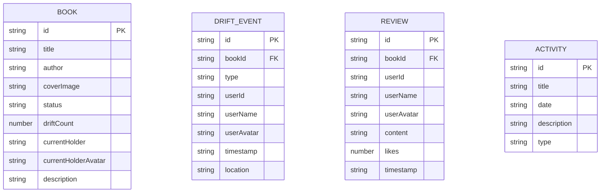

## 1. 架构设计



## 2. 技术描述
- 前端框架：React@18 + TypeScript
- 构建工具：Vite@5 + @vitejs/plugin-react
- 工具库：uuid、lodash
- 后端：无（纯前端，使用模拟数据）
- 数据管理：使用 React useState hooks 管理本地状态
- 样式方案：原生 CSS（含 CSS 变量、动画），不使用额外 CSS 框架

## 3. 路由定义
本应用为单页应用，无需前端路由，采用组件切换模式展示图书详情。
| 路由 | 用途 |
|------|------|
| / | 主页面（图书漂流主页） |

## 4. 数据模型

### 4.1 数据模型定义



### 4.2 TypeScript 类型定义

```typescript
type BookStatus = 'available' | 'pending_return' | 'drifting';
type DriftEventType = 'donate' | 'receive' | 'return';

interface Book {
  id: string;
  title: string;
  author: string;
  coverImage: string;
  status: BookStatus;
  driftCount: number;
  currentHolder: string;
  currentHolderAvatar: string;
  description: string;
  driftEvents: DriftEvent[];
  reviews: Review[];
}

interface DriftEvent {
  id: string;
  bookId: string;
  type: DriftEventType;
  userId: string;
  userName: string;
  userAvatar: string;
  timestamp: string;
  location?: string;
}

interface Review {
  id: string;
  bookId: string;
  userId: string;
  userName: string;
  userAvatar: string;
  content: string;
  likes: number;
  timestamp: string;
}

interface Activity {
  id: string;
  title: string;
  date: string;
  description: string;
  type: string;
}
```

## 5. 文件结构

```
e:\solo\VersionFast\tasks\auto222\
├── package.json
├── index.html
├── tsconfig.json
├── vite.config.js
└── src/
    ├── App.tsx
    ├── index.css
    ├── main.tsx
    ├── components/
    │   ├── BookCard.tsx
    │   ├── DriftTimeline.tsx
    │   ├── ActivityPanel.tsx
    │   ├── BookDetail.tsx
    │   ├── ReviewSection.tsx
    │   └── Modal.tsx
    └── data/
        └── bookData.ts
```

## 6. 组件设计原则
- 单一职责：每个组件专注一个功能模块
- 可复用性：通用 UI 元素（如弹窗、按钮）抽离为独立组件
- Props 类型安全：所有组件使用 TypeScript 严格类型定义
- 性能优化：避免不必要的重渲染，使用合理的组件粒度
- 动画流畅：所有交互（悬停、点击、加载）均有即时视觉反馈
