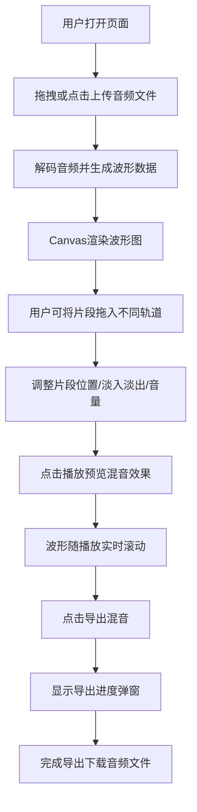

## 1. 产品概述

面向独立播客主和音频内容创作者的浏览器端轻量级音频编辑器，解决传统DAW软件（Audacity、GarageBand）功能臃肿、启动慢、需安装软件的痛点，让用户无需安装任何软件即可完成音频剪辑、多轨道混合和导出，同时实时看到波形变化。

## 2. 核心功能

### 2.1 功能模块

1. **音频导入与波形渲染模块**：拖拽/点击上传区域，支持WAV/MP3，Canvas实时波形绘制
2. **多轨道混合与剪辑模块**：3个并行轨道，支持添加音频片段、拖拽定位、淡入淡出调节
3. **播放控制与时间轴模块**：顶部工具栏（播放/暂停/停止/速度/时间显示）+ 时间轴刻度
4. **音量与效果控制模块**：单轨音量/静音/独奏、主音量控制、一键重置
5. **导出与保存模块**：混音导出、项目保存、导出进度提示

### 2.2 页面详情

| 页面名称 | 模块名称 | 功能描述 |
|-----------|-------------|---------------------|
| 主编辑页 | 拖拽上传区 | 80%宽180px高，背景#2a2a3a，虚线边框#6b6b8a，圆角12px，支持拖入或点击选择WAV/MP3 |
| 主编辑页 | 波形显示区 | 100%宽200px高，Canvas绘制，紫色#7c5cbf振幅线，线宽2px，实时滚动 |
| 主编辑页 | 多轨道区 | 3个轨道各120px高，背景#1e1e2e，间距4px，轨道编号标签60px宽背景#3a3a4a |
| 主编辑页 | 片段拖拽定位 | 轨道内水平拖拽调整位置，黄色吸附线，吸附到边缘或播放头 |
| 主编辑页 | 淡入淡出控制 | 轨道左侧上下边缘滑块，圆形20px直径，红色#ff6b6b |
| 主编辑页 | 顶部工具栏 | 52px高#252535背景，含播放/暂停/停止/速度/时间显示 |
| 主编辑页 | 时间轴刻度 | 24px高#202030背景，每100px秒级刻度线 |
| 主编辑页 | 单轨控制 | 垂直音量滑块80px高12px宽，静音/独奏按钮28x28px |
| 主编辑页 | 主输出区 | 水平主音量200px宽，一键重置按钮32x32px |
| 主编辑页 | 底部操作栏 | 60px高#252535背景，导出混音140x40px，保存项目140x40px |
| 主编辑页 | 导出弹窗 | 300x150px #2a2a3a背景，进度条80%宽8px高渐变#7c5cbf→#ff6b6b |

## 3. 核心流程

## 4. 用户界面设计

### 4.1 设计风格
- **主背景色**：#1e1e2e（深色主题）
- **强调色**：#7c5cbf（紫色）用于主按钮、波形、滑块
- **警示色**：#ff6b6b（红色）用于淡入淡出滑块、静音按钮
- **次级背景**：#2a2a3a（拖拽区、弹窗）、#252535（工具栏、底栏）、#1e1e2e（轨道区）、#3a3a4a（标签、按钮）
- **边框/辅助色**：#6b6b8a、#aaaaaa
- **按钮样式**：圆角8px，白色文字，悬停亮度+20%，点击缩放0.95
- **字体**：统一无衬线字体，按钮文字14px（主按钮16px），时间显示14px，刻度标签12px
- **交互反馈**：所有可交互元素有hover和active状态
- **动画**：波形滚动0.3s ease-out平滑动画

### 4.2 响应式设计
- 桌面端优先设计
- 宽度<768px时：轨道高度变为100px，拖拽区域宽度变为100%，按钮间距缩小

### 4.3 性能指标
- 波形渲染帧率 ≥ 30 FPS
- 播放启动延迟 ≤ 100ms
