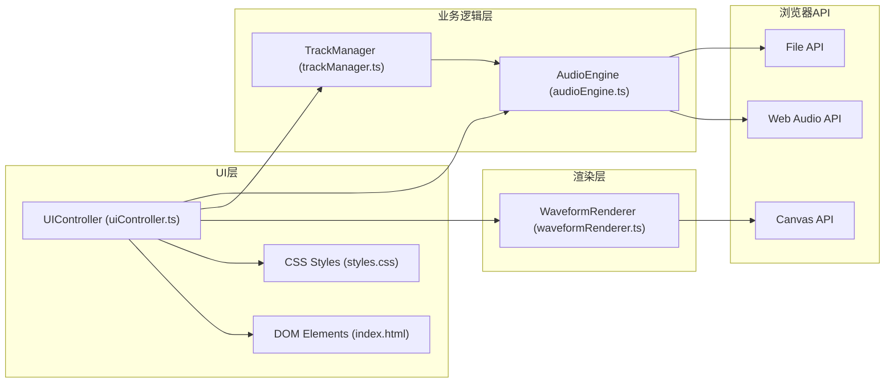

## 1. 架构设计



## 2. 技术说明

- **前端框架**：原生TypeScript（无React/Vue框架）
- **构建工具**：Vite 5
- **音频处理**：Web Audio API（AudioContext、AudioBufferSourceNode、GainNode等）
- **图形绘制**：Canvas 2D API
- **依赖库**：
  - `typescript`：类型系统
  - `vite@5`：构建与开发服务器
  - `lodash`：工具函数
  - `uuid`：唯一ID生成

## 3. 项目文件结构

| 文件路径 | 作用 |
|----------|------|
| `package.json` | 项目依赖与脚本配置 |
| `tsconfig.json` | TypeScript严格模式配置（target ES2020） |
| `vite.config.js` | Vite构建配置 |
| `index.html` | 入口页面（深色主题、全屏无滚动） |
| `src/main.ts` | 应用入口，初始化各模块 |
| `src/styles.css` | 全局样式与主题变量 |
| `src/audioEngine.ts` | 音频核心：导入解码、波形数据生成、播放控制、音量调节、导出混音 |
| `src/waveformRenderer.ts` | 波形Canvas绘制：振幅数据渲染、时间轴刻度、播放头位置更新 |
| `src/trackManager.ts` | 轨道数据管理：轨道增删、片段时间定位、淡入淡出参数、静音独奏状态 |
| `src/uiController.ts` | UI交互控制：拖拽文件处理、按钮事件绑定、滑块值变化响应、导出进度提示 |

## 4. 核心数据模型

```typescript
// 音频片段
interface AudioClip {
  id: string;
  name: string;
  buffer: AudioBuffer;
  waveformData: number[];  // 归一化振幅数据 -1~1
  startTime: number;       // 在轨道上的起始时间（秒）
  duration: number;        // 时长（秒）
  fadeIn: number;          // 淡入时长 0~1（比例）
  fadeOut: number;         // 淡出时长 0~1（比例）
}

// 轨道
interface Track {
  id: string;
  index: number;
  clips: AudioClip[];
  volume: number;          // 0~1
  muted: boolean;
  solo: boolean;
}

// 播放状态
interface PlaybackState {
  isPlaying: boolean;
  currentTime: number;     // 当前播放位置（秒）
  totalDuration: number;   // 总时长（秒）
  playbackRate: number;    // 0.5, 1, 1.5, 2
  masterVolume: number;    // 0~1
}
```

## 5. 模块接口定义

### AudioEngine
- `decodeAudioFile(file: File): Promise<AudioBuffer>` - 解码音频文件
- `generateWaveformData(buffer: AudioBuffer, samples: number): number[]` - 生成波形数据
- `startPlayback(): void` - 开始播放
- `pausePlayback(): void` - 暂停播放
- `stopPlayback(): void` - 停止播放
- `seekTo(time: number): void` - 跳转到指定时间
- `setPlaybackRate(rate: number): void` - 设置播放速度
- `setMasterVolume(volume: number): void` - 设置主音量
- `setTrackVolume(trackId: string, volume: number): void` - 设置轨道音量
- `exportMix(): Promise<Blob>` - 导出混音WAV文件

### WaveformRenderer
- `renderWaveform(canvas: HTMLCanvasElement, data: number[], color: string): void` - 渲染波形
- `renderTimeline(canvas: HTMLCanvasElement, duration: number): void` - 渲染时间轴
- `updatePlayhead(canvas: HTMLCanvasElement, time: number, pixelsPerSecond: number): void` - 更新播放头位置
- `renderTrackClips(canvas: HTMLCanvasElement, clips: AudioClip[], trackHeight: number): void` - 渲染轨道片段

### TrackManager
- `createTrack(index: number): Track` - 创建轨道
- `addClip(trackId: string, clip: AudioClip): void` - 添加片段
- `removeClip(trackId: string, clipId: string): void` - 删除片段
- `moveClip(trackId: string, clipId: string, newStartTime: number): void` - 移动片段
- `setClipFade(trackId: string, clipId: string, fadeIn: number, fadeOut: number): void` - 设置淡入淡出
- `setTrackMute(trackId: string, muted: boolean): void` - 设置静音
- `setTrackSolo(trackId: string, solo: boolean): void` - 设置独奏
- `resetAll(): void` - 重置所有轨道

### UIController
- `initDragDrop(dropZone: HTMLElement): void` - 初始化拖拽上传
- `bindPlaybackControls(buttons: ControlButtons): void` - 绑定播放控制
- `bindVolumeSliders(sliders: VolumeSliders): void` - 绑定音量滑块
- `bindExportButton(button: HTMLButtonElement): void` - 绑定导出按钮
- `showExportProgress(progress: number): void` - 显示导出进度
- `hideExportProgress(): void` - 隐藏导出进度
