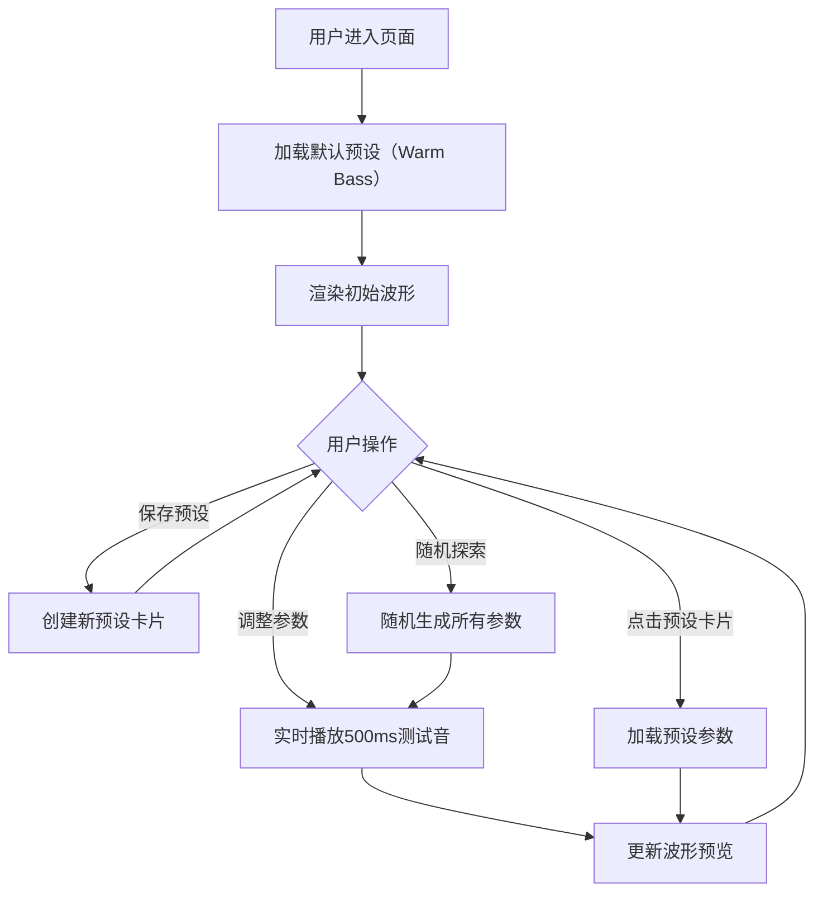

## 1. 产品概述

音色工坊（Tone Workshop）是一个面向独立音乐人和音频发烧友的浏览器内音色预设创建与探索工具，通过直观的可视化控制界面和Web Audio API实时音频合成，让用户能够快速实验、保存和对比各种合成器参数组合对音色的影响。

- 目标用户：独立电子音乐人、声音设计师、音频发烧友、音乐制作学习者
- 核心价值：将繁琐的参数调试转化为视觉与听觉的即时实验，提升音色设计效率与乐趣

## 2. 核心功能

### 2.1 功能模块

1. **主页面（音色工作台）**：合成器参数控制面板、预设管理卡片、波形实时渲染、随机探索、性能监控

### 2.2 页面详情

| 页面名称 | 模块名称 | 功能描述 |
|---------|---------|---------|
| 主页面 | 振荡器控制区 | 波形选择下拉菜单（正弦波、方波、锯齿波、三角波），深色背景#1e1e2e，边框#4a4a6a |
| 主页面 | 滤波器控制区 | 截止频率滑块（20-20000Hz）、共振滑块（0-100%），滑块轨道#3a3a5a，滑块把手#d4bfff |
| 主页面 | 包络控制区 | Attack、Decay、Sustain、Release四个带微小刻度标记的滑块 |
| 主页面 | LFO控制区 | 速率和深度旋钮，点击时显示圆形渐变动画提示当前速率 |
| 主页面 | 预设管理面板 | 预设卡片列表（140×60px，#2a2a3e背景，8px圆角，悬停1.05倍放大+淡蓝色外发光），保存当前预设按钮（#7c5cbf，6px圆角），3个默认预设（Warm Bass、Airy Pad、Pulse Lead） |
| 主页面 | 波形渲染区 | 400×200px Canvas（#12121e背景），波形渐变色#7c5cbf→#b39ddb，线宽2px，半透明垂直播放参考线动画 |
| 主页面 | 随机探索按钮 | #ff6b6b背景，6px圆角，点击时#ff4d4d+缩放动画，随机生成所有参数并播放 |
| 主页面 | 性能监控面板 | 左下角固定180×40px半透明面板（rgba(30,30,46,0.8)，8px圆角，#b0b0c4字体，12px），实时显示FPS和渲染耗时，低于50fps时红色边框闪烁警示 |

## 3. 核心流程

用户进入音色工坊后，默认加载第一个预设参数并展示波形。用户可以：
1. 调整合成器各参数，实时听到500ms测试音并看到波形变化
2. 点击预设卡片快速加载已保存的音色参数
3. 点击"保存当前预设"将当前参数组合保存为新卡片
4. 点击"随机探索"获得意外的音色惊喜
5. 左下角性能面板持续监控运行状态

## 4. 用户界面设计

### 4.1 设计风格

- **主色调**：深空蓝黑渐变#0d0d1a→#1a1a2e（背景），浅紫灰#c4c4d4（文字）
- **强调色**：紫色#7c5cbf/#b39ddb（按钮、波形），淡紫#d4bfff（滑块把手），红色#ff6b6b（随机按钮）
- **控件风格**：统一12px圆角，半透明毛玻璃效果（rgba(30,30,46,0.7) + backdrop-blur 8px），控件间距16px
- **字体**：Consolas等宽字体，14px正文，24px标题
- **交互反馈**：参数激活时0.2秒淡入圆形渐变光效，卡片悬停时放大+外发光，按钮点击时缩放+变色

### 4.2 页面设计概览

| 页面名称 | 模块名称 | UI元素 |
|---------|---------|--------|
| 主页面 | 顶部标题区 | "音色工坊"居中，24px #d4bfff字体 |
| 主页面 | 预设卡片栏 | 横向排列预设卡片+保存按钮，卡片悬停微动效 |
| 主页面 | 中央控制面板 | 四区域（振荡器/滤波器/包络/LFO）2×2网格布局，毛玻璃卡片 |
| 主页面 | 右侧波形区 | Canvas波形图，渐变色彩，播放位置参考线动画 |
| 主页面 | 底部随机按钮 | 醒目红色按钮，点击动效 |
| 主页面 | 左下角性能面板 | 半透明浮动，FPS/渲染耗时双指标 |

### 4.3 响应式设计

- Desktop-first设计，适配1280px~1920px屏幕宽度
- 左右两侧留白比例1:1，整体居中布局
- 所有控件不换行不溢出，均匀缩放
