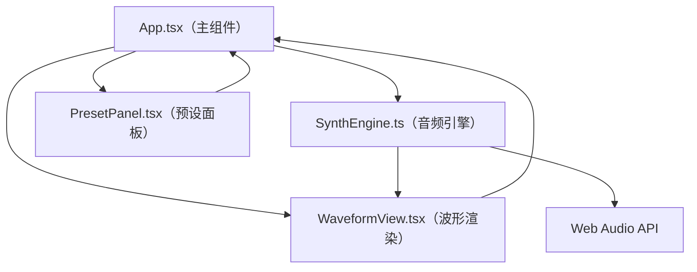

## 1. 架构设计



## 2. 技术栈说明

- **前端框架**：React@18 + TypeScript
- **构建工具**：Vite@5 + @vitejs/plugin-react
- **音频处理**：Web Audio API（原生浏览器API，无需额外库）
- **工具库**：uuid（生成预设唯一ID）、lodash（深拷贝等工具函数）
- **样式方案**：CSS + CSS变量（无需额外CSS框架，纯自定义样式以保持科幻深色风格）

## 3. 目录结构

```
.
├── index.html
├── package.json
├── tsconfig.json
├── vite.config.js
└── src/
    ├── App.tsx              # 主组件：布局、状态管理、性能监控
    ├── SynthEngine.ts       # 合成器引擎：Web Audio API封装
    ├── PresetPanel.tsx      # 预设卡片面板组件
    └── WaveformView.tsx     # Canvas波形渲染组件
```

## 4. 核心数据模型

### 4.1 合成器参数类型定义

```typescript
export type WaveformType = 'sine' | 'square' | 'sawtooth' | 'triangle';

export interface SynthParams {
  oscillator: {
    waveform: WaveformType;
  };
  filter: {
    cutoff: number;      // 20-20000 Hz
    resonance: number;   // 0-100 %
  };
  envelope: {
    attack: number;      // ms
    decay: number;       // ms
    sustain: number;     // 0-1
    release: number;     // ms
  };
  lfo: {
    rate: number;        // Hz
    depth: number;       // 0-1
  };
}

export interface Preset {
  id: string;
  name: string;
  params: SynthParams;
}
```

### 4.2 性能监控数据

```typescript
export interface PerfStats {
  fps: number;
  renderTime: number;  // ms
}
```

## 5. 模块职责说明

### 5.1 SynthEngine.ts
- 封装 Web Audio API：AudioContext、OscillatorNode、BiquadFilterNode、GainNode
- 提供 `setParams(params)` 方法更新合成器参数
- 提供 `playTestTone(durationMs)` 方法播放500ms测试音
- 提供 `calculateWaveform(params, durationMs, sampleRate)` 静态方法生成波形数据（供Canvas渲染）
- 内部处理ADSR包络、LFO调制、滤波器参数

### 5.2 WaveformView.tsx
- Canvas 2D绘制渐变波形
- 接收波形数据数组、当前播放位置（0-1）
- 绘制垂直参考线模拟播放动画
- 通过回调上报渲染耗时给父组件

### 5.3 PresetPanel.tsx
- 预设卡片横向滚动/排列
- 卡片悬停微动效（放大+外发光）
- "保存当前预设"按钮交互
- 预设数据接口定义

### 5.4 App.tsx
- 整体布局（中央控制面板 + 右侧波形区）
- 全局状态管理（当前参数、预设列表、性能数据）
- 参数变化时触发：播放测试音 → 更新波形 → 上报渲染耗时
- 性能监控面板（FPS + 渲染耗时，低帧率警示）
- 随机参数生成逻辑

## 6. 默认预设数据

| 预设名称 | 波形 | 截止频率 | 共振 | Attack | Decay | Sustain | Release | LFO速率 | LFO深度 |
|---------|------|---------|------|--------|-------|---------|---------|---------|---------|
| Warm Bass | sawtooth | 800Hz | 40% | 10ms | 200ms | 0.6 | 300ms | 0.5Hz | 0.1 |
| Airy Pad | sine | 4000Hz | 20% | 500ms | 300ms | 0.8 | 1000ms | 3Hz | 0.3 |
| Pulse Lead | square | 2500Hz | 60% | 5ms | 100ms | 0.4 | 200ms | 6Hz | 0.2 |
