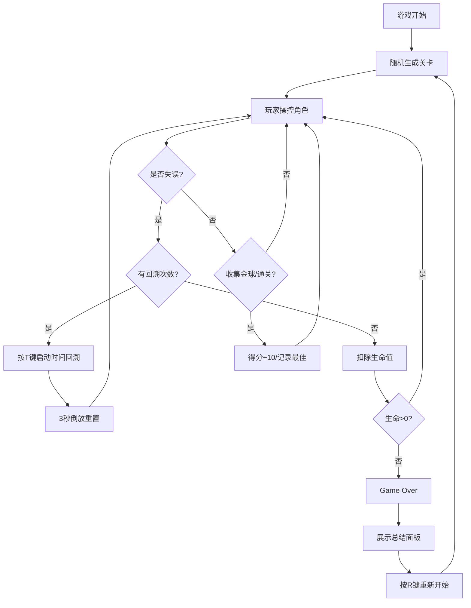

## 1. 产品概述

一款基于"时间逆流"机制的2D平台跳跃游戏交互原型，允许玩家主动、有限次地回溯数秒前的操作并改变后果，解决传统平台跳跃游戏失误后只能立即重来的问题，为游戏设计师提供快速验证时间操控与平台跳跃结合玩法的工具。

## 2. 核心功能

### 2.1 用户角色

| 角色 | 注册方式 | 核心权限 |
|------|----------|----------|
| 游戏玩家/设计师 | 无需注册，直接访问 | 体验游戏、测试时间回溯机制、查看最佳记录 |

### 2.2 功能模块

1. **游戏主场景**：2D横版关卡渲染、角色控制、物理系统
2. **时间回溯系统**：状态录制、倒放重置、视觉特效
3. **关卡生成系统**：随机平台、移动尖刺、收集金球
4. **状态面板UI**：生命值、得分、回溯次数、冷却条
5. **存档系统**：localStorage最佳记录存储、Game Over总结
6. **移动端适配**：虚拟摇杆、触摸按钮、响应式缩放

### 2.3 页面详情

| 页面名称 | 模块名称 | 功能描述 |
|----------|----------|----------|
| 游戏主界面 | Canvas渲染层 | 绘制角色、平台、尖刺、金球、背景渐变 |
| 游戏主界面 | 左上角状态 | 剩余回溯次数、冷却倒计时条 |
| 游戏主界面 | 右上角面板 | 金球数、生命值、回溯状态、冷却条 |
| 游戏主界面 | 底部提示 | "时间逆转中..."闪烁文字 |
| 游戏主界面 | 移动端控件 | 左下虚拟摇杆、右下跳跃/回溯按钮 |
| Game Over层 | 总结面板 | 得分、历史最佳记录展示 |

## 3. 核心流程

玩家进入游戏 → 角色在随机生成关卡中移动跳跃 → 收集金球得分/躲避尖刺 → 失误时按T键启动3秒时间回溯 → 角色和障碍物回到历史状态 → 继续游戏调整操作 → 收集所有金球或抵达终点通关 → R键重置关卡重新挑战 → Game Over时展示历史最佳记录

## 4. 用户界面设计

### 4.1 设计风格

- **主色调**：深空蓝渐变 `#0a0e27` → `#1a237e`
- **辅助色**：半透明青色 `#00e5ff66`（平台）、金色 `#ffd700`（金球）、红色三角形（尖刺）
- **角色**：蓝色方块 32x32，带阴影投射
- **字体**：白色微光字体
- **面板效果**：半透明黑色 `#00000080`、圆角8px、毛玻璃 `backdrop-filter: blur(6px)`
- **视觉特效**：淡蓝色扭曲光晕、粒子散射、光圈包裹、中心扩散淡入

### 4.2 页面设计概览

| 页面名称 | 模块名称 | UI元素 |
|----------|----------|--------|
| 游戏主界面 | Canvas游戏区 | 1200x600px、深空蓝渐变背景、角色阴影、平台发光 |
| 游戏主界面 | 左上角状态 | 回溯次数图标+数字、蓝色冷却条渐变至红色 |
| 游戏主界面 | 右上角面板 | 200px宽半透明面板、黄色金球数、绿色心形生命值、回溯冷却条 |
| 游戏主界面 | 回溯特效 | 屏幕边缘淡蓝色光晕、底部闪烁文字、角色光圈 |
| 游戏主界面 | 移动端控件 | 左下40px半径圆形摇杆、右下40x40跳跃按钮、50x50回溯按钮 |
| Game Over层 | 总结面板 | 半透明背景、当前得分、历史最佳通关时间、历史最高得分 |

### 4.3 响应式设计

- **桌面端**：固定1200x600px游戏区域居中显示
- **移动端**：Canvas按视口宽度等比缩放，自动启用虚拟摇杆和触摸按钮
- **触摸优化**：按钮尺寸适合手指点击（最小40px），摇杆支持拖动操作

### 4.4 动画过渡

- **关卡切换**：中心向外扩散式淡入（0.3秒）
- **回溯启动**：屏幕边缘淡蓝色扭曲光晕（0.5秒），底部文字闪烁
- **回溯结束**：角色淡蓝色光圈包裹（0.8秒内缩小消失）
- **跳跃特效**：6个白色粒子随机散射（持续0.3秒）
- **冷却条**：宽度100%→0%，颜色从蓝色渐变到红色

## 5. 性能要求

- **FPS**：维持55以上
- **回溯计算**：每次操作不超过10ms
- **关卡生成**：延迟不超过100ms
