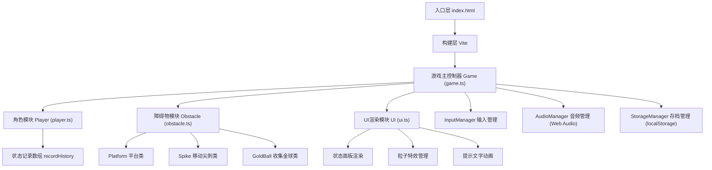

## 1. 架构设计



## 2. 技术描述

- **前端框架**：纯 TypeScript + Canvas 2D API（无UI框架，直接操作Canvas）
- **构建工具**：Vite@5（支持ES模块、快速HMR）
- **依赖库**：
  - `typescript`：类型系统
  - `lodash`：工具函数（深拷贝、防抖等）
  - `uuid`：唯一ID生成（可选，用于游戏对象标识）
- **音频**：Web Audio API（生成低音脉冲背景音）
- **数据存储**：localStorage（保存最佳通关时间和最高得分）
- **无后端**：纯前端单机游戏

## 3. 文件结构

| 文件路径 | 用途 |
|----------|------|
| `package.json` | 项目依赖配置、启动脚本 |
| `index.html` | 入口页面、Canvas容器、移动端meta |
| `tsconfig.json` | TypeScript配置（严格模式、ES2020 target） |
| `vite.config.js` | Vite构建配置 |
| `src/game.ts` | 游戏主类：状态机、帧循环、输入事件、模块调度 |
| `src/player.ts` | Player角色类：移动、跳跃、重力、历史状态记录 |
| `src/obstacle.ts` | 障碍物/收集物：Platform、Spike、GoldBall类 |
| `src/ui.ts` | UI渲染：状态面板、粒子特效、文字动画 |

## 4. 核心数据模型

### 4.1 游戏状态枚举

```typescript
enum GameState {
  MENU = 'menu',
  PLAYING = 'playing',
  REWINDING = 'rewinding',
  GAME_OVER = 'game_over',
  LEVEL_COMPLETE = 'level_complete'
}
```

### 4.2 Player 角色类

```typescript
class Player {
  x: number;              // 位置x
  y: number;              // 位置y
  vx: number;             // 水平速度
  vy: number;             // 垂直速度
  width: number = 32;     // 宽度
  height: number = 32;    // 高度
  onGround: boolean;      // 是否在地面
  recordHistory: HistoryFrame[];  // 历史状态记录（环形缓冲，约180帧=3秒@60fps）
}

interface HistoryFrame {
  timestamp: number;
  playerX: number;
  playerY: number;
  playerVx: number;
  playerVy: number;
  spikeStates: { id: string; x: number; y: number; direction: number }[];
  ballStates: { id: string; collected: boolean }[];
}
```

### 4.3 障碍物/收集物类

```typescript
class Platform {
  x: number;
  y: number;
  width: number;   // 80-120px
  height: number;  // 16px
}

class Spike {
  id: string;
  x: number;
  y: number;
  speed: number;    // 1-2px/帧
  direction: number; // 1或-1
  size: number = 20;
}

class GoldBall {
  id: string;
  x: number;
  y: number;
  radius: number = 6; // 直径12px
  collected: boolean;
}
```

### 4.4 游戏全局状态

```typescript
interface GameStats {
  score: number;              // 总得分
  lives: number;              // 生命值（默认3）
  goldBallsCollected: number; // 已收集金球数
  rewindCount: number;        // 剩余回溯次数（默认3）
  rewindCooldown: number;     // 冷却剩余时间（毫秒）
  bestScore: number;          // localStorage保存
  bestTime: number;           // localStorage保存
  levelStartTime: number;     // 当前关卡开始时间
}
```

## 5. 关键算法

### 5.1 时间回溯实现

- **录制**：每帧将玩家和动态障碍物状态推入 `recordHistory` 数组，保持最大长度180帧（3秒）
- **启动回溯**：T键触发，设置 `GameState.REWINDING`，倒序播放历史帧（可按2x-4x速度倒放），同步重置障碍物位置
- **结束回溯**：倒放完成后停留在历史位置，重置记录数组，扣减 `rewindCount`，启动8秒冷却

### 5.2 碰撞检测

- AABB矩形碰撞检测（玩家 vs 平台、玩家 vs 尖刺）
- 圆形碰撞检测（玩家 vs 金球）
- 角色底部边缘碰撞用于判断站立

### 5.3 关卡随机生成

- 平台：5个，y坐标100-500区间随机分布，避免重叠
- 尖刺：3个，水平往返移动，初始位置随机
- 金球：5个，位于平台上方或浮空随机位置

## 6. 性能优化策略

- **固定时间步长**：使用 `requestAnimationFrame` + 累积 deltaTime，确保物理更新稳定
- **历史状态压缩**：只记录必要字段，避免深拷贝整个对象
- **Canvas批量绘制**：同类型元素批量绘制，减少状态切换
- **对象池**：粒子特效使用对象池复用，减少GC
- **离屏渲染**：静态背景使用离屏Canvas缓存
