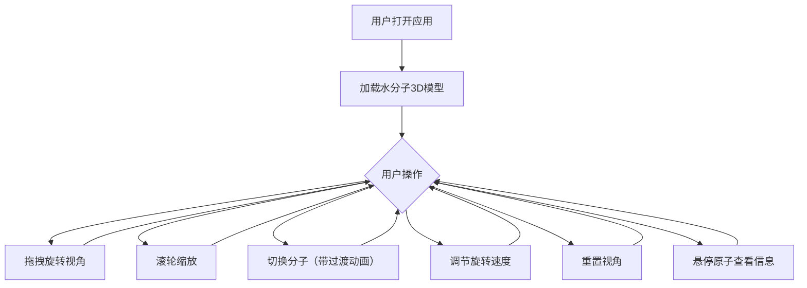

## 1. 产品概述

3D分子结构查看器是一个基于Web的科学可视化应用，允许用户交互式查看常见分子（水、二氧化碳、苯环）的三维球棍模型。面向化学学习者、教育工作者和科研人员，提供直观的分子结构可视化体验。

## 2. 核心功能

### 2.1 功能模块

1. **主场景页面**：3D分子渲染区域、分子信息展示、控制面板
2. **分子构建模块**：根据分子数据生成3D球棍模型
3. **交互控制模块**：视角控制、旋转速度调节、重置视角、分子切换
4. **悬停交互模块**：原子高亮、Tooltip信息展示

### 2.2 页面详情

| 页面名称 | 模块名称 | 功能描述 |
|-----------|-------------|---------------------|
| 主场景页面 | 3D渲染区域 | 显示分子3D球棍模型，支持拖拽旋转、滚轮缩放 |
| 主场景页面 | 分子信息面板 | 显示当前分子名称、原子数量 |
| 主场景页面 | 控制面板 | 分子选择下拉菜单、旋转速度滑块、重置视角按钮 |
| 主场景页面 | 悬停交互 | 鼠标悬停原子时高亮显示并展示原子名称Tooltip |

## 3. 核心流程

用户打开应用 → 默认加载水分子3D模型 → 用户可通过鼠标拖拽旋转/滚轮缩放查看 → 通过下拉菜单切换分子（平滑过渡动画）→ 调节旋转速度滑块控制自动旋转 → 点击重置视角恢复初始视角 → 鼠标悬停原子查看详细信息

## 4. 用户界面设计

### 4.1 设计风格

- **主色调**：蓝色 #4a90d9，悬停 #5aa3e6
- **文本颜色**：浅蓝色 #8bb8ff
- **背景渐变**：从上到下 深蓝 #0a0a2e → 黑色 #000000
- **控制面板**：半透明深色毛玻璃效果 rgba(0,0,0,0.7)，模糊10px，圆角12px
- **整体风格**：简洁科技感，深色主题

### 4.2 页面设计概述

| 页面名称 | 模块名称 | UI元素 |
|-----------|-------------|-------------|
| 主场景页面 | 3D渲染区域 | 占页面宽度75%，居中显示分子模型 |
| 主场景页面 | 控制面板 | 固定右侧250px宽度，包含下拉菜单、滑块、按钮 |
| 主场景页面 | 响应式布局 | 小于768px时控制面板变为底部浮层 |

### 4.3 响应式设计

- 桌面端优先，分子区域占75%，控制面板250px固定右侧
- 移动端（<768px）：分子区域全屏，控制面板收缩为底部浮层

### 4.4 3D场景指导

- **环境**：渐变深色背景，营造科技感氛围
- **光照**：环境光 + 方向光，确保分子各面清晰可见
- **相机**：透视相机，使用轨道控制器实现交互
- **交互**：OrbitControls支持拖拽旋转、滚轮缩放
- **动画**：分子自动绕Y轴旋转、切换时淡入淡出过渡、视角重置平滑动画
- **性能**：最多50原子+60化学键，帧率30fps+
