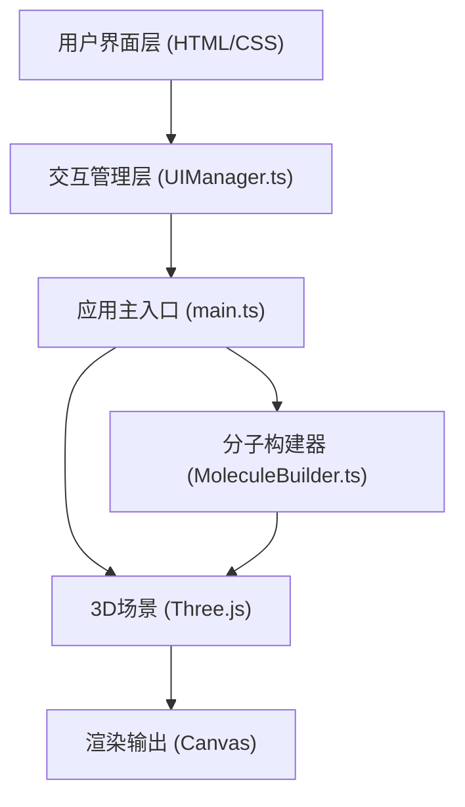

## 1. 架构设计



## 2. 技术描述

- **前端框架**：纯 TypeScript + Three.js，无UI框架
- **构建工具**：Vite
- **3D渲染库**：three@0.160.0
- **类型支持**：@types/three
- **语言**：TypeScript (strict模式，target ES2020)

## 3. 文件结构

| 文件路径 | 用途 |
|---------|------|
| package.json | 项目依赖和脚本配置 |
| vite.config.js | Vite构建配置（devServer端口3000） |
| tsconfig.json | TypeScript配置 |
| index.html | 入口页面，包含UI布局 |
| src/main.ts | 应用入口，场景初始化和动画循环 |
| src/MoleculeBuilder.ts | 分子3D模型构建（原子球体+化学键圆柱） |
| src/UIManager.ts | UI交互管理（下拉菜单、滑块、按钮） |

## 4. 数据模型

### 4.1 分子数据结构

```typescript
interface AtomData {
  element: string;       // 元素符号: 'O', 'H', 'C', etc.
  position: [number, number, number];  // 3D坐标 [x, y, z]
}

interface BondData {
  from: number;  // 起始原子索引
  to: number;    // 结束原子索引
}

interface MoleculeData {
  name: string;          // 分子名称
  nameCn: string;        // 中文名称
  atoms: AtomData[];     // 原子列表
  bonds: BondData[];     // 化学键列表
}
```

### 4.2 原子属性配置

| 元素 | 颜色 | 半径 | 名称 |
|------|------|------|------|
| O | 红色 #ff4444 | 0.6 | Oxygen |
| H | 白色 #ffffff | 0.4 | Hydrogen |
| C | 灰色 #666666 | 0.5 | Carbon |
| N | 蓝色 #4466ff | 0.5 | Nitrogen |

### 4.3 预置分子数据

- 水 (H2O)：1个氧原子 + 2个氢原子 + 2根键
- 二氧化碳 (CO2)：1个碳原子 + 2个氧原子 + 2根双键
- 苯环 (C6H6)：6个碳原子 + 6个氢原子 + 12根键

## 5. 核心功能实现方案

### 5.1 分子构建
- 使用 THREE.SphereGeometry 创建原子球体
- 使用 THREE.CylinderGeometry 创建化学键圆柱体，通过矩阵变换实现两端对齐
- 返回 THREE.Group 对象便于整体操作

### 5.2 场景与交互
- THREE.PerspectiveCamera 透视相机
- THREE.OrbitControls 实现拖拽旋转和滚轮缩放（minZoom=0.5, maxZoom=5）
- THREE.Raycaster 实现鼠标悬停原子检测

### 5.3 动画系统
- requestAnimationFrame 驱动渲染循环
- 分子自动绕Y轴旋转（速度可通过滑块调节0-2倍）
- 分子切换：旧模型opacity渐变至0（0.5s），新模型从0渐变至1（0.5s）
- 视角重置：使用插值动画在0.8s内平滑恢复相机位置和朝向

### 5.4 样式方案
- CSS实现毛玻璃效果：backdrop-filter: blur(10px)
- 渐变背景：linear-gradient(180deg, #0a0a2e 0%, #000000 100%)
- 响应式布局：CSS媒体查询，<768px切换底部浮层模式
