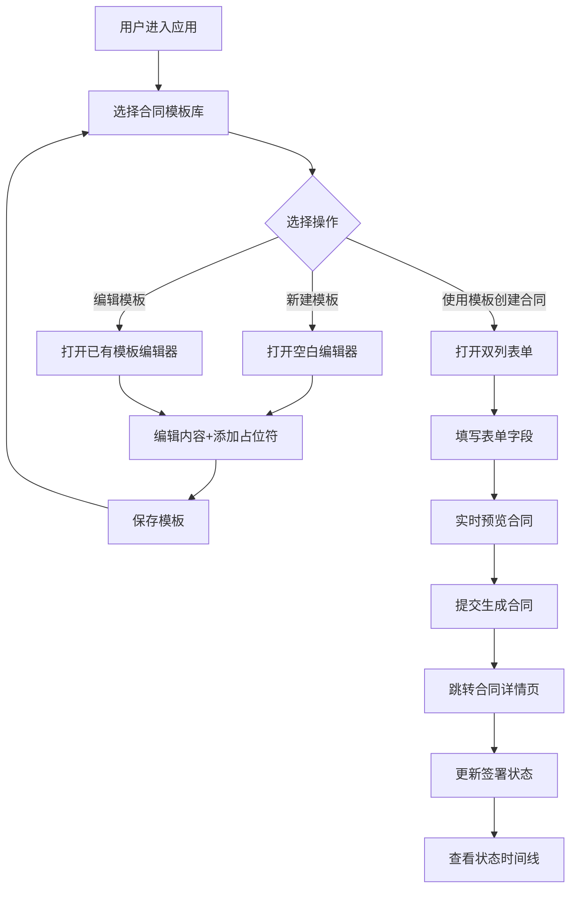

## 1. 产品概述

轻量级合同管理应用，帮助小团队和自由职业者管理合同模板、生成个性化合同文档并追踪签署状态。解决Word编辑合同模板时版本混乱、条款遗漏、签名状态不透明的问题，让合同管理像填写表单一样清晰可查。

- 目标用户：小团队、自由职业者、独立开发者
- 核心价值：简化合同管理流程，提供模板版本控制、一键生成合同、签署状态追踪

## 2. 核心功能

### 2.1 用户角色

| 角色 | 注册方式 | 核心权限 |
|------|----------|----------|
| 普通用户 | 本地应用，无需注册 | 创建/编辑模板、生成合同、更新签署状态 |

### 2.2 功能模块

1. **合同模板库页**：搜索框、新建模板按钮、模板卡片网格展示
2. **合同模板编辑器**：富文本编辑、占位符插入/管理、保存模板
3. **合同生成表单**：双列布局（左预览右表单）、实时预览、字符计数
4. **合同详情页**：合同内容展示、签署状态更新、状态时间线
5. **合同列表页**：所有合同展示、搜索筛选、状态查看

### 2.3 页面详情

| 页面名称 | 模块名称 | 功能描述 |
|----------|----------|----------|
| 模板库页 | 顶部搜索栏 | 关键词搜索模板名称 |
| 模板库页 | 新建模板按钮 | 跳转到空白模板编辑器 |
| 模板库页 | 模板卡片网格 | 展示模板名称、版本号、修改日期、操作按钮 |
| 模板编辑器 | 富文本编辑区 | 支持文本编辑、占位符高亮显示、点击编辑占位符 |
| 模板编辑器 | 占位符列表面板 | 展示所有占位符、支持添加/删除占位符 |
| 合同生成页 | 合同预览区 | 实时展示替换占位符后的合同内容 |
| 合同生成页 | 表单填写区 | 为每个占位符提供输入框，实时计数 |
| 合同详情页 | 状态信息栏 | 显示合同名称、创建日期、当前签署状态 |
| 合同详情页 | 合同内容区 | 只读展示已填充的合同内容 |
| 合同详情页 | 状态时间线 | 垂直时间线展示状态变更历史 |
| 合同列表页 | 合同列表 | 展示所有合同卡片，支持搜索和状态筛选 |

## 3. 核心流程

## 4. 用户界面设计

### 4.1 设计风格

- 主色调：深蓝 #1e3a5f、浅蓝灰背景 #f0f4f8、白色卡片 #ffffff、成功绿 #388e3c
- 按钮风格：圆角8px纯色块，0.2s ease过渡动画
- 字体：系统默认无衬线字体，层次分明（标题粗体、正文常规、辅助文字小号）
- 布局：左侧固定220px垂直导航栏 + 右侧主内容区
- 图标风格：简洁线性图标

### 4.2 页面设计概览

| 页面名称 | 模块名称 | UI元素 |
|----------|----------|--------|
| 模板库页 | 导航栏 | 深蓝色背景、白色文字、选中项加深背景+左侧4px白边 |
| 模板库页 | 模板卡片 | 白色背景、悬停上移6px+加深阴影、右下角两个操作按钮 |
| 模板编辑器 | 编辑区 | 白色卡片、占位符浅蓝色背景高亮 |
| 模板编辑器 | 占位符面板 | 右侧固定宽度、列表展示、添加/删除按钮 |
| 合同生成页 | 双列布局 | 左50%预览、右50%表单 |
| 合同详情页 | 状态时间线 | 垂直线条、绿色圆点节点、日期标注 |

### 4.3 响应式设计

- Desktop-first设计，768px为断点
- 768px以上：左侧固定导航栏 + 宽屏布局
- 768px以下：导航栏折叠为顶部汉堡菜单，单列布局
- 触摸优化：按钮最小点击区域44px
