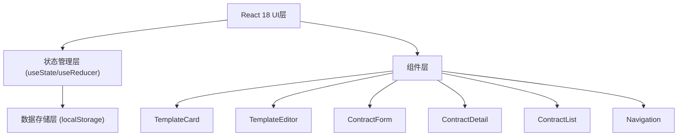
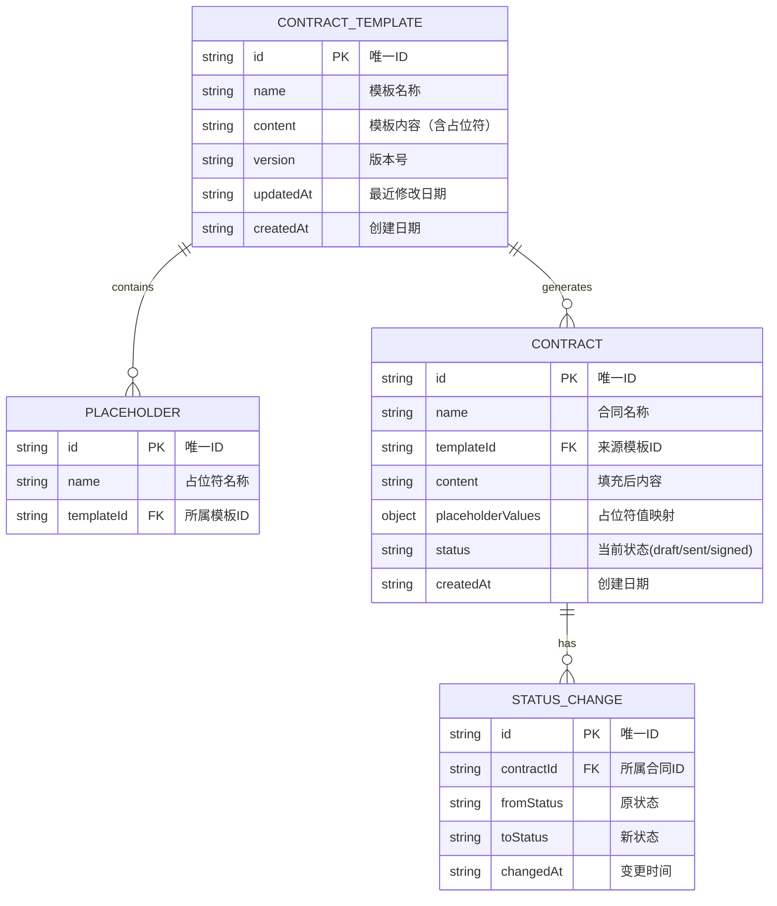

## 1. 架构设计



## 2. 技术栈描述

- 前端框架：React@18 + TypeScript
- 构建工具：Vite@5
- 数据存储：localStorage（浏览器本地存储）
- 状态管理：React内置useState + 状态提升
- 路由：条件渲染模拟前端路由（无需额外依赖）
- 工具库：uuid（生成唯一ID）、lodash（工具函数）

## 3. 路由定义

使用条件渲染模拟路由，实际通过App组件状态管理页面切换：

| 路由路径（逻辑） | 页面组件 | 用途 |
|-----------------|----------|------|
| /templates | 模板库页 | 展示所有合同模板 |
| /templates/editor | 模板编辑器 | 新建或编辑合同模板 |
| /contracts/create | 合同生成页 | 从模板生成新合同 |
| /contracts/detail | 合同详情页 | 查看合同内容和签署状态 |
| /contracts | 合同列表页 | 展示所有已生成合同 |

## 4. 数据模型

### 4.1 数据模型定义



### 4.2 localStorage键定义

- `contract_templates`: 存储所有模板数组
- `contracts`: 存储所有合同数组

## 5. 文件结构

```
src/
├── types.ts              # TypeScript类型定义
├── dataStore.ts          # localStorage数据存取逻辑
├── App.tsx               # 主应用组件（路由+状态管理）
├── main.tsx              # 入口文件
├── index.css             # 全局样式
└── components/
    ├── Navigation.tsx    # 导航栏组件
    ├── TemplateCard.tsx  # 模板卡片组件
    ├── TemplateEditor.tsx # 模板编辑器组件
    ├── ContractForm.tsx  # 合同生成表单组件
    ├── ContractDetail.tsx # 合同详情组件
    └── ContractList.tsx  # 合同列表组件
```

## 6. 核心模块说明

### 6.1 dataStore.ts
- `getTemplates()`: 读取所有模板
- `saveTemplate(template)`: 保存/更新模板
- `deleteTemplate(id)`: 删除模板
- `getContracts()`: 读取所有合同
- `saveContract(contract)`: 保存/更新合同
- `initSampleData()`: 初始化示例数据（首次加载）

### 6.2 性能优化策略
- 列表渲染：使用React key优化重渲染
- 表单输入：防抖处理非关键更新
- 状态提升：最小化状态范围，避免不必要的重渲染
- CSS动画：使用transform和opacity实现硬件加速
