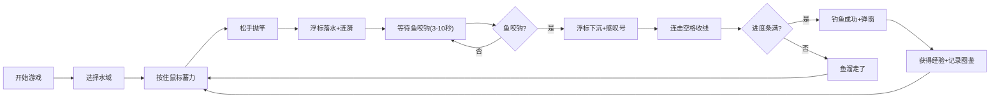

## 1. 产品概述

像素钓鱼日志是一款基于浏览器的2D像素风钓鱼模拟游戏，玩家可以在不同水域抛竿钓鱼、收集鱼种图鉴、提升等级解锁新地图。

- 核心玩法：蓄力抛竿 → 等待咬钩 → 快速收线 → 获得渔获
- 目标用户：喜欢休闲像素风游戏的玩家

## 2. 核心功能

### 2.1 功能模块

1. **游戏主界面**：Canvas画布、水域切换按钮、蓄力条、等级经验条
2. **钓鱼系统**：抛竿蓄力、浮标动画、鱼咬钩判定、收线进度条
3. **渔获系统**：鱼种随机生成、稀有度分级、重量计算、图鉴记录
4. **图鉴面板**：可展开/收起、已解锁鱼种展示、悬停详情

### 2.2 页面详情

| 页面名称 | 模块名称 | 功能描述 |
|---------|---------|---------|
| 游戏主界面 | 水域切换区 | 河流/湖泊/海洋三种水域切换，背景色平滑过渡 |
| 游戏主界面 | Canvas游戏区 | 640x480像素画布，绘制水面、浮标、涟漪、咬钩提示 |
| 游戏主界面 | 蓄力指示器 | 按住鼠标蓄力，显示当前抛竿力度 |
| 游戏主界面 | 等级经验条 | 底部显示当前等级和升级进度 |
| 游戏主界面 | 收藏图鉴 | 右侧面板，网格展示已解锁鱼种 |
| 渔获弹窗 | 详情面板 | 显示鱼名、稀有度、重量、收获时间 |

## 3. 核心流程

玩家进入游戏后，选择当前水域，按住鼠标左键蓄力抛竿，浮标落入水中产生涟漪。等待3-10秒后鱼咬钩（浮标下沉+红色感叹号闪烁），玩家快速连击空格键收线，进度条满则钓鱼成功，弹出渔获详情并获得经验值。所有钓到的鱼会记录在图鉴中。

## 4. 用户界面设计

### 4.1 设计风格

- **主色调**：#2a5a5a（深绿松石）、#6bc47f（草绿）、#d4a047（金色）
- **背景色**：#0a3d3d（深青色），CSS关键帧渐变水波纹横向动画
- **按钮风格**：像素边框、背景#4a7a4a，悬停#5a9a5a
- **字体**：复古像素风格，白色带微弱阴影
- **布局**：固定宽度960px居中，主画布640x480像素

### 4.2 页面设计概览

| 模块名称 | UI元素 |
|---------|-------|
| 顶部标题 | "像素钓鱼日志" 像素字体，白色带阴影 |
| 水域切换 | 左上角3个像素风按钮：河流/湖泊/海洋 |
| Canvas游戏区 | 640x480画布，水面波纹、浮标、涟漪动画 |
| 蓄力条 | 鼠标按住时显示横向力量条 |
| 咬钩提示 | 红色感叹号闪烁+浮标下沉抖动 |
| 收线进度条 | 垂直或水平显示当前收线进度 |
| 经验条 | 底部80%宽度，背景#2a3a3a，填充#6bc47f |
| 图鉴面板 | 右侧240px宽，每行3张64x64像素卡片 |
| 渔获弹窗 | 中央半透明面板#1a2a2a，边框#4a8a5a，圆角8px |

### 4.3 响应式设计

- 桌面端（≥1000px）：固定960px宽度居中，图鉴面板在右侧
- 移动端（<1000px）：纵向堆叠布局，图鉴面板移到底部

### 4.4 动画效果

- 背景水波纹：CSS关键帧横向渐变移动
- 浮标抖动：鱼咬钩时2px幅度抖动
- 涟漪扩散：浮标落水后0.3秒内环形扩散动画
- 颜色过渡：水域切换0.5秒平滑过渡
- 感叹号闪烁：咬钩时16x16像素红色图标闪烁3次
