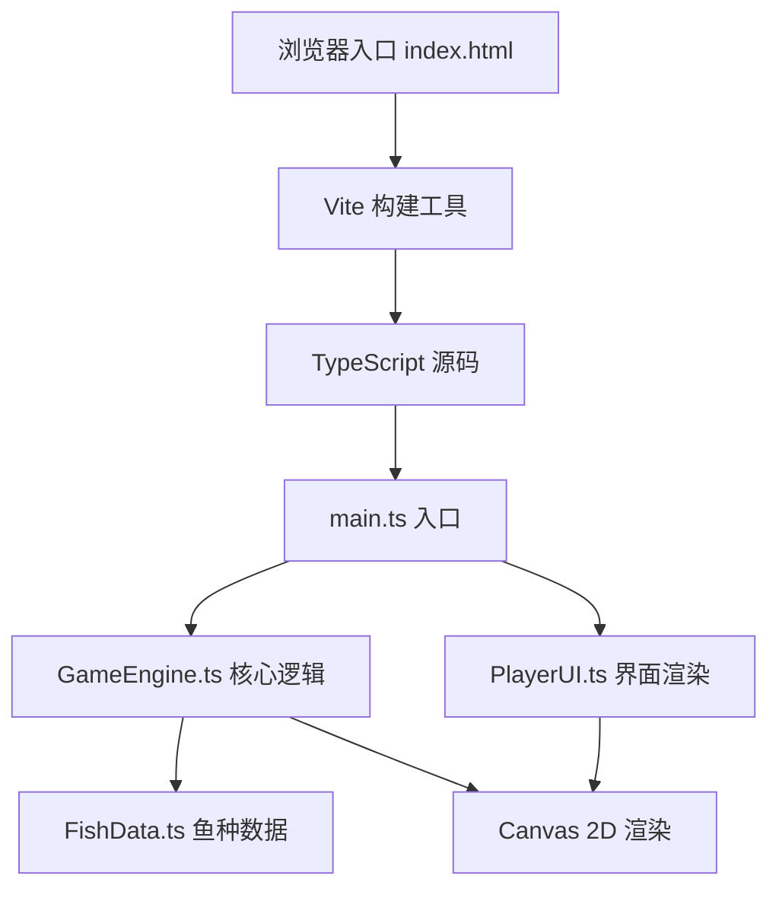

## 1. 架构设计



## 2. 技术描述

- **前端**：TypeScript@5 + Canvas 2D API + Vite@5
- **构建工具**：Vite 5
- **工具库**：lodash（工具函数）、uuid（唯一ID）
- **样式**：原生CSS，CSS变量，CSS关键帧动画
- **主循环**：requestAnimationFrame，60fps

## 3. 文件结构

| 文件路径 | 用途 |
|---------|-----|
| package.json | 项目依赖和脚本配置 |
| tsconfig.json | TypeScript严格模式配置 |
| vite.config.js | Vite构建配置 |
| index.html | 入口HTML页面，含CSS样式 |
| src/main.ts | 游戏初始化、事件绑定、主循环驱动 |
| src/GameEngine.ts | 游戏状态管理、钓鱼逻辑、等级系统 |
| src/FishData.ts | 15+鱼种数据、稀有度、重量范围、水域 |
| src/PlayerUI.ts | UI组件渲染、动画效果、弹窗面板 |

## 4. 核心数据模型

### 4.1 类型定义

```typescript
// 水域类型
type WaterType = 'river' | 'lake' | 'ocean';

// 稀有度
type Rarity = 'common' | 'rare' | 'legendary';

// 鱼种数据
interface FishSpecies {
  id: string;
  name: string;
  rarity: Rarity;
  minWeight: number;
  maxWeight: number;
  waters: WaterType[];
  color: string;
}

// 钓到的鱼实例
interface CaughtFish {
  id: string;
  speciesId: string;
  weight: number;
  caughtAt: Date;
  water: WaterType;
}

// 图鉴记录
interface FishEntry {
  speciesId: string;
  count: number;
  firstCaughtAt: Date;
}

// 游戏状态
type GamePhase = 'idle' | 'charging' | 'casting' | 'waiting' | 'biting' | 'reeling' | 'success' | 'escaped';

// 玩家数据
interface PlayerState {
  level: number;
  experience: number;
  collection: Map<string, FishEntry>;
}
```

### 4.2 经验计算公式

- 普通鱼：+10 XP
- 稀有鱼：+30 XP
- 传说鱼：+100 XP
- 升级所需：level * 50 XP
- 5级解锁海洋水域

## 5. 渲染优化

- Canvas绘制调用控制在50次以内
- requestAnimationFrame驱动60fps主循环
- 使用对象池管理动画粒子
- CSS动画处理背景水波纹和UI过渡
