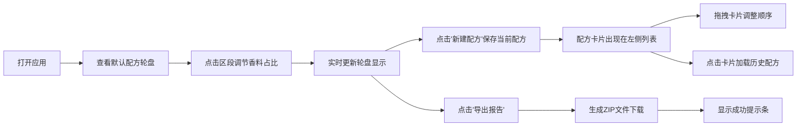

## 1. 产品概述

气味轮盘是一个面向独立调香师和香水爱好者的交互式配方记录与对比工具。用户通过可视化的圆形轮盘界面直观调配香料比例，保存多个配方并进行气味轮廓对比，一键导出包含可视化图表的配方报告。

- 目标用户：独立调香师、香水爱好者、气味设计师
- 核心价值：将传统的 Excel/手写笔记转化为直观的交互式可视化工具，让配方探索像调制鸡尾酒一样直观有趣

## 2. 核心功能

### 2.1 用户角色

| 角色 | 注册方式 | 核心权限 |
|------|---------|---------|
| 普通用户 | 无需注册（本地存储） | 创建、编辑、保存、对比、导出配方 |

### 2.2 功能模块

1. **气味轮盘主界面**：8个香料类别的圆形轮盘、中心信息展示、实时占比曲线、区段脉冲动画
2. **滑条调节面板**：点击区段弹出、滑条+数值输入框（0-100%）、实时联动轮盘
3. **配方列表面板**：卡片展示已保存配方、小型缩略轮盘、搜索框、新建配方按钮
4. **拖拽排序**：卡片拖拽重排序、半透明阴影+偏移效果
5. **导出报告功能**：Canvas截图+文本数据、ZIP格式下载、成功提示条

### 2.3 页面详情

| 页面名称 | 模块名称 | 功能描述 |
|---------|---------|---------|
| 主页面 | 气味轮盘 | 8区段渐变色轮盘（柑橘、花香、果香、草本、木质、辛香、琥珀、麝香），中心显示配方名和总用量，点击区段弹出调节面板，长按区段触发脉冲动画，外圈实时显示占比分布曲线 |
| 主页面 | 滑条调节面板 | 滑条+数值输入框联动，范围0-100%，实时更新轮盘显示 |
| 主页面 | 配方列表面板 | 左侧卡片列表，每张卡片显示配方名、创建日期、缩略轮盘，支持点击加载、拖拽排序、搜索过滤、新建配方 |
| 主页面 | 导出功能 | 右上角导出按钮，生成ZIP包含PNG截图+JSON文本数据，底部绿色提示条3秒自动消失 |

## 3. 核心流程

## 4. 用户界面设计

### 4.1 设计风格

- **主色调**：深色星空风背景 `#0b0e1a`
- **香料类别渐变色**：
  - 柑橘：`#ff7b00` → `#ffb347`（暖橙色）
  - 花香：`#e84393` → `#fd79a8`（粉色）
  - 果香：`#e17055` → `#fab1a0`（珊瑚橙）
  - 草本：`#00b894` → `#55efc4`（薄荷绿）
  - 木质：`#6c5ce7` → `#a29bfe`（紫罗兰）
  - 辛香：`#d63031` → `#ff7675`（朱红）
  - 琥珀：`#fdcb6e` → `#ffeaa7`（琥珀金）
  - 麝香：`#636e72` → `#b2bec3`（银灰）
- **按钮样式**：圆形按钮，圆角，悬停放大1.05倍
  - 新建按钮：`#6c5ce7` → `#a29bfe`
  - 导出按钮：`#00b894`，悬停图标旋转15度
- **字体**：无衬线字体，银白色，标题带微弱发光效果
- **布局风格**：轮盘居中，左侧配方列表，响应式适配
- **动效**：区段脉冲动画（0.3s 透明度0.7→1.0→恢复）、拖拽偏移6px+半透明阴影、提示条淡入淡出

### 4.2 页面设计概览

| 页面名称 | 模块名称 | UI元素 |
|---------|---------|--------|
| 主页面 | 标题区 | 顶部居中"气味轮盘"文字，银白色发光，无衬线字体 |
| 主页面 | 轮盘区 | 居中Canvas绘制的8区段渐变轮盘，外圈占比曲线，中心信息文字 |
| 主页面 | 调节面板 | 区段附近弹出，滑条+数值输入框，深色半透明背景 |
| 主页面 | 配方列表 | 左侧深色卡片列表，顶部搜索框+圆形新建按钮，卡片缩略轮盘+名称+日期 |
| 主页面 | 导出区 | 右上角圆形下载按钮，底部绿色提示条 |

### 4.3 响应式设计

- **桌面端**：左侧配方列表 + 中间轮盘 + 右上角导出按钮
- **平板端**：轮盘缩小，列表宽度减小
- **手机端**：轮盘居中缩小，配方列表变为底部横向滚动卡片条
- **触摸优化**：增大点击热区，支持触摸滑动调节

## 5. 性能要求

- 轮盘拖动滑块和重绘响应延迟 ≤ 50ms
- Canvas绘制使用 requestAnimationFrame 优化
- 配方数据使用本地 localStorage 存储
