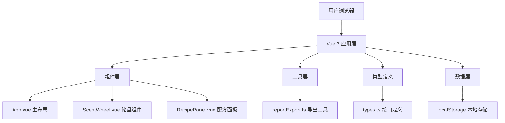

## 1. 架构设计



## 2. 技术栈说明

- **前端框架**：Vue 3 + Composition API + `<script setup lang="ts">`
- **构建工具**：Vite 5
- **类型系统**：TypeScript（严格模式，target: ES2020）
- **路由**：vue-router@4（单页应用）
- **UI渲染**：Canvas 2D API 绘制轮盘
- **数据存储**：localStorage（浏览器本地存储）
- **第三方库**：
  - `uuid`：生成唯一配方ID
  - `lodash`：工具函数（深拷贝、防抖等）
  - `file-saver`：文件下载
  - `jszip`：ZIP压缩打包

## 3. 路由定义

| 路由 | 用途 |
|-----|------|
| `/` | 主页面（唯一页面，单页应用） |

## 4. 数据模型

### 4.1 类型定义

```typescript
// 香料类别
interface ScentCategory {
  id: string;
  name: string;
  colorStart: string;  // 渐变起始色
  colorEnd: string;    // 渐变结束色
  percentage: number;  // 占比 0-100
}

// 配方
interface Recipe {
  id: string;
  name: string;
  createdAt: string;   // ISO date string
  description: string;
  categories: ScentCategory[];
}

// 轮盘组件 Props
interface ScentWheelProps {
  recipe: Recipe | null;
}

// 配方面板 Props
interface RecipePanelProps {
  recipes: Recipe[];
  selectedId: string | null;
}
```

### 4.2 初始数据

- 8个默认香料类别，每个占比12.5%
- 2-3个示例配方用于演示

## 5. 文件结构

```
├── package.json
├── tsconfig.json
├── vite.config.js
├── index.html
└── src/
    ├── App.vue              # 主组件，布局和全局状态
    ├── types.ts             # TypeScript类型定义
    ├── components/
    │   ├── ScentWheel.vue   # 轮盘组件（Canvas绘制+交互）
    │   └── RecipePanel.vue  # 配方列表面板（卡片+拖拽）
    └── utils/
        └── reportExport.ts  # 导出工具函数
```

## 6. 核心实现方案

### 6.1 轮盘绘制（ScentWheel.vue）
- 使用 Canvas 2D API 绘制8个扇形区段
- `createLinearGradient` 实现渐变色
- `requestAnimationFrame` 优化动画性能
- 点击检测：极坐标转换判断点击所在区段
- 脉冲动画：CSS transition + opacity 变化
- 占比曲线：根据百分比绘制外圈波浪/环形曲线

### 6.2 配方面板（RecipePanel.vue）
- HTML5 Drag and Drop API 实现拖拽排序
- 缩略轮盘：使用小型 Canvas 或简化 SVG
- 搜索过滤：computed 属性实时过滤
- 新建配方按钮：圆形设计，scale 1.05 悬停效果

### 6.3 导出功能（reportExport.ts）
- `canvas.toDataURL('image/png')` 获取轮盘截图
- JSZip 创建 ZIP 文件，包含 PNG 图片和 JSON 文本数据
- FileSaver.saveAs 触发浏览器下载
- setTimeout 3秒后隐藏提示条

### 6.4 响应式布局
- CSS Flexbox + Grid 主布局
- CSS Media Queries 适配平板/手机
- Canvas 尺寸根据容器宽度动态计算
